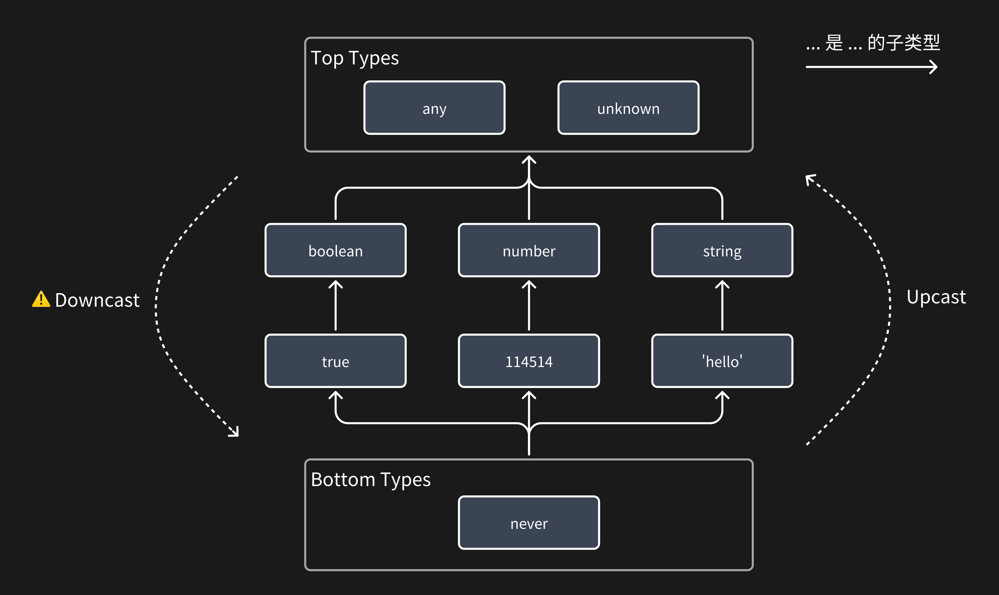
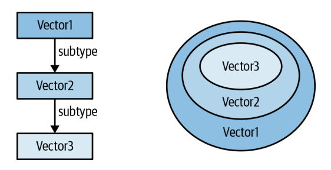
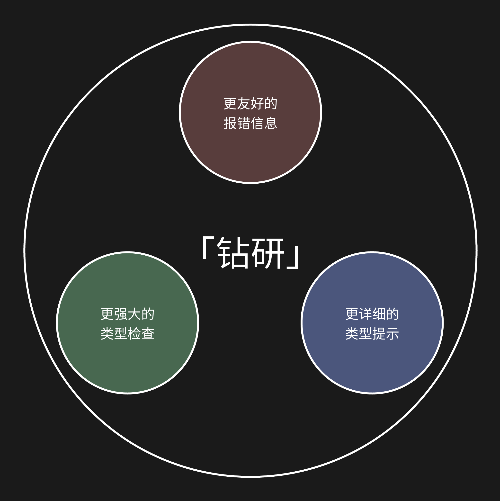

| **目录** | **下一章** |
| :----------: | :------: |
| [你可能不知道的 TypeScript](https://github.com/darkyzhou/You-Might-Not-Know-TypeScript#%E4%BD%A0%E5%8F%AF%E8%83%BD%E4%B8%8D%E7%9F%A5%E9%81%93%E7%9A%84-typescript) | [第二章：进阶话题](https://github.com/darkyzhou/You-Might-Not-Know-TypeScript/blob/main/chapter2.md)  |

---

# 第一章：基础知识

## 关于 TypeScript

早期的 JavaScript 应用普遍存在一个问题：开发效率难以随着团队规模的扩大而扩展（scale）。当时，来自微软的 Steve Lucco 等人认为解决问题的关键是一套类型系统，在它的基础上提供包括但不限于下面的能力：

- 自动补全（Code Completion）
- 跳转到定义（Go to Definition）
- 安全的重构（Safe Refactoring）

当我们今天讨论 TypeScript 时，应该意识到它不仅仅是一个语言或者一个类型系统，它也是一套完整的 JavaScript 工具链，赋予了 IDE 分析 JavaScript/TypeScript 代码的能力。

> TypeScript 和 VS Code 的诞生是相辅相成的。没有 TypeScript 带来的类型系统和上述的功能，就没有 VS Code 这个由多人团队构建的基于 Web 的大型应用程序。而 VS Code 的开发也为 TypeScript 带来了大量的改进反馈。TypeScript 和 VS Code 都是 2010 年代微软在 Web 上的投入计划的一环。

本文的主题是 TypeScript 的类型系统部分，并不涉及提供上述功能的部分，它被称为语言服务（language service）。因此，如果你在后文看到了「TypeScript」一词，它很可能指的是类型系统。

## 结构化类型（Structural Typing）

一个类型系统的重要属性是：它使用结构化类型（structural typing）还是名义类型（nominal typing）。这项属性决定了：当类型系统检查某个值是否能够被赋给（assign to）具有某个类型的变量时，它所使用的判据是什么。

对于名义类型，判据是值和变量的类型名称，就像下面的 Java 代码。

```java
class Dog {
    public void walk() {}
}

class Duck {
    public void walk() {}
}

Dog dog;
// 错误，Dog 和 Duck 是没有任何关系的类型，「狗就是狗，鸭就是鸭」
dog = new Duck();
```

而对于结构化类型，判据是值和变量的类型结构，就像下面的 TypeScript 代码：

```java
class Dog {
  public walk() {}
}

class Duck {
  public walk() {}
}

// 没有错误，因为狗和鸭的类型的结构一样（都由一个相同的 walk 函数构成）
// 「因为都能够走路，所以狗和鸭一样」
const dog: Dog = new Duck();
```

> [!NOTE]
> 你可能听说过[鸭子理论（Duck Typing）](https://en.wikipedia.org/wiki/Duck_typing)，它可以说是结构化类型的思想的一种体现。
>
> Duck typing in computer programming is an application of the duck test—"If it walks like a duck and it quacks like a duck, then it must be a duck"—to determine whether an object can be used for a particular purpose.
>
> With nominative typing, an object is of a given type if it is declared as such. With duck typing, an object is of a given type if it has all methods and properties required by that type.
>
> Duck typing may be viewed as a usage-based structural equivalence between a given object and the requirements of a type.

TypeScript 的类型系统选择了结构化类型，这是出于兼容 JavaScript 生态的考虑。因为从人们使用 JavaScript 的方式来看，它更适合使用结构化类型去建模。这里举一个简单的例子：

```typescript
function logPoint(p) {
  console.log(`${p.x}, ${p.y}`);
}

logPoint({ x: 12, y: 26 });
```

就像上面的 `logPoint` 一样，在人们编写的很多 API（特别是 DOM API 或者 JavaScript 语言内置的 API）中，人们只关心这个值是否存在一些发挥功能必要的属性。就像[你可以使用 `Array.from({ length: 10 })` 创建定长数组](https://darkyzhou.net/articles/js-array-creation)一样，JavaScript 并不关心你传入的参数是否真的是一个数组，它只关心发挥功能所必需的 `length` 属性。如果 TypeScript 采用名义类型，则需要为这些 API 的参数提供大量的内置类型，这样的做法无疑提高了 TypeScript 接入 JavaScript 的现有 API 的复杂度。
对于已经习惯了采用的名义类型的语言（大多数的面向对象语言，比如 Java）的人来说，结构化类型有时候会给他们带来一些意想不到的惊喜，比如他们可能会惊讶于下面的例子：

```typescript
interface MyInterface {
  // 空接口
}

// 不报错！
const a: MyInterface = "seele";
// 也不报错！
const b: MyInterface = () => {};
```

不过，结构化类型赋予了 TypeScript 的类型系统非常强大的功能，让我们可以通过编程的方式「组合」出自己想要的类型，这一点在后续的类型编程中会详细讨论。

> [!NOTE]
> 虽然我们说 TypeScript 的类型系统采用了结构化类型，但这不是绝对的。在一些细节上，它采用了名义类型，比如对于 `class` 中使用 `private` 或 `protected` 修饰的属性：[https://github.com/microsoft/TypeScript/wiki/FAQ#when-and-why-are-classes-nominal](https://github.com/microsoft/TypeScript/wiki/FAQ#when-and-why-are-classes-nominal)。
>
> 此外，我们会在后文看到，仍然可以通过一些特殊的手段在 TypeScript 的类型系统中模拟出名义类型的效果，来达到一些需要名义类型才能实现的目的。

## 类型系统的目的

[TypeScript 的设计目标（design goals）的第一条](https://github.com/microsoft/TypeScript/wiki/TypeScript-Design-Goals#goals)：

> Statically identify constructs that are likely to be errors.

我认为这是在说 TypeScript 应该为程序员提供一些手段，让他们在编码或编译时就能识别出各种结构的错误。所谓的「结构」可以理解为包括但不局限于以下的内容：

- 函数的返回值必须是一个 `Promise`，且它 resolve 之后返回的值必须是个字符串
- 函数的两个入参必须是长度相同的数组
- 对象要么含有 `A` 属性要么含有 `B` 属性，不能同时含有、也不能都不含有
- 若干个对象必须含有相同的键
- 字符串必须包含若干个特定子串

从上面的内容可以看出，在 TypeScript 的视野中，标注并检查符号的原始类型只是它目的的一个方面。TypeScript 的团队在这十多年来不断地追求着更为宏大的设计目标。我们会在后文介绍如何利用 TypeScript 实现这些复杂的规则。

TypeScript 想要为这些「结构（construct）」提供一种在编译期就能够进行自动化检查的手段，从而避免过去人们使用 JavaScript 时将很多编码错误（不局限于类型错误）泄漏到运行时，带来不必要的损失。
换句话说，TypeScript 的目的是提供一种自动化的工具，对代码进行广义上的静态检查，只不过具体的检查规则需要程序员接入（opt in）到代码中的对应部分。如果程序员什么规则都不施加，那么一段 TypeScript 代码就跟 JavaScript 代码无异，这也在一定程度上解释了为什么 [TypeScript 的仓库介绍里说「TypeScript is a superset of JavaScript」](https://github.com/microsoft/typescript)。

TypeScript 提供的自动化检查对于团队协作来说是一个可扩展（scalable）的方案，因为它将过去的很多通过注释、文档和口口相传的「结构」固化在了代码中，并且不依赖人就能检查这种「结构」的完整性。毕竟相比起记性很差、非常粗心的人来说，死板的规则有时候更适合做这类事情。当然，TypeScript 不能解决所有的「结构」问题，因为这不仅仅是编程语言层面的问题。

> [!NOTE]
> **扩展性（scalability）是我的个人见解**
>
> 我在评估某个解决方案时，会考察它在时间和空间两个维度上的扩展性：
>
> - 时间维度：时间的流逝等
> - 空间维度：团队人员的变动，包括规模的扩大、成员的改变等
>
> 当我们说传统的基于注释、文档和 CR 等方法维护「结构」的方案扩展性不佳时，我们是在说：
>
> - 当时间流逝时，团队成员会不断忘记大量的注释和文档，导致方案效果弱化
> - 当团队人员变动时，需要花费更多人力在理解注释、文档和进行 CR 上才能确保方案效果的持续
>
> 当我们说 TypeScript 提供的方案是可扩展的时候，我们基于以下理由：
>
> - 当结构的规则被完成后，它通过 TypeScript 的编译检查确保效果的实施，不依赖于人力的变化
> - 当结构的规则被完成后，无论时间如何流逝，这个规则的效果并不会发生改变

## 类型是值的集合

在 TypeScript 的类型系统中，我们最好将所谓的「类型」理解为「值的集合」，即一个类型的本质是它所框定的值的集合。基于这个定义有：

- 如果一个类型是另一个类型的子集，那么称前者是后者的子类型（subtype）
- 如果一个类型是全集，那么其它所有类型都是它的子类型
- 如果一个类型是空集，那么它是其它所有类型的子类型

在 TypeScript 对赋值语句 `a = b` 进行类型检查时，它会检查 `b` 的类型是不是 `a` 的子类型。如果 `a` 的类型是全集，那么这个赋值总是会通过检查。如果 a 的类型是空集，那么这个赋值总是无法通过检查。对应到具体的类型来说，上述的「全集」指的是 `any` 和 `unknown` 而「空集」指的是 `never`。

如果使用箭头表示类型的父子关系，可以得到下面的这张图：

<p align="center">
  
</p>

像 `any` 和 `unknown` 这样在整个类型系统中处于顶部位置（其它所有类型是它们的子集）的类型，被称为「top types」。而像 `never` 这样在整个类型系统中处于底部位置（它是其它所有类型的子集）的类型，被称为「bottom types」。谁框定的值更多谁就处于这个体系中更高的位置，反之则处于更低的位置。

我们还有下面的讨论：

- 当使用 `string` 标注变量时，我们是在表达「这个变量的值可能是任意一个字符串值」
- 当使用 `'foo' | 'bar'` 标注变量时，我们是在表达「这个变量的值只能是 `'foo'` 或 `'bar'`」
- `null` 和 `undefined` 类型有些特殊，它们都只框定了一个值，分别是 `null` 和 `undefined`

### 对象类型

对于对象类型来说，情况有些复杂：当使用 `{ foo: string }` 时，我们实际上框定的值是「任何含有名为 `foo` 的属性的对象」，而不是仅含有那个属性的对象。在下面的例子中，观察 `Vector1D`、`Vector2D` 和 `Vector3D` 之间的关系，我们向对象类型添加更多属性的过程是在收缩而不是扩充这个类型对应的集合。

```typescript
interface Vector1D {
  x: number;
}

interface Vector2D extends Vector1D {
  y: number;
}

interface Vector3D extends Vector2D {
  z: number;
}
```
<p align="center">
  
</p>

特别地，TypeScript 不允许对一个对象字面量值进行 upcast：

```typescript
const _0: Vector1D = { x: 114, y: 514 };
// ERROR: Object literal may only specify known properties, and 'y' does not exist in type 'Vector1D'
```

这倒不是在说前面的说法有问题，而是它就是一个附加的「特例」规则，这在一些场景下很有用（特别是向 React 组件传对象字面量参数时）。这个特例只发生在对象字面量值中，如果使用一些间接的方式赋值就不会报错：

```typescript
const _1: Vector2D = { x: 114, y: 514 };
const _: Vector1D = _1; // OK
```

> [!NOTE]
> **类型 `{}` 到底是什么？**
>
> 按照刚才有关对象类型的讨论，是否可以得出 `{}` 框定的是「任何对象类型」的结论？唔，情况其实有些复杂。
>
> 事实上，从 TypeScript 4.8 开始，`{}` 等价于「任何非 `null` 且非 `undefined` 的类型」，并且有：`type NonNullable<T> = T extends null | undefined ? never : T` 等价于 ` T & {}`。换句话说，`string`、`number`、`boolean` 等常见类型也能够被赋给 `{}`。
>
> 因此，`{}` 框定的值的范围实际上要大于「任何对象类型」。如果确实想表示对象类型，`Record<string, unknown>` 一般会是更好的选择。

### Upcast 和 Downcast

在 TypeScript 检查一个值是否可以被赋给（assign to）一个变量时，如果这个值的类型是变量类型的子类型，那么称这个过程为 upcast。例如将 `true` 赋给一个 `boolean` 类型的变量。根据里氏替换原则，这种 upcast 基本上是安全的，因此 TypeScript 不会对这种赋值语句做额外的要求。

如果方向相反，变量的类型是值的子类型，这个过程则被称为 downcast。例如将 `{}` 赋给 `{ foo: string }`。这种赋值并不安全，因此 TypeScript 在进行类型检查时会报错。我们一般需要通过类型断言（type assertion）去告诉 TypeScript 我们十分肯定这件事情是正确的，不过这也成为了 `as` 被滥用的开端，在[后文](https://github.com/darkyzhou/You-Might-Not-Know-TypeScript/blob/main/chapter2.md#%E6%BB%A5%E7%94%A8%E7%B1%BB%E5%9E%8B%E6%96%AD%E8%A8%80type-assertion)会展开讨论。

> [!WARNING]
> **不推荐使用 any 类型！**
>
> 你可能听说过 TypeScript 被称为 AnyScript 的调侃。 any 类型是类型系统提供的一种「后门」。在使用它时，TypeScript 只会检查语法，而不会执行任何类型检查。在大多数我们不关心具体的类型为何的场景中，应该使用 unknown 而不是 any，因为它更安全。我们会在后文详细讨论 any 类型。

### TypeScript 概念和对应的集合概念

| TypeScript 概念                                                                                                                                  |    对应的集合概念     |
| ------------------------------------------------------------------------------------------------------------------------------------------------ | :-------------------: |
| `never`                                                                                                                                          | $$\emptyset（空集）$$ |
| `unknown`                                                                                                                                        |         全集          |
| 字面量，例如 `'foo'`                                                                                                                             |      单元素集合       |
| 某个值可以被赋给（is assignable to）类型 `T`                                                                                                     |    $$Value \in T$$    |
| 类型 `A` 可以被赋给（is assignable to）类型 `B`                                                                                                  |   $$A \subseteq B$$   |
| 类型 `A` 是类型 `B` 的子类型                                                                                                                     |   $$A \subseteq B$$   |
| A extends B，其中 A 和 B 为某种类型（这个指的不是类继承语法哦）                                                                               |   $$A \subseteq B$$   |
| `A \| B`，其中 A 和 B 为某种类型 这个概念被称为联合类型（union types） |     $$A \cup B$$      |
| `A & B`，其中 A 和 B 为某种类型 这个概念被称为交叉类型（intersection types）                                                                     |     $$A \cap B$$      |

> [!NOTE]
> 赋值（assignment）和子类型（subtype）具体检查的项目其实不完全等价。
>
> [TypeScript 的官方文档提到](https://www.typescriptlang.org/docs/handbook/type-compatibility.html#subtype-vs-assignment)，前者在后者的基础上扩展了两条规则：
>
> - `any` 总是可以被 downcast 而不会报错
> - 不同枚举类型间的赋值规则基于它们实际代表的数字值（numeric values）
>
> 事实上，在 TypeScript 的类型检查系统中[存在下列的五种关系](https://github.com/microsoft/TypeScript-Compiler-Notes/blob/main/codebase/src/compiler/checker-relations.md#relations)，它们会被用到不同的场合中，并在具体细节上存在区别。不过，上述的表格总体来说在多数日常场景中仍然是正确的。
>
> - Identity（相等）
> - Strict Subtyping（严格子类型）
> - Subtyping（子类型）
> - Assignability（可赋值）
> - Comparability（可比较）

## 类型的来源

TypeScript 在进行类型检查时，实际上需要知道源码中所有节点的类型。但是，正如我们可以直接使用 `const example = "Hello, World!"` 声明一个类型为 `string` 的变量一样，TypeScript 在我们不使用显式的类型标注的情况下也能够进行类型检查。TypeScript 可以通过下面的方法获取类型信息：

### 程序员的手动标注

手动标注符号的类型的方式包括声明符号时的 `variable: type` 语法和类型断言（Type assertion）等方式。对于后者来说，主要包括 `as` 关键字的使用以及与之等价的 `<type>` 前缀。

#### [JSDoc 的类型标注](https://www.typescriptlang.org/docs/handbook/jsdoc-supported-types.html)

JSDoc 中[存在一种 @type 类型的注释](https://jsdoc.app/tags-type.html)可以让程序员在 JavaScript 代码中标注一个符号或者函数返回值的类型，TypeScript 的语言服务也能够读取这些注释来给符号限定类型，提供和 TypeScript 代码相当的类型检查能力。

> 基于 JSDoc 的这种能力和在 TypeScript 的 DX 上遇到的痛点，知名的前端框架 Svelte 选择将部分 TypeScript 源文件迁移至使用 JSDoc 的 JavaScript 源文件。参见 https://github.com/sveltejs/svelte/pull/8569 中的评论以及互联网上的相关讨论。

#### [类型推导（Type Inference）](https://www.typescriptlang.org/docs/handbook/type-inference.html)

TypeScript 在进行类型推导时存在两套特殊的机制：类型泛化（type widening）和类型具化（type narrowing）。虽然类型推导是一个复杂的机制，不过下面讨论的两种机制是日常编写代码时接触得最多的。

##### 类型泛化（Type Widening）

我们在编写 TypeScript 代码（甚至是纯 JavaScript 代码）时，在很多情况下不需要通过上述方法标注类型，因为 TypeScript 可以通过分析源代码去自动推断出类型。例如当写下 `let foo = 'bar'` 时，虽然我们并没有指出 `foo` 应该是 `string` 类型，但 TypeScript 能够依据它是变量声明语句以及它的 rhs 表达式（right-hand side expression）是一个字符串字面量（string literal）等事实，来推导出一种「合适」的类型。

不过，所谓的「合适」其实是一个复杂的话题。TypeScript 只能从源码上掌握有限的信息，有时并不能以此推断出程序员的意图。例如，我们经常在声明变量时遇到下面这样的两难问题（dilemma）：

```typescript
declare function myApi(someTuple: [string, boolean]): void;

const firstTry = ['foo', false];
// 推导的类型为：(string | boolean)[]
myApi(firstTry);
// 报错！
// Argument of type '(string | boolean)[]' is not assignable to parameter of type '[string, boolean]'.
//   Target requires 2 element(s) but source may have fewer.

const secondTry = ['foo', false] as const;
// 推导的类型为：readonly ["foo", false]
myApi(secondTry);
// 还是报错！
// Argument of type 'readonly ["foo", false]' is not assignable to parameter of type '[string, boolean]'.
//  The type 'readonly ["foo", false]' is 'readonly' and cannot be assigned to the mutable type '[string, boolean]'

// 这样才可以……
myApi(['foo', false]);
```

只有当我们将元组字面量直接作为函数调用的入参时，TypeScript 才会得知这个字面量的类型应该被推断为 `[string, boolean]` 而不是别的一些看上去符合道理，但不符合我们意图东西。当然，也可以选择手动类型标注来解决问题，但是这样就太麻烦了，引入了额外的维护成本，看上去不像一种能够扩展的办法。

说到这里大家应该就明白了，类型泛化是 TypeScript 在类型推断中将值的类型从对应的字面量类型开始泛化，直到寻找到一种平衡的过程。如果推导出的类型太宽泛，比如将上述的 `firstTry` 推导为 `unknown[]`，这确实可以通过类型检查，却会让程序员不知所措。如果推导出的类型太具体，比如将上述的 `firstTry` 推导为 `['foo', false]`，可能也不太好。TypeScript 掌握的信息实在有限，以至于很多情况下它会做错事。

##### [类型具化（Type Narrowing）](https://www.typescriptlang.org/docs/handbook/2/narrowing.html#typeof-type-guards)

除了对类型进行泛化，TypeScript 还有一套机制用来让某个值的类型变得更加具体。这套机制被称为具化（narrowing），主要（但不全是）发生在条件控制流语句中，用于提高程序员的开发体验。下面是一些例子：

- 通过感叹号判空

  ```typescript
  const element = document.getElementById('#input');
  // 此时，element 类型为 HTMLElement | null
  if (!element) {
    // 此时，element 类型为 null
  } else {
    // 此时，element 类型为 HTMLElement
  }
  ```

- 通过 `instanceof` 判断类型

  ```typescript
  declare const value: string | RegExp;
  if (value instanceof RegExp) {
    // 此时，value 类型为 RegExp
  } else {
    // 此时，value 类型为 string
  }
  ```

- 类似地，可以通过 `in` 关键字、`Array.isArray()`、`typeof` 关键字、[type predicates](https://www.typescriptlang.org/docs/handbook/2/narrowing.html#using-type-predicates) 的方式具化类型，具体可以参考 TypeScript 官方文档 [Documentation - Narrowing](https://www.typescriptlang.org/docs/handbook/2/narrowing.html)。

值得一提的是，类型具化的结果可以为空集（也就是 `never`），在多重的 `if-else` 语句或者 `switch` 语句中有时候可以帮助检查我们是否在前面的分支中覆盖了所有可能的情况，参见后文。

## 为何而钻研

本节介绍了许多 TypeScript 官方文档（下面简称「文档」）中没有涉及或详细介绍的基础知识，接下来我们会介绍更多这样的内容。一些读者可能因此会觉得，如果你总是钻研一些超出了官方文档范畴的知识，那么这些知识一般都会脱离「群众」，会超过大多数 TypeScript 程序员的「公共认知」，从而难以在实际项目中落地，甚至只能沦落为茶余饭后的些许谈资。

我却要在这里说：TypeScript 的官方文档写得不够好，大多数程序员能容易接触到的学习资料也写得不够好。这些资料有好的方面：它们都有介绍一些基础知识，有的还讲得活灵活现。但是它们大多没有涉及到一些「更隐蔽」的内容。所谓「更隐蔽」指的是 TypeScript 的开发者明明做出来了一些特别有用的特性，但是没有将它写到文档里，而只是在更新日志或者 GitHub 上的某个 issue 的评论里提了一嘴，像是生怕别人知道似的。或许也不应该因此苛责 TypeScript 的开发者们，因为工具的开发者和使用者之间存在一种信息上的不对称。

所谓的「类型体操」在某种程度上就是在充当一个这样的一个角色：发掘这些隐蔽特性，理清它们的功能，找到它们的用处，探索 TypeScript 真正的上限。因此「钻研」除了是一些人对存在主义不断追求的体现，也是对 TypeScript 能力上限的探索。就像奥林匹克的格言「更快、更高、更强」，人们总是希望自己一成不变甚至有些枯燥的生活（或许有些幸运的人不是这样）能够迎来某种更好的变化。

「钻研」的客体如下图所示，它们会贯穿全文。~~这个图看上去有点像某个国产手机的镜头模组~~。

<p align="center">
  
</p>

> [!NOTE]
> 为了便于读者分辨某个特性被正式引入 TypeScript 的版本，我们在后文提及特性的地方使用了版本号进行标注。例如，当读者看到「`4.9+`」字样时，意味着这项特性在 TypeScript 的 4.9 版本被引入，并从这个版本开始可用。这些版本信息的标注可能不全面或者有错误，欢迎读者划线评论指出。

---

| **目录** | **下一章** |
| :----------: | :------: |
| [你可能不知道的 TypeScript](https://github.com/darkyzhou/You-Might-Not-Know-TypeScript#%E4%BD%A0%E5%8F%AF%E8%83%BD%E4%B8%8D%E7%9F%A5%E9%81%93%E7%9A%84-typescript) | [第二章：进阶话题](https://github.com/darkyzhou/You-Might-Not-Know-TypeScript/blob/main/chapter2.md)  |

