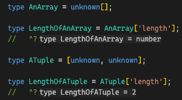
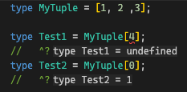
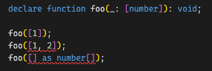
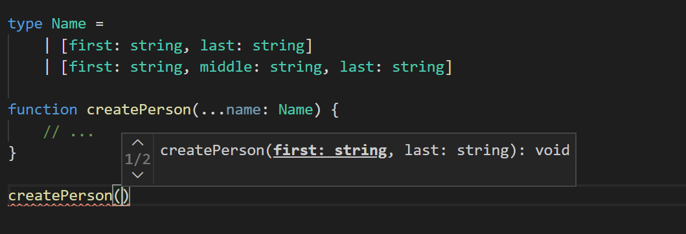

| **上一章** | **目录** | **下一章** |
| :------------- | :----------: | :------: |
| [第一章：基础知识](https://github.com/darkyzhou/You-Might-Not-Know-TypeScript/blob/main/chapter1.md) | [你可能不知道的 TypeScript](https://github.com/darkyzhou/You-Might-Not-Know-TypeScript#%E4%BD%A0%E5%8F%AF%E8%83%BD%E4%B8%8D%E7%9F%A5%E9%81%93%E7%9A%84-typescript) | [第三章：类型编程](https://github.com/darkyzhou/You-Might-Not-Know-TypeScript/blob/main/chapter3.md) |

---

# 第二章：进阶话题

## [声明合并（Declaration Merging）](https://www.typescriptlang.org/docs/handbook/declaration-merging.html)

在 TypeScript 中，一个「声明」实际上会包含下列至少一种概念的声明：

- 命名空间（namespace）
- 类型（type）
- 值（value）

下表列出了当声明某个类型时，我们实际声明了上述的哪些概念。例如，当我们使用 `class Foo` 声明了一个 `Foo` 类型时，符号 `Foo` 实际上指向了一个类型和一个值。其中，类型指的是 `Foo` 的实例类型（instance type），即通过 `new` 关键字创建出来的对象类型；值指的是 `Foo` 的构造函数。

必须要强调的是，类型是仅在编译期才存在的概念，当编译为 JavaScript 代码之后，类型不会再存在。而命名空间和值却会存在于编译产物中（尽管命名空间的存在形式比较特殊）。

| **声明的类型** | **命名空间** | **类型** | **值** |
| :------------- | :----------: | :------: | :----: |
| `namespace`    |      ✅      |          |   ✅   |
| `class`        |              |    ✅    |   ✅   |
| `enum`         |              |    ✅    |   ✅   |
| `interface`    |              |    ✅    |        |
| `type`         |              |    ✅    |        |
| 函数           |              |          |   ✅   |
| 变量           |              |          |   ✅   |

当一个标识符同时指向类型和值时，我们可以通过直接引用它的名称来获得指向的类型，通过 `typeof` 关键字获得它指向的值类型，就像下面的例子这样：

```typescript
class Foo {
  bar!: "seele";

  static baz: "sirin";
}

// 直接引用名称指代它的类型，对于 class 来说，指的是实例类型
const _0: Foo = { bar: "seele" };
const _1: Foo = new Foo();

// 使用 typeof 获得它的值类型，对于 class 来说，指的是构造函数的类型
const _2: typeof Foo = Foo;

// 注意 class 的实例类型和值类型的区别
type _3 = Foo["bar"];
//   ^? type _3 = "seele"
type _4 = (typeof Foo)["baz"];
//   ^? type _4 = "sirin"
```

类似地，如果一个名称指向一个变量声明，我们需要通过 `typeof` 来获得它指向的值类型（尽管这个名称只声明了一个值，并没有声明命名空间和类型）。

### `interface` 的声明合并

TypeScript 中同一个模块下的同名 `interface` 声明会被合并。例如，下面的两段代码是等价的。

```typescript
interface Document {
  createElement(tagName: any): Element;
}

interface Document {
  createElement(tagName: "div"): HTMLDivElement;
  createElement(tagName: "span"): HTMLSpanElement;
}

interface Document {
  createElement(tagName: string): HTMLElement;
  createElement(tagName: "canvas"): HTMLCanvasElement;
}
```

```typescript
interface Document {
  createElement(tagName: "canvas"): HTMLCanvasElement;
  createElement(tagName: "div"): HTMLDivElement;
  createElement(tagName: "span"): HTMLSpanElement;
  createElement(tagName: string): HTMLElement;
  createElement(tagName: any): Element;
}
```

这种特性有什么用呢？对于 TypeScript 来说，它被用在了 TypeScript 自带的 JavaScript 基础库和 DOM 库的类型定义中。例如，在 ECMAScript 2019 标准中，数组被引入了 `flat` 和 `flatMap` 函数，它被 TypeScript 定义在了 `lib.es2019.array.d.ts` 文件中：

```typescript
interface Array<T> {
  flatMap<U, This = undefined>(
    callback: (
      this: This,
      value: T,
      index: number,
      array: T[]
    ) => U | ReadonlyArray<U>,
    thisArg?: This
  ): U[];

  flat<A, D extends number = 1>(this: A, depth?: D): FlatArray<A, D>[];
}
```

当我们在配置文件中将目标（target）设置为了 `ES2019` 或更新的版本时，TypeScript 就会自动引入这个定义文件，为已有的数组类型定义（定义在更老的 ECMAScript 版本的类型文件中）扩充数组的类型定义。这就是为什么当调整目标之后，自动补全能够获得更多的提示。此外，这项特性还会被后文要介绍的其它进阶话题所使用。

### 命名空间的声明合并

命名空间除了能够和自身进行合并外，还能够和同名的类、函数或枚举声明进行合并，向这个名字指代的值定义中扩充更多的值。在下面的例子中，我们通过将命名空间和类声明进行合并，从而构造出了一个「内部类」定义：

```typescript
class Album {
  label: Album.AlbumLabel;
}

namespace Album {
  export class AlbumLabel {}
}
```

类似地，在下面的例子中，我们通过和函数声明进行合并，表示出了这个函数的附加属性：

```typescript
function buildLabel(name: string): string {
  return buildLabel.prefix + name + buildLabel.suffix;
}

namespace buildLabel {
  export let suffix = "";
  export let prefix = "Hello, ";
}

console.log(buildLabel("Sam Smith"));
```

上面的方法是 TypeScript 中推荐的向函数附加额外属性的方法，它能够提供良好的类型支持。

在下面的例子中，我们通过和枚举声明进行合并，为它附加了额外的函数：

```typescript
enum Color {
  red = 1,
  green = 2,
  blue = 4,
}

namespace Color {
  export function mixColor(colorName: string) {
    if (colorName == "yellow") {
      return Color.red + Color.green;
    } else if (colorName == "white") {
      return Color.red + Color.green + Color.blue;
    } else if (colorName == "magenta") {
      return Color.red + Color.blue;
    } else if (colorName == "cyan") {
      return Color.green + Color.blue;
    }
  }
}
```

### 模块扩充（Module Augmentation）

模块扩充指的是这样一种机制：在不同的模块（或源文件）中对其它模块（或源文件）的类型定义通过进行扩充。特别地，通过 `declare global` 可以向全局空间扩充类型定义，就像下面的例子一样。

```typescript
declare global {
  // 扩充值定义
  const foo: string;
  function bar(): void;

  // 扩充类型定义
  interface Baz {}
}

// 下面的代码都可以通过类型检查
console.log(foo);
bar();
const x: Baz = {};

export {};
```

请注意，模块扩充只是在扩充声明（declaration），这意味着我们编写的内容不会在编译产生的 JavaScript 代码中出现。这个过程可以被类比为编写 `d.ts` 文件。上述代码的编译结果如下所示，如果确实没有向全局空间附加这些额外的变量或函数，那么我们会在运行时遇到报错。

```typescript
console.log(foo);
bar();
const x = {};
export {};
```

值得一提的是，我们可以在模块扩充中使用声明合并。在下面的代码中，我们在 `map.ts` 中扩充了来自 `Observable.ts` 的类型定义。用户可以通过导入 `map.ts` 来获得扩充后的类型定义。

```typescript
// observable.ts
export class Observable<T> {
  // ...
}

// map.ts
import { Observable } from "./observable";

declare module "./observable" {
  interface Observable<T> {
    map<U>(f: (x: T) => U): Observable<U>;
  }
}

Observable.prototype.map = function (f) {
  // ... another exercise for the reader
};

// consumer.ts
import { Observable } from "./observable";
import "./map";
let o: Observable<number>;
o.map((x) => x.toFixed());
```

我们会在生产实践中看到更多有关模块扩充的使用例子。

## 元组（Tuple）

在 TypeScript 的类型系统中，元组是具有固定长度的有序数组。这意味着下面的特性：

访问类型的 `length` 属性会获得数字字面量类型 | 直接使用下标访问元素会被类型检查 | 作为参数类型时，不会接受数组值，也不会接受长度不对的数组字面量
:-------------------------:|:-------------------------:|:-------------------------:
 |  |  |

TypeScript 还提供了一些特殊的功能，让元组类型发挥着独特的作用。

### [具名元组元素（Labeled Tuple Elements）](https://www.typescriptlang.org/docs/handbook/release-notes/typescript-4-0.html#labeled-tuple-elements)`4.0+`

从 TypeScript 4.0 开始，可以为元组的元素赋予名称，就像下面的例子一样：

```typescript
type Foo = [first: number, second?: string, ...rest: any[]];
```

除了能够传达各个元素用作何用的信息之外，它还能在被作为函数的 [Rest Parameters](https://developer.mozilla.org/en-US/docs/Web/JavaScript/Reference/Functions/rest_parameters) 时将名称传递为函数参数名：

<p align="center">
  
</p>

### [可变元组类型（Variadic Tuple Types）](https://www.typescriptlang.org/docs/handbook/release-notes/typescript-4-0.html#variadic-tuple-types) `4.0+`

同样是从 TypeScript 4.0 开始，元组类型被赋予了可变的能力，它包含两个层面：展开语法（Spread syntax）支持泛型、剩余元素（Rest elements）可位于任意一项。

#### 展开语法（Spread Syntax）支持泛型

在元组类型中出现的展开语法，如果作用于一个泛型类型（需要约束为数组或元组类型），那么它可以在类型推导时被推导为元组类型。下面是一个例子：

```typescript
// 获得除了第一个元素之外的剩余元素
declare function tail<T extends readonly unknown[]>(
  _: readonly [unknown, ...T]
): T;

const myTuple = [1, 2, 3, 4] as const;
const myArray = ["hello", "world"];

const _1 = tail(myTuple);
//    ^? const _1: [2, 3, 4]

const _2 = tail([...myTuple, ...myArray] as const);
//    ^? const _2: [2, 3, 4, ...string[]]
```

> [!NOTE]
> **为什么 `tail` 函数泛型 `T` 的约束需要使用 `readonly unknown[]`？**
>
> 在 TypeScript 的类型系统中，只读数组（readonly array）实际上是可变数组（mutable array，即不加 `readonly` 的数组类型）的父类型。根据[接口隔离原则（Interface segregation principle)](https://en.wikipedia.org/wiki/Interface_segregation_principle)，`tail` 函数不会对输入的数组做任何修改，它只依赖数组的只读接口（访问下标等），因此我们最好显式地声明这一点。这样，用户通过 `as const` 获得的只读数组也可以传入函数。
>
> 如果将 `T` 约束为 `unknown[]`，用户不仅无法传入只读数组，也可能被误导，认为我们的函数会修改数组内容，从而防御性地传入了一份数组的拷贝（例如，`tail([...myArray])`），这样做通常是不必要的。
>
> 更一般地，`readonly` 关键字以及它背后的理念能够辅助程序员对函数接口的合约（contract）进行建模，帮助我们写出更为严谨可靠的代码。它不仅能够像上面那样作用于数组，也能够作用于一般的对象。可惜的是，它并没有得到太多人的关注。

#### 剩余元素（Rest Elements）可位于任意一项 `4.2+`

过去，剩余元素只能位于元组的最后一项，限制了它能够发挥的作用。现在，可以做到类似下面这样的事情：

```typescript
// 合并两个元组，返回正确的类型
declare function concat<
  T extends readonly unknown[],
  U extends readonly unknown[]
>(arr1: T, arr2: U): [...T, ...U];

const _1 = concat([1], [2]);
//    ^? const _1: number[]

const _2 = concat(["foo", "bar"], [1, 2]);
//    ^? const _2: (string | number)[]

const _3 = concat([1] as number[], ["foo"] as string[]);
//    ^? const _3: (string | number)[]

const _4 = concat([1] as const, ["foo"] as const);
//    ^? const _4: [1, "foo"]
```

如果结合「展开语法支持泛型」的特性，可以这样改进上面的例子：

```typescript
// 合并两个元组，返回正确的类型
declare function concat<
  T extends readonly unknown[],
  U extends readonly unknown[]
>(arr1: [...T], arr2: [...U]): [...T, ...U];

const _1 = concat([1], [2]);
//    ^? const _1: [number, number]

const _2 = concat(["foo", "bar"], [1, 2]);
//    ^? const _2: [string, string, number, number]

const _3 = concat([1] as number[], ["foo"] as string[]);
//    ^? const _3: (string | number)[]

const _4 = concat([1] as const, ["foo"] as const);
//    ^? const _4: [1, "foo"]
```

这样，我们就能在用户传入元组时得到元组类型，而不是数组类型。

### [可选元素（Optional Element）](https://www.typescriptlang.org/docs/handbook/release-notes/typescript-3-0.html#optional-elements-in-tuple-types) `3.0+`

TypeScript 允许元组中存在可选元素，即这个元素可以存在也可以不存在。它主要被用来表示包含可选参数的函数，请看下面的例子。注意当 [`strictNullChecks`](https://www.typescriptlang.org/tsconfig#strictNullChecks) 配置被打开时，TypeScript 会向可选元素的类型中附加一个 `undefined` 类型形成联合类型。

```typescript
declare function foo(arg1?: string, arg2?: number): void;

type _1 = Parameters<typeof foo>;
//   ^? type _1 = [arg1?: string | undefined, arg2?: number | undefined]
```

可选元素的存在会导致元组类型的长度虽然固定但不唯一，请看下面的例子：

```typescript
type _1 = [number, string, boolean]['length'];
//   ^? type _1 = 3

type _2 = [number, string?, boolean?]['length'];
//   ^? type _2 = 1 | 2 | 3
```

### 工具函数 `asTuple` `5.0+`

我们还能够扩展上述的 `concat` 函数，注意其中的变量 `_1`、`_2` 和 `_4`，为什么非得使用 `as const` 才能让 TypeScript 推导出字面量类型呢？实际上，我们可以通过 [`const` 类型参数（`const` type parameters）](https://github.com/darkyzhou/You-Might-Not-Know-TypeScript/blob/main/chapter2.md#const-%E7%B1%BB%E5%9E%8B%E5%8F%82%E6%95%B0const-type-parameters-50) `5.0+` 来改进这一点，让用户无需使用 `as const` 就能让 TypeScript 推导出元组字面量类型：

```typescript
declare function concat<
  const T extends readonly unknown[],
  const U extends readonly unknown[]
>(arr1: [...T], arr2: [...U]): [...T, ...U];

const _1 = concat([1], [2]);
//    ^? const _1: [1, 2]

const _2 = concat(["foo", "bar"], [1, 2]);
//    ^? const _2: ["foo", "bar", 1, 2]

const _3 = concat([1] as number[], ["foo"] as string[]);
//    ^? const _3: (string | number)[]

const _4 = concat([1] as const, ["foo"] as const);
//    ^? const _4: [1, "foo"]
```

更一般地，这里介绍一个工具函数 `asTuple`，它能够利用上述特性实现将给定的元组字面量推导为对应的元组字面量类型，注意它和 `as const` 的区别：

```typescript
function asTuple<const T extends unknown[]>(input: [...T]) {
  return input;
}

const _1 = asTuple([1, "foo"]);
//    ^? const _1: [1, "foo"]

const _2 = [1, "foo"] as const;
//    ^? const _2: readonly [1, "foo"]
```

> [!NOTE]
> 一般来说不必担心多了一个函数调用带来的 overhead，因为 minifier 很多时候都会自动去掉。不过我还没有调查过在跨模块调用的场景下类似的效果是否还会发生。

## [模板字面量类型（Template Literal Types）](https://www.typescriptlang.org/docs/handbook/2/template-literal-types.html) `4.1+`

从 TypeScript 4.1 开始，字符串字面量类型（string literal types）可以用来构造其它字符串字面量类型。具体的构造方法和 JavaScript 的模板字符串（template literals）类似，如下面的例子所示：

```typescript
type Seele = "Seele";
type HelloSeele = `Hello ${Seele}`;
//   ^? type HelloSeele = "Hello Seele"
```

模板字面量类型接受下列类型的插值：

- `string`
- `number`
- `bigint`
- `boolean`
- `undefined`
- `null`

它们能够提供针对字符串字面量的检查手段，请看下面的例子：

```typescript
// 以数字以及一个下划线开头的字符串
type StartsWithNumber = `${number}_${string}`;

// ERROR!
const _0: StartsWithNumber = "seele";

// OK!
const _1: StartsWithNumber = "114514_seele";
```

### 在联合类型（Union Types）中使用

一些人可能不知道的是，上述的插值并非只能使用单个的字符串字面量类型，联合类型也是可被接受的。此时，TypeScript 会对模板字面量类型做联合类型运算，这个过程可以被理解为对联合类型等价的集合做笛卡尔积运算：

```typescript
type VerticalAlignment = "top" | "middle" | "bottom";
type HorizontalAlignment = "left" | "center" | "right";

type Alignment = `${VerticalAlignment}-${HorizontalAlignment}`;
//   ^? type Alignment = "top-left" | "top-center" | "top-right" | "middle-left" | "middle-center" | "middle-right" | "bottom-left" | "bottom-center" | "bottom-right"
```

### 在条件类型（Conditional Types）中使用

```typescript
// 检查是否以 Seele 结尾
type _1 = "Hello Seele" extends `${string}Seele` ? true : false;
//   ^? type _1 = true

// 取出括号内的文字
type _2 = "Test (foo) bar" extends `${string}(${infer T})${string}` ? T : never;
//   ^? type _2 = "foo"
```

我们会在[后文](https://github.com/darkyzhou/You-Might-Not-Know-TypeScript/blob/main/chapter3.md#%E6%9D%A1%E4%BB%B6%E7%B1%BB%E5%9E%8Bconditional-types)对条件类型进行详细的讨论。

### 映射类型中键的重映射（Key Remapping in Mapped Types）

我们可以在映射类型（mapped types）中使用额外的 `as` 关键字来重命名构造的属性的名称。

```typescript
type Getters<T> = {
  [K in keyof T as `get${Capitalize<string & K>}`]: () => T[K];
};

interface Person {
  name: string;
  age: number;
  location: string;
}

type LazyPerson = Getters<Person>;
//   ^? type LazyPerson = {
//        getName: () => string;
//        getAge: () => number;
//        getLocation: () => string;
//      }
```

> [!NOTE]
> **代码中的 `string & K` 是什么意思？**
>
> 对象的属性名的类型可能是 `string | number | symbol` 等，而我们在这里只关心那些类型为 `string` 的属性名。可以使用交叉类型（intersection types）来实现这个功能，具体的原理是：
>
> - 当 `K` 满足 `string` 类型时，结果为 `K` 对应的字符串字面量类型
> - 否则，结果为 `never`，映射类型会过滤掉类型为 `never` 的键

## 枚举（Enum）

### 常值枚举（Const Enum）

常值枚举具有和一般的枚举显著不同的特点：对它的成员的引用会被内联（inline）到使用处（caller site）。请看下面的对比。

```typescript
enum MyEnum {
  Foo,
  Bar,
  Baz,
}

console.log(MyEnum.Baz);
var MyEnum;
(function (MyEnum) {
  MyEnum[(MyEnum["Foo"] = 0)] = "Foo";
  MyEnum[(MyEnum["Bar"] = 1)] = "Bar";
  MyEnum[(MyEnum["Baz"] = 2)] = "Baz";
})(MyEnum || (MyEnum = {}));
console.log(MyEnum.Baz);
```

对于一般的枚举，它的编译产物是一个对象。

```typescript
const enum MyEnum {
  Foo,
  Bar,
  Baz,
}

console.log(MyEnum.Baz);
console.log(2 /* MyEnum.Baz */);
```

对于常值枚举，注意到它并没有像一般的枚举那样在编译产物中留下对象的定义，而是直接将它的值内联到使用它的地方。常值枚举的这种特点可以大大减少枚举在编译产物中占据的体积，也能够带来一定的运行时性能提升。

#### 局限性

由于常值枚举的特性，它不能像一般的枚举那样使用[计算成员（computed member）](https://www.typescriptlang.org/docs/handbook/enums.html#computed-and-constant-members)。

换句话说，常值枚举的成员的值只能通过下面任一方式得到：

- 作为枚举的第一个成员没有使用初始化语句（initializer）

  > 此时，它会被赋予默认值 `0`

- 没有使用初始化语句（initializer），而且在它前面的成员都被赋予了数字常量作为值

  > 此时，它会被赋予前一个成员的值加上 `1`

- 常量表达式的计算，包括字符串字面量等，具体请见[官方文档](https://www.typescriptlang.org/docs/handbook/enums.html#computed-and-constant-members)

#### 不推荐在共享库中使用

由于常值枚举的内联特性，TypeScript 不推荐在共享库（包括 `d.ts` 文件）中使用使用它，因为[它会导致一些问题](https://www.typescriptlang.org/docs/handbook/enums.html#const-enum-pitfalls)，特别是下面的版本问题：

库 `A` 的使用者 `U` 在编译代码之后，实际上将 `A` 的*某个版本*的常值枚举的枚举值写入到了编译产物中，如果此时使用者依赖了其它库 `B`，这些库依赖了*不同版本*的 `A`，那么 `U` 和 `B` 内联得到的具体枚举值可能会不同，即便它们是同一个枚举成员，这可能会在运行时产生一些意料之外的报错。

当然，如果你只是在终端项目里使用常值枚举，并且自己的包不会被其它项目共享，那么上述问题一般不会出现。

#### 在模块扩充中使用

还记得我们在[模块扩充](https://github.com/darkyzhou/You-Might-Not-Know-TypeScript/blob/main/chapter2.md#%E6%A8%A1%E5%9D%97%E6%89%A9%E5%85%85module-augmentation)讨论过的，模块扩充一般用来为现有的类型扩充类型定义，但是不能为它扩充值吗？实际上由于常值枚举的内联特性，我们可以使用对常值枚举使用模块扩充，此时能够实现「扩充值定义」的效果。

请看下面的例子，我们直接引用 `a.ts` 的 `Registry`，却可以访问到 `b.ts` 中扩充的枚举成员。而且，和对一般的枚举进行的模块扩充不同，我们不需要实际地给扩充类型定义的声明扩充对应的值，却可以在运行时顺利执行，不会遇到报错。这是因为常值枚举具有内联的特性，在 `c.ts` 的编译产物中只会得到 `console.log("foo")`。

```typescript
// a.ts
export const enum Registry {}

// b.ts
declare module "./a" {
  const enum Registry {
    Foo = "foo",
  }
}

export {};

// c.ts
import { Registry } from "./a";

console.log(Registry.Foo);
```

这种模块扩充的用法极其特殊，因为它做到了在不同的模块中向同一个中心化的定义同时扩充类型和值定义（尽管这个「值」只能是常值枚举支持的数字或字符串字面量）。

> [!WARNING]
> **对常值枚举使用模块扩充的要求很多！**
>
> 首先，这种用法要求编译器在编译 `c.ts` 时不仅需要扫描它直接导入的 `a.ts` 文件，还需要扫描几乎其它所有源文件（去检查它们是否使用了模块扩充），所以当你在 tsconfig 中打开了 `isolatedModules` 等选项时，这个用法是无法工作的（常值枚举会被降级为普通的枚举）。
>
> 其次，本节的内容基于的是 tsc 的行为，在生产环境中使用这个技巧前请先务必确认自己使用的编译工具链是否支持这种用法。包括 babel、swc、esbuild 在内的 TypeScript 编译器对常值枚举的兼容性可能不会太好，因为它们工作在这样的一个假设上：「所有的 TypeScript 源文件都可以被独立地编译」，而上述的技巧会破坏这条假设，以至于在编译产物中常值枚举可能会被降级为普通的枚举，导致模块扩充出现问题。
>
> 类似的问题也可能存在于命名空间上，如果你在多个源文件中扩充了同一个命名空间的定义，你必须确认编译产物符合预期。

### [枚举是联合类型](https://www.typescriptlang.org/docs/handbook/release-notes/typescript-5-0.html#all-enums-are-union-enums) `5.0+`

从 TypeScript 5.0 开始，包括计算成员（computed member）在内的所有枚举成员都称为了独立类型。这意味着从此之后，一个枚举定义在类型定义的层面上实际上是一个由它的各个枚举成员对应的独立类型构成的联合类型。回忆我们在声明合并中的讨论，我们可以通过直接引用枚举定义的名字来引用它指向的类型定义。

> 在 5.0 之前，如果一个枚举不包含计算成员，那么它可能也具有上述特性。

这一特性使得我们可以在模板字面量中使用枚举类型：

```typescript
const enum MyEnum {
  Foo = "foo",
  Bar = "bar",
  Baz = "baz",
}

type _0 = `${MyEnum}`;
//   ^? type _0 = "foo" | "bar" | "baz"

enum AnotherEnum {
  Simple = 114,
  Complex = Math.random(),
}

type _1 = `${AnotherEnum}`;
//   ^? type _1 = string
// 由于 Complex 是计算成员，它的类型是 number 而不是字面量类型
// 所以最终计算得到的字符串类型为 string
```

### 枚举成员的透明性（opaque）

许多人可能遇到过这样的场景：

```typescript
enum MyEnum {
  Foo = 'foo', Bar = 'bar', Baz = 'baz'
}

declare function myFunction(value: MyEnum): void;

// 我们希望用户可以这样传参：
myFunction(MyEnum.Foo); // 编译通过

// 我们也希望用户不必导入 MyEnum 就能传参
myFunction('foo'); // 编译不通过 :(
```

结合前文对枚举是联合类型的讨论，我们很容易认为函数参数中的 `MyEnum` 类型就是它的成员值的联合类型，即 `'foo' | 'bar' | 'baz'`，因此也就觉得 `myFunction('foo')` 的用法是符合道理的。然而，为什么 TypeScript 会报错呢？简单来说，[这是一个设计决策](https://github.com/microsoft/TypeScript/issues/17690#issuecomment-321319291)：TypeScript 的设计者希望枚举具备透明性（opaque），即枚举成员实际的值可以被修改却不会导致它的消费者出错，简单来说就是 TypeScript 不希望我们可以通过枚举的值去指代某个枚举成员，因为枚举的存在意义在于枚举成员的名字，而不是它的值，考虑下面的例子：

```typescript
enum MyEnum {
  // 假如因为各种原因，我们去掉了 Foo，同时将 Bar 的值改为了 'foo'
  Bar = 'foo', Baz = 'baz'
}

// 假如 TypeScript 允许我们这么做，我们就会无声无息地得到一个 bug：
// 在修改 MyEnum 前，'foo' 指的是 MyEnum.Foo，而之后它却指代了 MyEnum.Bar
myFunction('foo');

function myFunction(value: MyEnum) {
  switch(value) {
    case MyEnum.Bar:
      // 啊哦！原本会进入 MyEnum.Foo 的逻辑进到了这里，天知道会发生什么事情！
  }
}
```

在 TypeScript 中，枚举实际上是一种「合约（contract）」，即「大家不关心成员的值是什么，只关心成员的名字」。特别是当被编译为 JavaScript 代码之后，常值枚举成员的名字不再存在，取而代之的是它实际的值。这种合约就像是在编译期（依托类型系统）对运行时中的某种常量值的约定，就像我们经常使用常量变量来在项目中「分享」某段字符串字面量，从而防止消费者不小心打错常量的值导致程序出问题那样。

一旦我们抛弃枚举的名字，试图使用枚举的值去指代枚举，那么我们很可能会在运行时中遇到类似上述的问题，此时枚举就失去了它存在的意义了。尽管你仍然可以[通过命名空间](https://www.typescriptlang.org/play?#code/HYQwtgpgzgDiDGEAEBZAngUWAVzEg3gFBIlIQAeMA9gE4AuS8VwUDAYlVUgLxIDkAM058A3MVIVq9Rs1ZIAQiBo9+AIyWjCAX0KEA9HqSAmNMBG1qkw48gDW1AFOqBZxMCwmoE8MwHdugELdAAxaBT80J00MZABVYABLZgAVKgBJYDoIGigIeDow4AAeQIA+FQAKcRJAsnI44AATKCRsYABrYCoAd2AkAH4kHKUAcwAuJECASh5sgAYkHuAIADd4wgGKEvK2zp6Q4AF4pCiB7mH8lo3dscn4sT8ApAAZEFYY4NSM7N5biOjY+MTku93CuYgyiqrag0mq0cuQev1BkgRocpjRCNkfn82mCkCs1spzlsdqQ9ucDkhxrCTv4gqFnuFsDAADYQDIAGguVwYvEu12AT3SWQeSAA2oEALpFeYVHmE+L83atHkSnE9HkAOkVHMiFOptIw5HgVOwpVpgQZrLomUyBqZ-LEuq1SmQAiqH2YSFKlKpIXgIBSzAA4tglKU0uFMjk6AALCBYXA9cJ9OXKqiqmlpaoQNBUARIAM8vg04AdEN8fmCxELPlk4Aq5208I8pMptPhfmZTPZ3PB-OC1pi5Q9PjhUM0ZDWx3O13uiClJATEDa6AAQk0TupI49wG9vpy6HDYAGUHdISgAhC0AJRxoYgMSEAboqAYO1AEb6gHh9NxIDo+milLr6QxMFgMAD6C5dbrLqur4xqW5ZqomyapkgpwQNBG6WI2Wa-C2bZCr8xaxvGtKwfBFi4NWUFprhaYIbgDZNiheYFnsOBUlSoz8L28QDv2Q6LoBY4TlO2CznwKh0VSYi+CS5ibgAajxR68CRYmWIRtYwSSeGbuauiWlSg62sA9pNDQVQ5JO049GRYCSdOUDRhOVAhKUwn6cA674WA8ocFQfQiEg54APIANKEA5OQAERCFQQUeTiJA+f5ui-Lg5gxHEHTxJuBBIG5DKKMoOiEBpWl2suSAOQATIZUkmWgiUQMlNCblZEw2XZuglU5VU1ZurmcBF0UBVUpVDBFkVDZFPVAA)或者对象字面量等方式来模拟可以被赋予字面量值的枚举，但我仍然不建议大家这么做。这种做法尽管能够提供更方便的 API，却也不可避免地带来了隐患。

不过，故事到这里还没有结束。有些出人意料的是，我们确实可以直接将数字字面量赋值给数字枚举类型：

```typescript
enum MyEnum {
  Foo, Bar, Baz
}

declare function myFunction(value: MyEnum): void;

myFunction(MyEnum.Foo); // OK!
myFunction(0); // OK! <-- WTF?
```

TypeScript 的这种「漏洞」其实是一个重要特性带来的副作用：数字枚举可以参与数学运算，就像下面的例子。

```typescript
const _1 = MyEnum.Foo | MyEnum.Bar; // OK
const _2 = MyEnum.Foo * 2; // OK
const _3 = MyEnum.Baz & 0; // OK
```

虽然[从 5.0 开始，只有数字枚举成员对应的值的字面量才能被赋给枚举](https://github.com/microsoft/TypeScript/pull/51561#issue-1451913116)，这依然没有解决上面提到的问题。特别地，我们还可能会因为调换枚举成员的顺序使得枚举成员的值发生改变，进而导致上述问题的出现，而这是一个更加可能犯的错误！我们或许又多了一个使用字符串枚举而不是数字枚举的理由。

## 名义类型（Nominal Typing）

还记得文章开头有关[结构化类型和名义类型之间区别](https://github.com/darkyzhou/You-Might-Not-Know-TypeScript/blob/main/chapter1.md#%E7%BB%93%E6%9E%84%E5%8C%96%E7%B1%BB%E5%9E%8Bstructural-typing)的讨论吗？在名义类型中，如果函数的入参是某种特定类型，那么我们就必须通过一定的手段构造出这个类型的值才能输入给函数。在实践中，名义类型的这种对 API 用户侧提供约束的功能有着它独特的用武之地。包括约束功能在内，名义类型有着多种特殊用法。

### 在现有类型上施加约束

假设我们想引入一系列 API，而且它们仅接受正数作为入参。传统的实践可能是在 API 的各个函数中重复地检查入参是否为正数。这种实践的扩展性很差，而且很容易引入多次不必要的检查。

通过名义类型，我们可以将这种繁琐的任务转移给用户侧，提供更加简洁、更加内聚的 API 实现：

```typescript
declare const TYPE_TAG: unique symbol; // 2.7+
// 通过 & 并入一个特殊属性来定义名义类型（一些人将这个过程称为 Tagging）
type PositiveValue = number & { [TYPE_TAG]: '_' };

// 我们的 API
declare function doSomething(value: PositiveValue): void;

// 我们自己提供一个将 number 转为 PositiveValue 的函数
function asPositiveValue(value: number): PositiveValue {
  if (value <= 0) {
    throw new Error(...);
  }
  return value as PositiveValue;
}

doSomething(-123); // 报错
doSomething(asPositiveValue(123)); // 不报错
```

使用 `unique symbol` 而不是字符串作为属性名不是必要的，不过我们推荐使用这种方法，因为 Lanuage Service 提供的自动补全不会将这个属性考虑在内，避免对用户造成不必要的干扰，同时也能避免用户无意中访问这个「假的属性」造成运行时错误，因为这个属性只是我们在类型里附加上去的。

> [!WARNING]
> **错误处理实在是一个复杂的话题！**
>
> 关于一个函数在接受非法输入时是否应该抛错还是返回一种合法结果，需要考虑非常多复杂的状况（尽管大多数时候，人们根本不考虑这些）。名义类型为我们提供了另一种思路：用调用前检查取代调用后抛错，直接阻止用户传入非法输入。我们将在关于[非空数组的讨论](https://github.com/darkyzhou/You-Might-Not-Know-TypeScript/blob/main/chapter2.md#%E9%9D%9E%E7%A9%BA%E6%95%B0%E7%BB%84non-empty-array)中继续这个话题。

> [!WARNING]
> **对数组和对象类型使用本节介绍的方法是危险的！**
>
> 在 JavaScript 中数组和对象的引用是可以被随意共享的，并没有好的办法保证某个数组或者对象在某个时刻只存在一个引用。这就导致了如果你使用其中一个引用通过了类似 `asPositiveValue` 的名义类型转换，其它代码却可能通过它持有的那份引用修改了对象内部的属性，破坏了名义类型本身的约束。我们将在关于[非空数组的讨论](https://github.com/darkyzhou/You-Might-Not-Know-TypeScript/blob/main/chapter2.md#%E9%9D%9E%E7%A9%BA%E6%95%B0%E7%BB%84non-empty-array)中继续这个话题。

### 附加元信息

名义类型也可以用在给某个现有的类型附加一些「元信息」，这些元信息可以是泛型参数，也可以是字符串、数组等类型，用来给和它相关的函数的类型检查提供信息。在下面的例子中，我们通过给字符串附加一个泛型参数让它携带了这个字符串对应的依赖注入值的类型信息。

```typescript
declare const TYPE_TAG: unique symbol; // 2.7+
type StringInjectToken<T> = string & { [TYPE_TAG]: T };

// 依赖注入的函数
declare function inject<T>(token: StringInjectToken<T>): T | null;

// 我们的用户服务和对应的注入 Token
declare class UserService {}
const USER_SERVICE = "userService" as StringInjectToken<UserService>;

// 用户可以通过使用这个 token 获得类型提示
const userService = inject(USER_SERVICE);
//    ^? const userService: UserService | null
```

### 阻止 Type Alias Preservation

当我们使用一些复杂的联合类型时，由于 [4.2 版本引入的 Smarter Type Alias Preservation 特性](https://www.typescriptlang.org/docs/handbook/release-notes/typescript-4-2.html#smarter-type-alias-preservation)，TypeScript 不会展开这些联合类型。正如下面的例子，很难看出这个类型具体是哪些类型的联合。

```typescript
type Foo = 1 | 2 | 3;
type Bar = Foo | 4 | 5;
//   ^? type Bar = Foo | 4 | 5
```

此时可以使用 `Foo & {}` 阻止 TypeScript 的这种行为：

```typescript
type Foo = 1 | 2 | 3;
type Bar = (Foo & {}) | 4 | 5;
//   ^? type Bar = 1 | 2 | 3 | 4 | 5
```

### 阻止联合类型的 Subtype Reduction

当使用联合类型声明一些字面量类型和它对应的父类型（比如 `'foo'` 和 `string`）时，TypeScript 会将联合类型中的 `'foo'` 约去，因为这个字面量类型是它的子类型，而且它的值可以覆盖 `'foo'`。这个过程被称为 subtype reduction。

有时候我们并不希望出现这种行为，例如在下面的例子中，我们希望用户在使用 `foo()` 时得到 `'a'` 和 `'b'` 的自动补全提示，但碍于 TypeScript 的上述行为，自动补全只会提供 `string` 的补全提示。

```typescript
declare function foo(input: "a" | "b" | string): void;
```

此时，我们可以通过 `string & {}` 阻止这种行为。这里的原理（rationale）是通过提供一个名义类型阻止了 TypeScript 的约去动作。

```typescript
declare function foo(input: "a" | "b" | (string & {})): void;
```

> 即将推出的 TypeScript 5.3 版本可能会解决上述问题，使得我们不需要再使用 `& {}`。

## 控制流中的类型具化

TypeScript 在对源码的控制流分析中可能会施加[类型具化](https://github.com/darkyzhou/You-Might-Not-Know-TypeScript/blob/main/chapter1.md#%E7%B1%BB%E5%9E%8B%E5%85%B7%E5%8C%96type-narrowing)，运用好这个特性能够帮助简化代码，以及提供类型检查。

### Discriminated Union Types

一种很常见的场景是，我们有一个对象值，它满足且只满足若干个 `interface` 定义的其中一个。同时，我们需要在代码中区分这个对象值究竟满足的是哪个 `interface` 定义。就像下面的例子一样：

```typescript
interface Apple {
  foo: string;
}

interface Banana {
  bar: number;
}

interface Watermelon {
  foo: string;
  bar: number;
}

function myFunction(value: Apple | Banana | Watermelon) {
  // 如何类型安全地区分 value 的不同的类型？
}
```

在上面的例子中，如果三个 `interface` 都含有不同的属性，那么我们通过 `in` 关键字就能够让 TypeScript 利用类型具化的机制进行区分。但是，实际情况中我们更多地会遇到一些部分含有相同属性的类型。

除了为每个类型编写对应的 [type predicates](https://www.typescriptlang.org/docs/handbook/2/narrowing.html#using-type-predicates) 这种费时费力且[不可扩展](https://github.com/darkyzhou/You-Might-Not-Know-TypeScript/blob/main/chapter1.md#%E7%B1%BB%E5%9E%8B%E7%B3%BB%E7%BB%9F%E7%9A%84%E7%9B%AE%E7%9A%84)的办法，我们还可以使用一种被称为 Discriminated Union Types 的技巧。在这种技巧中，需要为每个类型引入一个字符串字面量类型，作为这种类型的标签，它们的属性名必须相同，就像下面的代码那样。

这种技巧的原理是：TypeScript 在计算 `Apple | Banana | Watermelon` 这个联合类型时，会将它们的公共属性（即 `type`）提取出来作为联合类型整体的属性，此时 `type` 会指向 `'apple' | 'banana' | 'watermelon'`。通过使用控制流区分这个联合类型，TypeScript 会自动地具化它所属的 `value` 的类型。

```typescript
interface Apple {
  type: "apple";
  foo: string;
}

interface Banana {
  type: "banana";
  bar: number;
}

interface Watermelon {
  type: "watermelon";
  foo: string;
  bar: number;
}

function myFunction(value: Apple | Banana | Watermelon) {
  switch (value.type) {
    case "apple":
      // 此时，value 的类型被具化为 Apple
      break;
    // ...
  }
}
```

### Exhaustive Guard（Exhaustive Check）

在实践中，我们经常会对某个枚举值或者联合类型值进行特化处理，就像下面的代码这样。

```typescript
enum MyType {
  Foo,
  Bar,
}

declare const someValue: MyType;

switch (someValue) {
  case MyType.Foo:
    // 此时 someValue 的类型为 MyType.Foo
    break;
  case MyType.Bar:
    // 此时 someValue 的类型为 MyType.Bar
    break;
  default:
  // 因为我们已经在前面的分支语句处理了所有的情况
  // 所以现在 someValue 的类型为 never
}
```

如果 `MyType` 引入了新的枚举值 `Baz`，`default` 分支中的 `someValue` 的类型就会变为 `MyType.Baz`。利用这个特性，我们可以引入一种被称为 exhaustive guard （或者 [Exhaustive check](https://www.typescriptlang.org/docs/handbook/2/narrowing.html#exhaustiveness-checking)）的技巧：

```typescript
function exhaustiveGuard(value: never): never {
  throw new Error(`Exhaustive guard failed with ${value}`);
}
```

在 `default` 分支中插入 `exhaustiveGuard(someValue)` 就可以检查当前分支下的值是不是 `never`——换句话说，通过这种方式我们可以在编译期就检查条件语句是否考虑了值的类型的所有情况，避免需要检查的值因为被引入了新的枚举值（或者联合类型）导致对应的情况进入了 `default` 分支造成各种问题。

理论上来说，`exhaustiveGuard()` 里的抛错语句不是必要的——因为在编译时就可以抛错了，对吧？不过，保险起见还是要在运行时做好兜底，因为[我们常常会通过滥用 as 等方式欺骗 TypeScript](https://github.com/darkyzhou/You-Might-Not-Know-TypeScript/blob/main/chapter2.md#%E6%BB%A5%E7%94%A8%E7%B1%BB%E5%9E%8B%E6%96%AD%E8%A8%80type-assertion)，让这套仅存在于编译期的机制误以为我们已经处理了所有情况。

如果你不在乎运行时的兜底，可以使用 `satisfies 4.9+` 来做到相同的事情。我们会在[后文](https://github.com/darkyzhou/You-Might-Not-Know-TypeScript/blob/main/chapter2.md#%E6%BB%A5%E7%94%A8%E7%B1%BB%E5%9E%8B%E6%96%AD%E8%A8%80type-assertion)介绍这个关键字。

```typescript
switch (someValue) {
  case MyType.Foo:
    // 此时 someValue 的类型为 MyType.Foo
    break;
  case MyType.Bar:
    // 此时 someValue 的类型为 MyType.Bar
    break;
  default:
    someValue satisfies never;
}
```

## 类型系统至暗时刻

TypeScript 的类型系统不是完美的，在一些场景下它需要程序员去配合它才能正常工作。可是许多不耐烦的程序员总是倾向于通过一些强硬的手段让 TypeScript「闭嘴」，通过一些「不安全」的办法绕过类型检查（我曾经也会这样！）。下面，我们将介绍一些比较常见的让 TypeScript 闭嘴的方式，注意它们是如何阻碍 TypeScript 进行类型检查，造成使类型错误逃逸到运行时的风险的。

### 滥用 `any`

> [!NOTE]
> **回顾一下为什么 `any` 类型如此特殊！**
>
> `any` 类型是类型系统提供的一种「后门」。在使用它时，TypeScript 只会检查语法，而不会执行任何类型检查，尤其是在下面的两个场景中：
>
> - 当访问类型为 `any` 的值的属性时，TypeScript 不会进行类型检查
> - 当类型为 `any` 的值被赋予子类型时，TypeScript 不会进行类型检查

这里我们不讨论将一些符号赋予为 `any` 类型的实践，因为通常它会被用在下面的场景：

- 第三方依赖的类型定义有误，不得已而为之。这是第三方依赖的话题
- 给予类型定义的收益不高。这是项目管理的话题

这里主要讨论一个比较常见的关于 `any` 的误用：当程序员不关心某个符号的具体类型，想要表达 **「这个符号的类型是什么都可以」** 时，使用 `any` 标注这个符号的类型。我认为，人们之所以选择使用 `any` 的原因，在于对它名字的误解。参考下面的例子，注意到 TypeScript 竟然没有报任何一个错误。

```typescript
function myFunction(value: any) {
  value.bar();
  const myNumber = value * Math.random();
  console.log(value + myNumber);
}
```

**「不关心类型为何」** 不能被等同于 **「可以忽略它的类型」**，而应被视为 **「它存在一个未知的类型」** 。许多人采用了前一种思考方式，让 `any` 类型禁用了相关的类型检查，导致代码出现了具有传播性的漏洞，这种漏洞会导致类型错误逃逸到运行时中，削弱了 TypeScript 本身的作用。试想，我们需要调用一个仅接受字符串的 API，而实际传入的是一个 `any` 类型的值，我们又做了什么事情确保它的类型是正确的呢？

同样是上面的例子，当使用 `unknown` 取代 `any` 之后，TypeScript 正确地提供了类型错误，让我们在使用 `value` 之前先确定好它的具体类型。从这个角度来说，`unknown` 远比 `any` 更加切合需求。事实上，除了「[都是 top types](https://github.com/darkyzhou/You-Might-Not-Know-TypeScript/blob/main/chapter1.md#%E7%B1%BB%E5%9E%8B%E6%98%AF%E5%80%BC%E7%9A%84%E9%9B%86%E5%90%88)」这一点外，`unknown` 和 `any` 几乎没有任何共同点了！当需要使用 top types 时，我们在绝大多数情况下需要的都会是 `unknown` 而不是 `any`。

TypeScript 自带的类型库，特别是 `JSON.parse` 和 `fetch.json()` 的返回值都使用了 `any` 类型，饱受许多人的诟病。一些[工具类型库](https://github.com/total-typescript/ts-reset)会将它们修补为 `unknown` 类型。

### 滥用类型断言（Type Assertion）

[类型断言](https://www.typescriptlang.org/docs/handbook/2/everyday-types.html#type-assertions)，包括 `as` 关键字在内，是 TypeScript 中又一个受到了大量滥用的功能。它的作用是将某个符号的类型进行*强制的 upcast 或 downcast*，让程序员可以为符号赋予一些 TypeScript 没能推导出来的类型。对它大多数滥用都将它当作了类似于声明变量时使用的 `variable: type` 这种手动标注类型的办法。

在下面的例子中，我们的目标是「让 `myObject` 具有 `MyObject` 类型」。注意到我们并没有给 `myObject` 填入应该填入的 `bar` 和 `baz` 属性，但 TypeScript 并没有提供任何错误。这是因为通过 `as` 将对象字面量推导出来的类型 `{ foo: string }` 被强制地 downcast 为了 `MyObject` 类型，然后将它分配给了符号 `myObject` 的类型。这个过程中并不会发生期望的类型检查。

```typescript
interface MyObject {
  foo: string;
  bar: number;
  baz: boolean;
}

const myObject = {
  foo: "Hello, World!",
} as MyObject;
```

正如[类型是值的集合](https://github.com/darkyzhou/You-Might-Not-Know-TypeScript/blob/main/chapter1.md#%E7%B1%BB%E5%9E%8B%E6%98%AF%E5%80%BC%E7%9A%84%E9%9B%86%E5%90%88)提到的，downcast 不是一种安全的操作，但是 `as` 会让 TypeScript 忽略这个问题，毕竟这个功能叫「断言（assertion）」。如果我们将这样的 `myObject` 传给其它参数，我们很可能在运行时会遇到报错，完全放弃了 TypeScript 能够提供的类型检查能力。

> 尽管如此，类型断言还是会在程序员尝试将类型转化为不兼容的类型时抛错，例如：
>
> ```typescript
> const x = "hello" as number;
> // Conversion of type 'string' to type 'number' may be a mistake because neither type sufficiently overlaps with the other. If this was intentional, convert the expression to 'unknown' first.
> ```
>
> 为此，TypeScript 提供了一些方法绕过这种检查，例如先泛化再具化：
>
> ```typescript
> const x = "hello" as unknown as number;
> // OK
> ```

> [!NOTE]
> TypeScript 的 4.9 版本引入了[一个新的关键字 satisfies](https://www.typescriptlang.org/docs/handbook/release-notes/typescript-4-9.html#the-satisfies-operator)，它的语义是「将某个值的类型推导为给定类型」（注意它和类型断言在语义上的显著区别）。在上面的例子中我们可以将 `as MyObject` 修改为 `satisfies MyObject`，这样 TypeScript 就会提供正确的报错。这里的原理（rationale）是：我们通过 `satisfies` 告诉 TypeScript 这个对象字面量的类型是 `MyObject`，当我们修改时请检查这个字面量的值是否满足这个类型。

具有讽刺意味的是，[TypeScript 的官方文档说，类型断言应该被运用在类似下面的场合](https://www.typescriptlang.org/docs/handbook/2/everyday-types.html#type-assertions)：

```typescript
const myCanvas = document.getElementById("main_canvas") as HTMLCanvasElement;
```

TypeScript 不知道我们的 `#main_canvas` 指向一个 `canvas` 元素，但知道它是一个 `HTMLElement`，所以我们需要通过这种方式来将类型具化为 `HTMLCanvasElement`。看上去很有道理，但我认为这导致了关于类型断言的另一种滥用形式，它仍然不是一种安全的用法。注意到 `document.getElementById()` 的函数签名如下：

```typescript
getElementById(elementId: string): HTMLElement | null;
```

此函数在 `elementId` 指向的元素不存在时会返回 `null`，而我们通过类型断言将返回值限定为 `HTMLCanvasElement` 之后舍弃了这个信息。这就意味着我们依然抛弃了 TypeScript 的类型检查能力，在运行时可能遇到报错（可以据此想像有多少类型错误这种滥用而逃逸到了运行时中）。

类似这种返回值类型包含空值类型，程序员却通过类型断言忽视掉的问题甚至有可能造成 eslint 这类工具的误判。在我所在的团队中，近期发生了数个 Oncall 缺陷，它们的原因相同：eslint 认为某些使用了类型断言的变量（例如 `const foo = ... as Foo`）不可能包含空值，所以将引用了 `foo` 的 optional chain 去掉了（例如将 `foo?.bar()` 改为了 `foo.bar()`）。

一个可能的解决方法是：使用 `as HTMLCanvasElement | null`。但它不是一个[可扩展](https://github.com/darkyzhou/You-Might-Not-Know-TypeScript/blob/main/chapter1.md#%E7%B1%BB%E5%9E%8B%E7%B3%BB%E7%BB%9F%E7%9A%84%E7%9B%AE%E7%9A%84)的办法：如果这个函数发生了修改，返回了其它类型的元素，或者会返回 `undefined` 而不是 `null`，那么我们使用的类型断言很可能不会产生任何报错，类型错误又逃逸到了运行时中。

说到这里，我很倾向于告诉大家 **不要使用任何类型断言**，因为我几乎想不到它的任何安全的使用价值，除了[我们在名义类型中看到的用法](https://github.com/darkyzhou/You-Might-Not-Know-TypeScript/blob/main/chapter2.md#%E5%90%8D%E4%B9%89%E7%B1%BB%E5%9E%8Bnominal-typing)，以及作为某些细分场景下不得已的 workaround。如果你真的遇到了需要使用类型断言的场景，那么这说明你使用的 API 有问题，应该从源头修复问题而不是在另一端假装自己避开了问题。正如我们看到的，类型断言很容易成为一种掩耳盗铃的、自欺欺人的手段。

> [!NOTE]
> 就上面的 `getElementById()` 来说，我认为它的类型定义应该被修改为：
>
> ```typescript
> getElementById<T extends HTMLElement = HTMLElement>(id: string): T | null;
> ```
>
> 这样，用户既能够手动限定类型，又能够受到返回值可能为 `null` 的约束。

### 误用泛型

这里讨论一个常见的对泛型的误用：实例化（instantiate）某个泛型参数之后没有为它提供类型别名。

我们从下面的例子出发，这个例子定义了一个带泛型的类 `API`，它的泛型参数用来承载 `foo` 属性。我们常在生产实践中看到这样的类，它们接受泛型参数让用户可以指定具体的类型，而类本身不太关心具体的类型为何（或者说它们本身只工作在通过 `extends` 约束的顶层接口上）。

```typescript
class API<T = unknown> {
  constructor(readonly foo: T) {}
}
```

问题常常出现在不同模块或函数共享某个 `API` 的实例类型的时候。我们很容易忘记泛型信息的传递，导致用户不得不使用类型断言，就像下面的例子这样。

```typescript
class OtherModule {
  constructor(readonly api: API);
}

const api = new API("It's a string!");
const otherModule = new OtherModule(api);
doSomething(otherModule.api.foo as string);
```

就这个例子来说，问题的直接原因是：我们为 `API` 的泛型参数提供了默认值，导致用户可以「偷懒」地忽略对泛型参数的指定；根本原因则是：我们没有独立地看待实例化后的泛型类型。

[后文](https://github.com/darkyzhou/You-Might-Not-Know-TypeScript/blob/main/chapter3.md#%E6%B3%9B%E5%9E%8Bgenerics)会详细讨论泛型，不过目前我们只需要知道：带泛型的类型一旦被实例化（被赋予具体的类型）之后会成为一个新的类型。换言之，`API<X>` 和 `API`（由默认值等价于 `API<unknown>`）不应该被视为相同的类型，即使有时候后者可以被赋给前者。

`OtherModule` 的构造函数中 `api` 的类型被定义为 `API` 就是一个根本性的错误，但是即便我们通过去掉 `API` 的泛型默认值，也不能得到一个[可扩展](https://github.com/darkyzhou/You-Might-Not-Know-TypeScript/blob/main/chapter1.md#%E7%B1%BB%E5%9E%8B%E7%B3%BB%E7%BB%9F%E7%9A%84%E7%9B%AE%E7%9A%84)的解决方案。所有需要共享 `API<string>` 类型的地方都需要手动地指定 `string` 作为 `T` 的类型，而一旦后续决定不再使用 `string` 类型，则需要花费很大力气修改代码。

一个可能的解决方案是：为 `API<string>` 类型提供别名，尊重「它已经是一个新类型」的事实。就像下面这样：

```typescript
type MyAPI = API<string>;

class OtherModule {
  constructor(api: MyAPI);
}

const api: MyAPI = new API("It's a string!");
const otherModule = new OtherModule(api);
doSomething(otherModule.api.foo); // 不再需要类型断言！
```

总的来说，一旦需要复用某些类型（特别是实例化后的泛型类型），我们都需要使用类型别名让这种类型称为一种「权威」，一种可供后续代码直接复用的东西。这些代码不应该承担「应该如何实例化泛型类型」的职责。

### 慎用 Type Predicate

我们在前文类型具化中提到，可以使用 Type Predicates 来手动具化类型，就像下面的代码这样：

```typescript
declare function isNumber(input: unknown): input is number;

declare const someValue: unknown;
if (isNumber(someValue)) {
  // 此时，someValue 的类型被具化为 number
}
```

Type Predicates 其实是一种和类型断言类似的强制性手段，尽管它确实存在运行时的检查能够保障这种断言的正确性，不过我们必须注意：这只是一种快照式的保障，它只能确保给定的值在输入函数的那一刻是某种类型，它不总能确保它在之后仍然是这种类型。请看下面的例子：

```typescript
declare function isArrayOfSingleNumber(array: unknown[]): array is [number];

declare const myArray: unknown[];
if (isArrayOfSingleNumber(myArray)) {
  // myArray 现在确实是 [number] 了

  // 😈 做点坏事！
  myArray.push(2);

  // 呃……myArray 现在的类型仍然是 [number]，尽管我们都知道它应该是 [number, number] 了
}
```

对于数组和对象这类能够就地（in-place）修改数据的类型来说，我们可能通过这些修改而导致它的类型不再和 Type Predicates 具化为的类型一致，从而可能引发和类型断言一样的问题。从这点上看，Type Predicates 除非被用在原始类型上，否则它至少和类型断言同等危险，尤其是许多人都以为它能够在运行时进行检查于是就将它作为一种安全的手段而放松了警惕。因此，在使用类型断言时需要特别注意检查后的值是否会从原本的类型空间迁移出去。

就数组和对象来说，我们可以修改 Type Predicate 的返回值类型为只读（readonly）类型，这样就可以避免用户后续再对它做出修改，就像下面的代码：

```typescript
// 👇 注意新增的 readonly 关键字
declare function isArrayOfSingleNumber(array: unknown[]): array is readonly [number];

if (isArrayOfSingleNumber(myArray)) {
  // 👿 怎么编译不通过了，原来是因为 ReadonlyArray 类型没有 push 函数！
  myArray.push(2);
}
```

在本节末尾，我想额外讨论一个我讨厌 Type Predicate 的原因：*它对 API 提供者自己来说也不是安全的*。

笔者最近在编写幻灯片的动画播放控制功能，我提供了一个时间线抽象来承载需要先后按顺序触发的动画，在时间线上，我们有两种不同的步骤，一种位于时间线的两个端点，用于标识时间线的界限；另一种位于端点之间，用于标识各种动画的执行。这两种步骤包含不同的信息，其中后者会包含一个 `index` 属性用于区分它们之间的相对顺序，就像下面的代码：

```typescript
// 位于端点的步骤类型
export interface BoundaryStep {
  kind: 'initial' | 'final';
}

// 位于端点之间的步骤类型
export interface ActionStep {
  kind: 'leading' | 'gap' |  'ending' | 'formal';
  index: number;
}

// 它们构成的联合类型
export type AnimationTimelineStep = BoundaryStep | ActionStep;
```

现在，给定一个 `AnimationTimelineStep` 类型的值，我的代码需要能够区分这两种不同类型的步骤。我们自然而然地想到可以提供一个 Type Predicate 来完成这件事，就像下面的代码：

```typescript
export function isBoundaryStep(step: AnimationTimelineStep): step is BoundaryStep {
  return step.kind === 'initial' || step.kind === 'final';
}
```

这似乎是个可行的方案，只是给 API 提供者带来了一个问题：如果后续 `BoundaryStep` 的 `kind` 新增了一些情况，又或者我们把 `'initial'` 的情况搬到了另一种步骤类型，那么这个 Type Predicate 不会有任何编译错误，但它在运行时却不能正确地工作了。

也许你会尝试将上述判据改为 `!('index' in step)`，但这是一个更加危险的做法：

- `BoundaryStep` 未来可能也会引入一个 `index` 属性，届时你的判据会失效，但仍然编译通过。
- `ActionStep` 未来可能会去掉 `index` 属性或者改名，届时你的判据也会失效，但仍然编译通过。

总之，在这种情况下 Type Predicate 无法为你的判断条件提供充足的类型检查，这就是它尴尬的处境！它很难保证代码的正确性，无论是对 API 的用户还是作者而言皆如此。对于上面的例子，我想到了下面的两种解决办法，但他们无一不带来了额外的问题，很难称得上实用且安全。

```typescript
// 方案一：转向 class
export class BoundaryStep {
  constructor(
    readonly kind: 'initial' | 'final'
  ) {}
}

export class ActionStep {
  constructor(
    readonly kind: 'leading' | 'gap' |  'ending' | 'formal',
    readonly index: number,
  ) {}
}

declare const someStep: AnimationTimelineStep;

// 这样，我们就可以通过 instanceof 来安全地判断究竟是哪个类型了
if (someStep instanceof BoundaryStep) {
  // ...
}

// 😭 可是，用户被迫地需要使用构造函数来创建实例
// 通过函数传参的方式构造对象实例并不直观，而且不安全：
// 函数参数调换位置或发生其他改变时，调用它的用户可能不会产生编译错误
const myStep = new ActionStep('leading', 0);
```

```typescript
// 方案二：手动指定 Tag
export interface BoundaryStep {
  tag: 'boundary';
  kind: 'initial' | 'final';
}

export interface ActionStep {
  tag: 'action'
  kind: 'leading' | 'gap' |  'ending' | 'formal';
  index: number;
}

export function isBoundaryStep(step: AnimationTimelineStep): step is BoundaryStep {
  return step.tag === 'boundary';
}

// 🙃 可是，用户以后创建实例时就必须带上奇怪的 tag，非常繁琐
const myStep = { tag: 'action', kind: 'leading', index: 0 };
```

更好的解决方案通过引入特殊的构造方式和 API 来解决问题，这里推荐使用 [@practical-fp/union-types](https://www.npmjs.com/package/@practical-fp/union-types?activeTab=readme) 库。下面是一段解决了上述问题的代码。顺便说一句，这个库要求 TypeScript `4.2+` 版本。

```typescript
// 类似方案二的方式，不过它帮我们封装好了很多东西
type AnimationTimelineStep =
  | Variant<"BoundaryStep", { kind: 'initial' | 'final' }>
  | Variant<"ActionStep", { kind: 'leading' | 'gap' |  'ending' | 'formal' }>

// impl() 使用了 Proxy，如果你不喜欢可以改用 constructor()
const { BoundaryStep, ActionStep } = impl<AnimationTimelineStep>()

function doSomethingWithStep(step: AnimationTimelineStep) {
  // 通过模式匹配来区分类型
  return matchExhaustive(step, {
    BoundaryStep: (...) => ...,
    ActionStep: (...) => ...,
  })
}

// 😘 相比之下，这种构造方式更加清晰直观！
const circle = BoundaryStep({ kind: 'initial' })
```

## 一些零碎的技巧

本节会介绍一些零碎的 TypeScript 技巧，它们的内容不足以让它们成为单独的一节。

### `const` 类型参数（`const` Type Parameters） `5.0+`

在声明函数中的泛型时，可以通过额外的 `const` 关键字来约束类型系统在类型推导时尽量使用字面量类型。目前，这种约束只对函数调用时直接写在括号中的字面量有效。

下面是它的使用例子，注意到要想让 `names` 被推导为字面量类型，过去我们只能通过让函数调用方手动编写 `as const` 来实现。这是不方便的，因为对字面量的需求来自于函数定义方，不应该将这层抽象泄漏给函数调用方。

```typescript
type HasNames = { names: readonly string[] };
declare function getNamesExactly<T extends HasNames>(arg: T): T["names"];

const names = getNamesExactly({ names: ["Alice", "Bob", "Eve"] });
//    ^? const names: string[]
```

通过使用 `const` 类型参数，可以在函数定义侧做到和 `as const` 类似的事情：

```typescript
type HasNames = { names: readonly string[] };
declare function getNamesExactly<const T extends HasNames>(arg: T): T["names"];

const names = getNamesExactly({ names: ["Alice", "Bob", "Eve"] });
//    ^? const names: readonly ["Alice", "Bob", "Eve"]
```

### [Immediately Indexed Mapped Type（IIMT）](https://www.totaltypescript.com/immediately-indexed-mapped-type)

这个技巧主要用于对一个联合类型进行迭代，进而构造出一个由对象类型构成的联合类型。它的基本形式如下：

```typescript
export type ResultType = {
  // 👇 T 取自联合类型      👇 使用 T 构建对应的对象类型
  [T in SomeUnionType]: {};
}[SomeUnionType]; // 👈 创建一个马上运行的映射类型（mapped type）
```

下面是一个使用例子，它构造了 CSS 单位构成的对象类型的联合类型：

```typescript
type CSSUnits = "px" | "em" | "rem" | "vw" | "vh";

/**
 * type CSSLength =
 *   | { length: number; unit: 'px'; }
 *   | { length: number; unit: 'em'; }
 *   | { length: number; unit: 'rem'; }
 *   | { length: number; unit: 'vw'; }
 *   | { length: number; unit: 'vh'; };
 */
export type CSSLength = {
  [U in CSSUnits]: {
    length: number;
    unit: U;
  };
}[CSSUnits];
```

我们可以将这种技巧推广到由对象类型构成的联合类型，就像下面的例子这样：

```typescript
type Event =
  | {
      type: "click";
      x: number;
      y: number;
    }
  | {
      type: "hover";
      element: HTMLElement;
    };

// 对某个含有 type 属性的对象类型，将它的 type 属性加上一个字符串前缀
// 同时，其它属性保持不变
type PrefixType<E extends { type: string }> = {
  type: `PREFIX_${E["type"]}`;
} & Omit<E, "type">;

/**
 * | { type: 'PREFIX_click'; x: number; y: number; }
 * | { type: 'PREFIX_hover'; element: HTMLElement; }
 */
type Example = {
  //               👇 使用了「映射类型中键的重映射」
  [E in Event as E["type"]]: PrefixType<E>;
}[Event["type"]];
```

### 工具类型 `Prettify`

当我们写出一些复杂的对象类型时，TypeScript 的类型提示并不会显示它的实际内容（或者说，它展示的类型不够直观），这对使用这个类型造成了一定的困难，因为我们不能马上知道这个类型究竟具有哪些属性。

```typescript
type TypeA = { foo: number };
type TypeB = { a: TypeA } & { baz: number };
//   ^? type TypeB = { a: TypeA } & { baz: number }
```

我们可以使用名义类型中[阻止 Type Alias Preservation](https://github.com/darkyzhou/You-Might-Not-Know-TypeScript/blob/main/chapter2.md#%E9%98%BB%E6%AD%A2-type-alias-preservation) 的技巧，编写下面这样的工具类型。

```typescript
export type Prettify<T> = {
  [K in keyof T]: Prettify<T[K]>;
} & {};
```

有了它的帮助，上面的 `TypeB` 会被 TypeScript 提示为更加清晰直观的形式。

```typescript
type TypeB = Prettify<{ a: TypeA } & { baz: number }>;
//   ^? type TypeB = { a: { foo: number }; baz: number; }
```

### 非空数组（Non-Empty Array）

在一些场景下，长度为 `0` 的数组（即空数组）是有害的，或者说严重违背了 API 的语义。在这种情况下，用户向 API 传入的空数组具有着类似 `undefined` 或者 `null` 那样的破坏力。考虑一个 `last` 函数，它接受一个数组作为参数，返回这个数组的末尾元素。从设计的角度来说，如何处理「用户可以输入空数组」这一事实呢？

- 允许用户输入空数组，当发现数组为空时，抛错

  可是，抛错是一件很严肃的事情。我们需要在注释中写清楚这个函数可能抛出的错误。但是，在 JavaScript 中并不存在一种手段让用户在调用函数时必须处理潜在的抛错。所以，粗心的用户总是会什么都不检查就调用我们的函数，代码质量悄悄地降下了它的身姿。

- 允许用户输入空数组，当发现数组为空时，返回 `null`

  或许是一种可行的方案。用户需要手动检查返回值是否为 `null`，从而知道自己是否传入了非法的参数。不过，如果我们的函数不是 `last`，而是一些没有办法提供有意义的特殊返回值的函数（特别是一些存在复杂的副作用逻辑的函数），这个方法就行不通了。

顺着在[名义类型](https://github.com/darkyzhou/You-Might-Not-Know-TypeScript/blob/main/chapter2.md#%E5%90%8D%E4%B9%89%E7%B1%BB%E5%9E%8Bnominal-typing)中的讨论，我们提出另外一种解决思路：不允许用户输入空数组。这样，我们就将输入合法性的问题从函数的实现方转嫁给了调用方，从某种程度上说这样是更合理的，就像你不能向汽车油箱里加入茅台咖啡一样，那是 API 使用者的责任而不是提供者的责任。

在下面的例子中，用户必须先通过 `isNonEmptyArray` 检查它们的数组是否非空数组，然后才能调用 `last`。

```typescript
declare const TYPE_TAG: unique symbol; // 2.7+
type NonEmptyArray<T> = readonly T[] & { [TYPE_TAG]: never };

// 给用户提供一个函数来进行检查和类型转换
function asNonEmptyArray<T>(array: readonly T[]): NonEmptyArray<T> {
  if (!array.length) {
    throw new Error(...);
  }

  return array as any;
}

declare function last<T>(array: NonEmptyArray<T>): T;

// 这样，用户在调用 last 函数之前就必须先确保自己的函数非空
const nonEmptyArray = asNonEmptyArray(myArray);
last(nonEmptyArray);
```

为什么需要对 `NonEmptyArray<T>` 返回的数组类型施加 `readonly`？考虑下面的情况：

```typescript
const nonEmptyArray = asNonEmptyArray(myArray);

// 🙀 还好有 readonly 的存在，让 nonEmptyArray 拥有 ReadonlyArray 类型
// 否则下面的代码是可以通过类型检查的，它会导致在运行时中数组重新变成了空数组！
nonEmptyArray.length = 0;

// 🙀 类似地，如果不添加 readonly，那么下面的函数调用就会没有类型错误！
function evilFunction(array: unknown[]) {
  array.length = 0;
}
evilFunction(nonEmptyArray);

last(nonEmptyArray);
```

> [!WARNING]
> **小心，对数组和对象使用名义类型存在风险！**
>
> 如果其它代码持有对 `myArray` 的引用，那么它们仍然可以随意修改数组的内容（包括将它清空）。不过，对于 `last` 函数来说由于它不是异步函数，一般不会被这个问题影响。此外，你可能会尝试提供一个 type predicate 方便用户将数组转换为非空数组类型，但它仍有上面的问题。
>
> 类似地，如果通过名义类型修饰一个对象类型，尽管你可以使用 `Readonly` 这类工具类型将它转换为只读类型，阻止用户后续的修改，你也还是暴露在了相同的风险中。
>
> 事实上，「在类型系统侧提供一个原生的非空数组类型」的话题是备受争议的，相关的讨论可以见：
>
> - https://github.com/sindresorhus/type-fest/issues/661#issuecomment-1666553729
>
> - https://github.com/microsoft/TypeScript/issues/38000
>
> - https://stackoverflow.com/questions/56006111/is-it-possible-to-define-a-non-empty-array-type-in-typescript
>
> 总之，我们需要记住像非空数组这样「对数组或者对象使用名义类型」的方法并不是完全可靠的。在生产实践中应该事先思考清楚上面的问题再决定是否使用。

### [函数中的 this](https://www.typescriptlang.org/docs/handbook/2/functions.html#declaring-this-in-a-function)

在 TypeScript 的函数类型定义中，我们实际上可以提供一个特殊的 `this` 参数，通过指定它的类型，可以指定在这个函数中 `this` 的指向。此时，用户若传入箭头函数，它的 `this` 仍然指向全局空间。

```typescript
interface User {
  admin: boolean;
}

interface DB {
  filterUsers(filter: (this: User) => boolean): User[];
}

declare const db: DB;
const admins = db.filterUsers(function () {
  // 👇 此时，this 指向 User
  return this.admin;
});
```

特别地，可以通过将 `this` 的类型指定为 `never` 来阻止用户在函数中使用 `this`。

### 调用类型的函数

如果你检查过 `keyof string` 这个类型里面有什么，你会发现它会包含字符串对象里面的各种属性名。类型系统为各种基础类型都提供了它的实例通过原型链获得的可访问的属性。其中，类型系统还会将一些类型的个别属性具化为有用的字面量类型，[正如我们在元组中看到的那样](https://github.com/darkyzhou/You-Might-Not-Know-TypeScript/blob/main/chapter2.md#%E5%90%8D%E4%B9%89%E7%B1%BB%E5%9E%8Bnominal-typing)。

这里介绍一个关于 `valueOf` 的技巧。我们可以通过取得这个函数的返回值类型来获得字面量类型对应的父类型。

```typescript
type GetParentTypeOf<T extends number> = ReturnType<T["valueOf"]>;

type _1 = GetParentTypeOf<number>;
//   ^? type _1: number

type _2 = GetParentTypeOf<123>;
//   ^? type _2: number
```

---

| **上一章** | **目录** | **下一章** |
| :------------- | :----------: | :------: |
| [第一章：基础知识](https://github.com/darkyzhou/You-Might-Not-Know-TypeScript/blob/main/chapter1.md) | [你可能不知道的 TypeScript](https://github.com/darkyzhou/You-Might-Not-Know-TypeScript#%E4%BD%A0%E5%8F%AF%E8%83%BD%E4%B8%8D%E7%9F%A5%E9%81%93%E7%9A%84-typescript) | [第三章：类型编程](https://github.com/darkyzhou/You-Might-Not-Know-TypeScript/blob/main/chapter3.md) |
