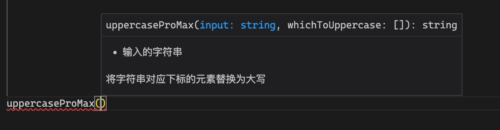
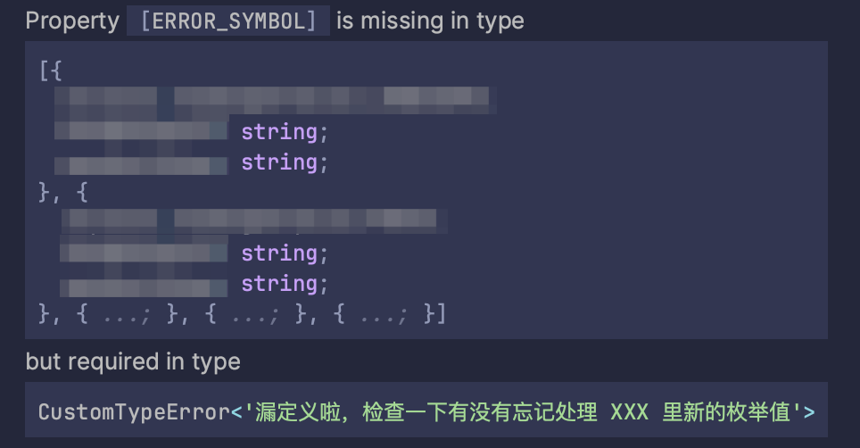
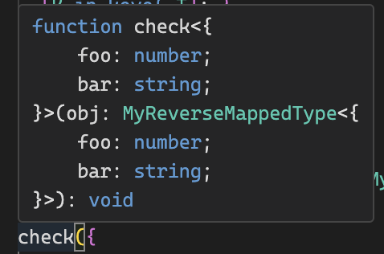

| **上一章** | **目录** | **下一章** |
| :------------- | :----------: | :------: |
| [第二章：进阶话题](https://github.com/darkyzhou/You-Might-Not-Know-TypeScript/blob/main/chapter2.md) | [你可能不知道的 TypeScript](https://github.com/darkyzhou/You-Might-Not-Know-TypeScript#%E4%BD%A0%E5%8F%AF%E8%83%BD%E4%B8%8D%E7%9F%A5%E9%81%93%E7%9A%84-typescript) | [第四章：生产实践](https://github.com/darkyzhou/You-Might-Not-Know-TypeScript/blob/main/chapter4.md) |

---

# 第三章：类型编程

进阶话题中的内容远远不是 TypeScript 强大的类型系统的全部。还记得[类型系统的目的](https://github.com/darkyzhou/You-Might-Not-Know-TypeScript/blob/main/chapter1.md#%E7%B1%BB%E5%9E%8B%E7%B3%BB%E7%BB%9F%E7%9A%84%E7%9B%AE%E7%9A%84)说过的，TypeScript 的设计目标之一是为「结构」提供检查手段吗？我们已经在进阶话题中讨论了很多检查手段，不过它们大多都只是直接基于类型系统提供的原语实现的。事实上，这套类型系统还能构造出更加复杂的检查手段，而它们才真正代表了 TypeScript 的上限。

有关 TypeScript 的类型系统，你可能听说过一个极其经典的说法，即[它的类型系统是图灵完备（turing complete）的](https://github.com/microsoft/TypeScript/issues/14833)。我不是 PL 的研究者，所以不会在这里做复杂的讨论，我们只需要知道 TypeScript 的类型系统具有极为强大的计算能力，这种能力至少在图灵完备的视角上和 Java、C++、JavaScript 等现代编程语言相当。基于这种计算能力，理论上我们能够使用 TypeScript 表达很多复杂的类型限制（尽管难度可能不低）。

本节的故事会从 TypeScript 的类型系统本身开始，介绍它之所以具备图灵完备性所仰赖的几个关键功能。然后，我们会介绍如何通过函数来检查一些需要进行特殊检查的值。本节的话题被称为「类型编程」，因为我们将会看到，类型编程做的事情就是使用 TypeScript 的类型系统算出一个类型，然后检查传入的值是否满足这个类型。

## [泛型（Generics）](https://www.typescriptlang.org/docs/handbook/2/generics.html)

在 TypeScript 中，泛型被视为向类型系统中引入变量的手段，通过使用泛型我们可以在类型上下文中引入一些互相关联的类型。例如，在下面的 `sum` 函数中，通过引入泛型统一了函数的入参和返回值的类型。

```typescript
declare function sum<T>(numbers: T[]): T;
```

顺带一提，如果没有对相关联的类型的需求，那么一般不需要引入泛型，这是一些人容易犯的失误。

```typescript
// 没有必要的泛型，等价于 arg: unknown
declare function foo<T>(arg: T): void;
```

> [!NOTE]
> 如果你熟悉函数式编程（functional programming），你可能会觉得这里使用「变量」一词并不贴切。
>
> TypeScript 的类型系统在形式上更接近函数式语言而不是命令式语言，而在函数式语言中严格来说并不存在大多数人理解的「变量」这种说法，所有的运算都是通过 [λ 演算（λ-calculus）](https://en.wikipedia.org/wiki/Lambda_calculus)表达的。不过，由于我猜测大多数阅读这篇文章的人相比函数式编程更熟悉传统的命令式编程，所以在这整一节中我都会使用更加偏向命令式编程的比喻修辞。

### 类型中的泛型

在使用 `type`、`interface`、`class` 等关键字定义类型时，可以为类型引入泛型，泛型参数可以被理解为「构造这个类型所需要输入的变量」。带有泛型参数的类型定义就像一个函数，它接受其它类型作为入参，返回构造出来的类型。

例如，下面的例子提供了一个 `Nullable` 类型，它接收一个泛型类型，输出它和 `null` 构成的联合类型：

```typescript
type Nullable<T> = T | null;
```

我们可以将这个类型想象成下面这段伪代码，注意到它返回了一个联合类型，而 TypeScript 会使用这个联合类型执行后续的类型检查。

```typescript
function nullable(someType) {
  return new UnionType([someType, NullType]);
}
```

这种基于给定类型构造其它类型的过程是类型编程的基础之一，我们会在[后文](https://github.com/darkyzhou/You-Might-Not-Know-TypeScript/blob/main/chapter3.md#%E5%87%BD%E6%95%B0%E6%B3%9B%E5%9E%8B)继续讨论这一点。

### 函数中的泛型

在声明函数时，我们也可以为函数引入泛型。不过，和类型中的泛型不同，函数中的泛型既可以手动指定也可以由 TypeScript 自动推导。而后者是利用 TypeScript 对值进行特殊的类型检查所依赖的底层能力。我们将马上在[后文](https://github.com/darkyzhou/You-Might-Not-Know-TypeScript/blob/main/chapter3.md#%E5%87%BD%E6%95%B0%E6%B3%9B%E5%9E%8B)继续讨论这一话题。

### 泛型约束（Generic Constraints）

通过对泛型参数使用 `extends` 关键字，可以限定这个泛型的类型范围，参见[类型是值的集合](https://github.com/darkyzhou/You-Might-Not-Know-TypeScript/blob/main/chapter1.md#%E7%B1%BB%E5%9E%8B%E6%98%AF%E5%80%BC%E7%9A%84%E9%9B%86%E5%90%88)。

在下面的例子中，我们定义了一个带泛型的类型，它接受一个字符串类型的泛型参数，输出一个函数类型。要使用这个类型，需要为泛型指定一个具体的类型，比如 `'seele'`。

```typescript
type Foo<T extends string> = () => T;

const _0: Foo<"seele"> = () => "seele"; // OK
const _1: Foo<"seele"> = () => "sirin"; // ERROR
```

如果继续使用「函数」的比喻，那么它看上去有些像下面这段伪代码。

```typescript
function foo(t: StringType) {
  return new FunctionType({ returnType: t });
}

check(foo(new LiteralStringType("seele")), () => "seele"); // OK
check(foo(new LiteralStringType("seele")), () => "sirin"); // ERROR
```

## [条件类型（Conditional Types）](https://www.typescriptlang.org/docs/handbook/2/conditional-types.html#handbook-content)

条件类型指的是一套机制，它根据输入类型是否满足给定条件，返回不同的类型作为结果。它具有下面的代码展示的形式。其中，若条件满足，`Result` 最终指向 `TrueType`；否则，指向 `FalseType`。

```typescript
type Result = SomeType extends OtherType ? TrueType : FalseType;
```

条件类型能够在使用泛型时发挥巨大的作用，正如下面的例子所示。

```typescript
type NameOrId<T extends number | string> = T extends number
  ? IdLabel
  : NameLabel;

// 如果用户传入的参数是 string，那么它的返回值类型为 NameLabel，否则为 IdLabel
declare function createLabel<T extends number | string>(
  idOrName: T
): NameOrId<T>;

const _1 = createLabel("typescript");
//    ^? const _1: NameLabel

const _2 = createLabel(2.8);
//    ^? const _2: IdLabel
```

通过上面的例子我们可以看到，条件类型是 TypeScript 用来提供条件分支（conditional branch）的手段，这是人们之所以称它为图灵完备的原因之一。接下来，我们介绍条件类型的几个重要机制。

### `infer` 关键字

在通过条件类型判断输入类型是否满足给定条件（这本质上是检查它是否为目标类型的子类型）时，TypeScript 提供了 `infer` 关键字来让我们可以在这个过程中根据目标元素的泛型类型，提取出输入类型的额外信息。

在下面的例子中，我们通过 `infer` 关键字在目标类型中引入了一个泛型类型，要求 TypeScript 在判断 `Type` 是否为 `Array` 的子类型时，将 `Item` 赋予一个有效的类型。

```typescript
type Flatten<Type> = Type extends Array<infer Item> ? Item : Type;

type Flatten<Type> = Type extends Array<infer Item> ? Item : Type;

type _1 = Flatten<string>;
//   ^? type _1 = string

type _2 = Flatten<string[]>;
//   ^? type _2 = string

type _3 = Flatten<[string, number]>;
//   ^? type _3 = string | number
```

TypeScript 内置了许多使用了这个关键字的工具类型，例如：

- `ReturnType`：获得给定函数类型的返回值类型

  ```typescript
  type ReturnType<T extends (...args: any) => any> = T extends (
    ...args: any
  ) => infer R
    ? R
    : any;
  ```

- `InstanceType`：获得构造函数类型对应的类的实例类型

  ```typescript
  type InstanceType<T extends abstract new (...args: any) => any> =
    T extends abstract new (...args: any) => infer R ? R : any;
  ```

- `ThisParameterType`：获得给定函数类型的 `this 类型`

  ```typescript
  type ThisParameterType<T> = T extends (this: infer U, ...args: never) => any
    ? U
    : unknown;
  ```

在使用 `infer` 时，可以[使用泛型约束来附加额外的限定条件](https://www.typescriptlang.org/docs/handbook/release-notes/typescript-4-7.html#extends-constraints-on-infer-type-variables) `4.7+`，就像下面的例子这样。特别地，`extends` 的右边可以是字符串字面量类型，例如 `"foo"`、`${number}foo` 等。

```typescript
type IsNumberString<T extends string> = T extends `${infer _ extends number}`
  ? true
  : false;
// 这里只是举例子，可以简化成 T extends `${number}`

type _0 = IsNumberString<"114514">;
//   ^? type _0 = true

type _1 = IsNumberString<"seele">;
//   ^? type _1 = false

type _2 = IsNumberString<"114514seele">;
//   ^? type _2 = false
```

> 这里留个小问题：如何修改代码使得 `_0` 和 `_1` 保持不变，而让 `_2` 返回 `true`？

使用 `infer` 结合泛型约束在一些场景下是必要的，例如当我们尝试匹配一个元组时，TypeScript 并不会为匹配得到的元素赋予对应元素的类型。此时必须使用 `infer First extends string`。

```typescript
type Foo<T extends string[]> =
  T extends [infer First, ...infer _] ? Bar<First> : never;
// Type 'First' does not satisfy the constraint 'string'

type Bar<T extends string> = // ...;
```

### [分配式条件类型（Distributive Conditional Types）](https://www.typescriptlang.org/docs/handbook/2/conditional-types.html#distributive-conditional-types)

在通过 `extends` 关键字表达泛型的类型约束时，很多人都会忘记要检查的类型可能是联合类型这一事实。例如，对于 `T extends string`，实际上当 `T` 为 `'foo' | 'bar'` 时也是满足约束的。

一个自然的问题是，联合类型是如何参与到条件类型的计算中的？在 TypeScript 中，这个过程被称为分配式条件类型。我们通过下面的例子理解这个特性。简单来说，当联合类型作为条件类型的输入时，TypeScript 会将联合类型中的每个类型单独拆出来计算条件类型，然后将得到的结果重新组合为联合类型。

```typescript
type ToArray<T> = T extends any ? T[] : never;
type _1 = ToArray<string | number>;
//   ^? type _1 = string[] | number[]
```

下面是另一个例子，注意我们是如何过滤输入的联合类型中的 `2` 字面量类型的：

```typescript
type NoTwo<T extends number> = T extends 2 ? never : T;
type _2 = NoTwo<1 | 2 | 3>;
//   ^? type _2 = 1 | 3
```

### [递归条件类型（Recursive Conditional Types）](https://www.typescriptlang.org/docs/handbook/release-notes/typescript-4-1.html#recursive-conditional-types)`4.1+`

从 TypeScript 4.1 版本开始，我们可以像编写 JavaScript 代码一样，在类型定义中递归地调用自身。这使得像 `Awaited` 这样的工具类型得以以一种简单的形式实现（它现在是 TypeScript 自带的工具类型）。

```typescript
type Awaited<T> = T extends PromiseLike<infer U> ? Awaited<U> : T;

type _1 = Awaited<"seele">;
//   ^? type _1 = "seele"

type _2 = Awaited<Promise<"seele">>;
//   ^? type _2 = "seele"

type _3 = Awaited<Promise<Promise<"seele">>>;
//   ^? type _3 = "seele"
```

## 递归与循环

回忆起在大一刚刚开始学习程序设计的时候，我们在学完分支语句之后会学习什么？对啦，循环语句。循环语句也是图灵完备性的要素之一，而在 TypeScript 中实现循环语句的方法却有些曲折：通过递归实现循环。

注意递归的两个关键因素：

- 自身调用：将问题分为子问题，调用自身继续处理
- 终止条件：当条件满足时不再继续进行自身调用，返回结果

在 TypeScript 中，一般对元组进行递归来实现给定次数的循环，它的基本结构如下：

```typescript
type Loop<N extends number, Acc extends never[] = []> =
  //  👇 终止条件：数组的长度为 N        👇 自身调用：增加数组的长度
  Acc["length"] extends N ? "END" : Loop<N, [never, ...Acc]>;
```

这里的 `Acc` 并不是让用户传入的泛型参数，而是函数的内部变量（注意到它有一个默认值，即初始值）。一般来说，我推荐向用户隐藏掉这个泛型参数，以免引起误会：

```typescript
type Loop<N extends number> = LoopImpl<N, []>;

type LoopImpl<
  N extends number,
  Acc extends never[] = []
> = Acc["length"] extends N ? "END" : LoopImpl<N, [never, ...Acc]>;
```

随着[模板字面量类型（template literal types）](https://github.com/darkyzhou/You-Might-Not-Know-TypeScript/blob/main/chapter2.md#%E6%A8%A1%E6%9D%BF%E5%AD%97%E9%9D%A2%E9%87%8F%E7%B1%BB%E5%9E%8Btemplate-literal-types-41)的引入，你可能会觉得字符串字面量类型也能够实现类似的功能。不过很可惜，TypeScript 目前并不会像对待元组那样给它的 `length` 属性返回具体的长度类型，而是返回 `number`。不过，你可以通过下面的方式计算一个字符串字面量类型的长度：

```typescript
type LengthOfString<S extends string, T extends never[] = []> =
  // 当 S 为空串时，条件为假；否则，_ 会被推导为第一个元素，Tail 会被推导为其余元素构成的子串
  S extends `${infer _}${infer Tail}`
    ? LengthOfString<Tail, [never, ...T]>
    : T["length"];
```

除了上面这种通过递归构造数组的方法，还有一些较为少见的方法，它们通过向数组字面量中写入索引值实现，就像下面这个 TypeScript 内置的对 ES2019 中数组 `flat` 函数的类型定义。当 `Depth` 传入 `5` 时，下一层递归会从数组字面量的索引为 `5` 的值即 `4` 继续执行。

```typescript
type FlatArray<Arr, Depth extends number> = {
  done: Arr;
  recur: Arr extends ReadonlyArray<infer InnerArr>
    ? FlatArray<InnerArr, [-1, 0, 1, 2, 3, 4, 5, 6, 7, 8, 9, 10, 11, 12, 13, 14, 15, 16, 17, 18, 19, 20][Depth]>
    : Arr;
}[Depth extends -1 ? "done" : "recur"];
```

当 TypeScript 怀疑它碰到了无限递归（通过检查递归层数），或者一些需要花费很多时间计算的类型展开（[比如对元组类型进行展开](https://www.typescriptlang.org/docs/handbook/release-notes/typescript-4-2.html#tuple-size-limits-for-spreads)）时，它会停止类型检查并直接报错。对于前者，它会抛出下面的错误：

> Type instantiation is excessively deep and possibly infinite.

因此，在使用递归时，为了减少资源占用和防止 TypeScript 报错，我们最好将递归步骤处理成满足尾递归的形式。从 TypeScript 4.5 开始，它会对递归类型做尾递归优化，这意味着当递归类型[满足一定条件](https://www.typescriptlang.org/docs/handbook/release-notes/typescript-4-5.html#tail-recursion-elimination-on-conditional-types)时，即使递归层数极其深也不会导致出现大量的资源占用，TypeScript 也不会报错。

### 使用 `infer` 关键字遍历元组类型

通过结合 `infer` 关键字，我们可以遍历一个元组类型。在下面的例子中：

- 当 `T` 为空数组时，匹配失败
- 当 `T` 为单元素数组类型时，推导得到的 `Tail` 为空数组元素
- 当 `T` 为数组类型而不是元组类型时，匹配也会失败

```typescript
type UppercaseArray<T extends string[]> = T extends [
  infer Head extends string,
  ...infer Tail extends string[]
]
  ? [Uppercase<Head>, ...UppercaseArray<Tail>]
  : [];

type _1 = UppercaseArray<["foo", "bar"]>;
//   ^? type _1 = ["FOO", "BAR"]

type _2 = UppercaseArray<string[]>;
//   ^? type _2 = []
```

### 使用 `infer` 关键字遍历字符串字面量类型

对字符串字面量类型，我们也有类似的遍历方法。在下面的例子中：

- 当 `T` 为空字符串时，匹配失败
- 当 `T` 为长度为 `1` 的字符串类型，推导得到的 `Tail` 为空字符串类型
- 当 `T` 为字符串类型而不是字面量类型时，匹配也会失败

```typescript
type RemoveSpaces<T extends string> = T extends `${infer Head}${infer Tail}`
  ? `${Head extends " " ? "" : Head}${RemoveSpaces<Tail>}`
  : "";

type _1 = RemoveSpaces<"  f o o  ">;
//   ^? type _1: "foo"

type _2 = RemoveSpaces<string>;
//   ^? type _2: ""
```

在遍历元组类型和字符串字面量类型时，如果接收的类型为数组类型或字符串类型，我们一般会通过额外的前置判断来返回一些更有意义的特殊值，让工具类型具备更好的实用性。例如，对于上面的 `RemoveSpaces`，我们可以修改为下面这样来让用户在输入 `string` 时直接返回 `string` 类型。

```typescript
type RemoveSpaces<T extends string> = string extends T // 👈 通过这种方式判断它是否为 string 类型
  ? string
  : T extends `${infer Head}${infer Tail}`
  ? `${Head extends " " ? "" : Head}${RemoveSpaces<Tail>}`
  : "";
```

### 使用递归构造需要的类型

在下面的例子中，我们构造了一个和给定字符串长度相同的数组类型。

```typescript
type WhichToUppercase<T extends string> = WhichToUppercaseImpl<
  LengthOfString<T>,
  [],
  []
>;

// 👇 通过 Res 承载最终得到的类型
type WhichToUppercaseImpl<
  N extends number,
  Res extends boolean[],
  Acc extends never[]
> = Acc["length"] extends N
  ? Res // 👇 更新最终返回的类型
  : WhichToUppercaseImpl<N, [boolean, ...Res], [never, ...Acc]>;

/**
 * 将字符串对应下标的元素替换为大写
 *
 * @param input - 输入的字符串
 * @param whichToUppercase - boolean 数组，每一项表示对应下标的字符串元素是否应该被大写
 */
declare function uppercaseProMax<T extends string>(
  input: T,
  whichToUppercase: WhichToUppercase<T>
): string;
```

<p align="center">
  
</p>

> [!NOTE]
> 我们其实还能做得更好，下面的这些优化点你知道如何实现吗？
>
> - 当 `input` 不是一个字面量而是一个 `string` 类型的变量时，`WhichToUppercase` 返回了 `[]`，这显然是不合理的，应该回退为 `boolean[]`
> - 当 `input` 为一个字面量时，返回值类型可以直接根据 `T` 和传入的 `whichToUppercase` 值的具体类型来计算得到。例如，当传入 `'foo'` 和 `[false, true, false]` 时，我们实际上可以计算出返回值类型应该为 `'fOo'` 而不是空泛的 `string`

## 函数泛型

前文提到，在函数泛型中，泛型参数的具体类型可以依据输入的参数值和函数的返回值进行推导。这里暗含了类型编程的重要功能：函数泛型可以让 TypeScript 从某个值中推导出类型，然后我们可以继续对这个类型进行计算（就像在前文讨论过的，如何基于给定类型计算新的类型），并使用最终得到的类型反过来对值进行类型检查。

从这点上说，函数泛型是最能够发挥 TypeScript 类型系统强大能力的手段之一。它能够对值（主要是字面量值）提供特殊的类型约束，这些约束要比一般的通过标注属性类型实现的约束更加进阶，包括：

- 对象的某些元组属性必须具有相同的长度
- 对于某个子串集合，对象的某些字符串必须都包含这些子串
- 包括前面的例子在内的，需要针对多个属性使用相同的或相关联的类型进行约束的场景

本节将提出一个使用函数泛型检查字面量是否满足某些约束的「通用方法」，这些字面量包括：字符串字面量、元组字面量、对象字面量。关于「某些约束」，这一方面取决于实际的需求，另一方面取决于 TypeScript 类型系统的上限以及程序员花费时间的意愿。我们假设读者愿意花费时间编写一些复杂的类型检查规则，那么剩下的问题就是类型系统是否能够满足需求，我们会在本节当中以及之后的生产实践提供一些例子来展示类型系统能做到什么。

### Type Parameter Inference

在此之前，我们先来搞清楚 TypeScript 在检查带泛型参数的函数的调用语句时，具体发生了什么。考虑下面的代码，当我们传入的对象字面量中的 `initial` 函数返回了字符串类型的值时，TypeScript 将 `T` 推导为了 `string`。这个过程中发生了什么？

```typescript
declare function setup<T>(config: { initial(): T }): T | null;

const _1 = setup({ initial() { return "seele"; } });
//    ^? const _1: string | null
```

这里发生的过程被称为 [Type Parameter Inference](https://github.com/microsoft/TypeScript-Compiler-Notes/blob/main/codebase/src/compiler/checker-inference.md#type-parameter-inference)，本质上是计算出函数泛型参数究竟应该为何的过程。顺带一提，我们可以通过将鼠标放在第三行的 `setup` 上获得此时的函数签名来看到 TypeScript 对 `T` 的计算结果。

这个过程可以被粗略地分成下面的步骤：

1. **根据传入的值推导出一个类型，设为源类型（source type）**

   TypeScript 会根据传入的值 `{ initial() { return "seele" } }` 推导出它的类型，在这里会推导出 `{ initial(): string }`。这个类型被称为源类型。

   关于返回值类型，TypeScript 其实有多种选择，例如 `"seele"`、`string`、`any` 等。此时，它会结合函数的签名信息（contextual signature）和泛型参数等类型（contextual type）进行考虑。

   如果没有特别的信息，就像上面的例子，TypeScript 一般会选择 `string`（[literal widening](https://github.com/microsoft/TypeScript-Compiler-Notes/blob/main/codebase/src/compiler/checker-widening-narrowing.md#literal-widening)）。如果你使用了 `<T extends string>`，那么 TypeScript 会倾向于选择字面量类型 `"seele"` 而不是 `string`。

2. **解析方法签名中对应参数的类型，设为目标类型（target type）**

   这里目标类型会被直接解析为 `{ initial(): T }`。对于一些复杂的类型，TypeScript 会做额外的处理，例如对于[条件类型](https://github.com/darkyzhou/You-Might-Not-Know-TypeScript/blob/main/chapter3.md#%E6%9D%A1%E4%BB%B6%E7%B1%BB%E5%9E%8Bconditional-types)，TypeScript 会尝试同时取它的真分支和假分支对应的类型。

3. **将源类型和目标类型进行对比，匹配属性得到 `T` 的推导类型**

   TypeScript 会发现源类型和目标类型都是对象类型，于是检查它们的属性，在检查到 `initial` 时发现双方都有此属性。由于 `initial` 是函数类型，在继续推导到函数的返回值类型时，TypeScript 发现 `string` 可以被直接作为 `T` 的候选类型（candidate）。

   在 Type Parameter Inference 中，TypeScript 一般来说会通过其它一些复杂的机制得到更多的候选类型，并最终根据优先级（priority）等信息选择「最好」的一个候选类型。在这里 TypeScript 最终选择了 `string`。

4. **实例化泛型参数，然后使用实例化后的类型对传入的值进行类型检查**

   TypeScript 在选择了 `string` 之后，会将它带入原函数。之后，它就像在使用下面的函数一样，对我们传入的对象字面量进行类型检查。

   ```typescript
   declare function setup<string>(config: { initial(): string }): string | null;
   ```

   就这个例子来说，我们的目的是「无论用户传入的 `initial` 函数返回什么类型，这个函数返回值的类型为它或者 `null`」。而需要构造出的类型 `T | null` 被正确地推导为了 `string | null`。

根据上面的过程，可以得到 Type Parameter Inference 的一个可以好好利用的切入点：第三步中得到的 `T` 类型。这里的类型承载了用户传入的值的类型信息，或者说它充当了我们即将进行的类型编程的入口，接受的是用户的意图。根据 `T` 承载着的「意图」，我们可以结合本章前文讨论过的许多内容，在业务需求的基础上对 `T` 进行特殊处理，例如得到新的类型用于后续的类型检查或类型提示。

### 约束检查的通用方法

这里提出一个通过函数泛型对任意字面量施加特殊约束的通用方法。请区分「约束检查」和「类型检查」两个概念，前者是业务相关的、由我们施加的；后者是 TypeScript 自动执行的。当然，约束检查最终还是要由 TypeScript 通过类型检查来落实。

下面是所谓的「通用方法」的一般形式：

```typescript
type DoCheck<T> = T extends ... ? unknown : never;

function check<T>(input: T & DoCheck<T>) {
  return input;
}

// VALUE 为我们要检查的字面量，当检查不通过时，TypeScript 会报错
check(VALUE);
```

- 声明一个泛型参数 `T` 用于接收 TypeScript 的推导结果
- 在 `DoCheck` 中对 TypeScript 推导出的 `T` 进行检查，如果满足约束则返回 `unknown`，否则返回 `never`
- 将函数参数的类型声明为 `T & DoCheck<T>` 有以下用意：
  - 让 TypeScript 顺利地通过 `T` 的部分推导出有意义的目标类型
    > 这里涉及到 Type Parameter Inference 的底层实现，由于篇幅原因不进行展开
  - 当约束检查通过时 `T & DoCheck<T>` 等价于 `T`，类型检查通过；否则等价于 `never`，类型检查不通过

下面是一个例子，用于检查对象中是否*仅*含有一个名为 `foo` 的键：

```typescript
type DoCheck<T> = [keyof T] extends ["foo"]
  ? ["foo"] extends [keyof T]
    ? unknown
    : never
  : never;

function check<T extends Record<string, unknown>>(input: T & DoCheck<T>) {
  return input;
}

check({}); // ERROR
check({ foo: true }); // OK
check({ foo: true, bar: false }); // ERROR
```

上面的例子通过 `extends Record<string, unknown>` 向 `T` 附加约束，这能够作为 contextual type 在 Type Parameter Inference 期间为 TypeScript 提供更好的提示，让它计算出更准确（更接近对象类型）的候选。在一些简单场景下这不是必要的，我们一般在遇到了问题时才会这样做。

#### 对比其它方案

由于通用方法是通过对传入值的整体进行约束检查，并在不通过时触发 TypeScript 的类型检查错误，所以当约束检查没有通过时，TypeScript 会对输入函数的整个值进行报错，你会看到红色下划线标记了传入的整个字面量。这在一些场合下并不理想，因为造成约束不通过的原因往往只是字面量定义里的很小一部分。

就前文的例子来说，我们显然可以用更加直观的方法做到让 TypeScript 提供更精细化的报错信息，就像在下面的代码中，TypeScript 只会标红出错的 `{}` 和 `bar`，并且提供更加易懂的报错信息，和通用方法标红整片对象字面量和晦涩的报错信息相比更有优势。

```typescript
function check(input: Record<"foo", unknown>) {
  return input;
}

check({}); // ERROR
check({ foo: true }); // OK
check({ foo: true, bar: false }); // ERROR
```

通用方法之所以被称为「通用」是因为它具有很高的泛用性。对于上面的例子，我们也许不能很快就想到使用 `Record<'foo', unknown>` 解决问题，但是可以想到使用通用形式以及 `keyof` 获取并检查输入对象的键。对于一些更复杂的场景来说尤为如此，通用方法总是能给出一个能够工作的解决方案，尽管它可能不是最优解。

通用方法和其它方案也不是严格的互斥关系，它可以被融合到其它方案中。例如在下面的例子中，我们只想对传入对象的 `baz` 属性做复杂的检查，而其它属性的检查只需要使用 TypeScript 原语就能实现。此时，我们在一定程度上克服了通用方法提供的报错范围过于粗糙的问题（当 `baz` 的检查不通过时，TypeScript 只会给 `baz` 划线）。

```typescript
type DoCheck<T extends string[]> = ...;

declare function check<T extends string[]>(
  input: {
    foo: `${number}`;
    bar: [string, string];
    baz: [...T] & DoCheck<T>;
  }
);
```

我们还能通过下面的方法来改善通用方法提供的报错信息过于晦涩的问题。

#### 定制报错信息

当需要进行约束检查的 `T` 是对象和元组类型时，可以通过[名义类型](https://github.com/darkyzhou/You-Might-Not-Know-TypeScript/blob/main/chapter2.md#%E5%90%8D%E4%B9%89%E7%B1%BB%E5%9E%8Bnominal-typing)提供「约束检查报错信息」。上面的例子可以改成下面这样，注意报错信息的末尾是如何展现我们提供的报错信息的。

```typescript
declare const ERROR_SYMBOL: unique symbol;
type MyTypeError<T extends string> = { [ERROR_SYMBOL]: T };

type DoCheck<T> = "foo" extends keyof T
  ? unknown
  : MyTypeError<"对象没有包含必须的类型 foo 哦">;

// ...

check({}); // ERROR!
// Property '[ERROR_SYMBOL]' is missing in type '{}'
// but required in type 'MyTypeError<"对象没有包含必须的类型 foo 哦">'
```

基于名义类型，在检查其它类型例如字符串字面量类型时，依然能够通过类似的方法提供定制化的报错信息。如果你使用的 IDE 是 WebStorm，它提供的 TypeScript 报错信息会更加美观，就像下面的图片这样：

<p align="center">
  
</p>

#### 其它形式

除了将 `DoCheck<T>` 通过交叉类型附加到参数类型上，还能够将其作为返回值的类型实现约束检查。此时约束检查的报错信息将具有更直观的形式。总之，通用方法的关键是能够在尽量不干扰 Type Parameter Inference 的同时具备触发 TypeScript 的类型报错的能力。

```typescript
type DoCheck<T> = "foo" extends keyof T
  ? never
  : MyTypeError<"对象没有包含必须的类型 foo 哦">;

function check<T>(input: T): DoCheck<T> {
  return input as any;
}

check({}) satisfies never;
// Type 'MyTypeError<"对象没有包含必须的类型 foo 哦">' does not satisfy the expected type 'never'
```

### 常用的匹配方法

了解完通用方法之后，我们来讨论一下如何对 `T` 提供 TypeScript 想要的 contextual signature 和 contextual type，进而让 `T` 被推导为我们需要进行约束检查的类型。毕竟谁也不想在需要检查某个字符串字面量的时候，收到了 TypeScript 传过来的 `string` 类型，而不是字面量类型。

#### 匹配元组类型 `4.0+`

我们已经在介绍[可变元组类型](https://github.com/darkyzhou/You-Might-Not-Know-TypeScript/blob/main/chapter2.md#%E5%8F%AF%E5%8F%98%E5%85%83%E7%BB%84%E7%B1%BB%E5%9E%8Bvariadic-tuple-types-40)时讨论过，可以使用 JavaScript 中的数组相关语法来匹配元组。下面是一些例子：

```typescript
// 获得除了第一个元素之外的剩余元素
declare function tail<T extends readonly unknown[]>(
  _: readonly [unknown, ...T]
): T;

// 获得第一个元素
declare function first<T>(_: readonly [T, ...unknown[]]): T;

const _1 = tail([114, "seele", false]);
//    ^? const _1 = [string, boolean]

const _2 = first([114, "seele", false]);
//    ^? const _2 = number
```

通过使用 `[...T]` 可以提示 TypeScript 将 `T` 推导为元组类型而不是数组类型：

```typescript
declare function test<T extends unknown[]>(_: [...T]): T;

const _3 = test(["seele", 114, false]);
//    ^? const _3: [string, number, boolean]
```

#### 匹配对象类型

我们已经在前文看到如何匹配对象中的特定属性了，接下来讨论的是如何匹配整个对象类型。

```typescript
//                                 👇 匹配对象类型                      👇 获得对象的键
declare function getKeys<T extends Record<string, unknown>>(input: T): keyof T;

const _0 = getKeys({ bar: "seele", baz: 233 });
//    ^? const _0: "bar" | "baz"
```

#### 匹配字面量类型

通过为 `T` 附加对应字面量的父类型（或者说 apparent type）约束可以让 TypeScript 保持选择字面量类型而不是它的父类型。

```typescript
declare function setup<T extends string>(config: { initial(): T }): T;

const _0 = setup({ initial() { return "seele"; }});
//    ^? const _0: "seele"
```

如果想将对象类型中的属性推导为字面量类型，除了对传入的值使用 `as const`，还可以通过 `const` 关键字 `5.0+` 实现，参考下面的例子。对于元组来说也是类似的方法。

```typescript
declare function setup<const T extends Record<string, unknown>>(config: T): T;

const _1 = setup({ foo: "seele", bar: 114514, baz: true });
//    ^? const _1: { readonly foo: "seele"; readonly bar: 114514; readonly baz: true; }
```

### 一些约束检查的例子

#### 确保字符串包含特定子串

在下面的例子中，我们通过引入一个函数来对某个字符串字面量进行检查，查看它是否包含子串 `seele`。当不包含该子串时，通过将函数的参数类型设置为 `never` 来触发类型检查错误。

```typescript
type DoCheck<T extends string> = string extends T
  ? string // 当输入的 T 为 string 类型而不是字面量类型时，直接返回 string
  : T extends `${string}seele${string}` // 否则，检查是否包含子串
  ? T
  : never;

function check<T extends string>(input: DoCheck<T>) {
  return input;
}

// 报错，Argument of type 'string' is not assignable to parameter of type 'never'
const _0 = check("hmm");

const _1 = check("Hi, seele!");
//    ^? const _1: "Hi, seele!"

const _2 = check("seele, hello!");
//    ^? const _2: "seele, hello!"
```

#### 确保两个数组长度相同

为了简洁，这里没有考虑输入的数组不是元组类型而是数组类型的情况。

```typescript
// 当两个数组元素类型相同时，可以直接使用可变元组类型
declare function check<T extends unknown[]>(a: [...T], b: [...T]): void;

check([1], []); // ERROR
check([], [1]); // ERROR
check([1], [1]); // OK

// 当两个数组元素类型不同时，可以通过对返回值类型进行检查
declare function check2<T extends unknown[], U extends unknown[]>(
  a: [...T],
  b: [...U]
): T["length"] extends U["length"] ? true : false;

check2([1], []) satisfies true; // ERROR
check2([], [1]) satisfies true; // ERROR
check2([1], ["foo"]) satisfies true; // OK

// 对返回值类型进行检验不是解决问题的唯一的办法，我们还有：
type DoCheck<
  T extends unknown[],
  U extends unknown[]
> = T["length"] extends U["length"] ? unknown : never;

// 考虑这样一个事实：unknown 是 top type（全集），所以其它类型对它取交都等于原类型
// 而 never 是 bottom type（空集），其它类型对它取交都等于 never
declare function check3<T extends unknown[], U extends unknown[]>(
  a: [...T] & DoCheck<T, U>,
  b: [...U] & DoCheck<T, U>
): void;

check3([1], []); // ERROR
check3([], [1]); // ERROR
check3([1], ["foo"]); // OK
```

### 函数类型闭包

除了能够实现约束检查，函数泛型还有一项重要的功能是：提供函数类型闭包。通过函数类型闭包，函数的泛型参数能够被传递到返回值类型中从而被保留下来。这和我们熟悉的 JavaScript 变量的闭包有些类似。

借助函数类型闭包，我们能够构建一些具有强大类型功能的 API，这些 API 能够「记住」向函数传入的参数值的一些类型信息，并将这些信息用于对后续的函数调用进行类型检查。当然，除了类型检查，这些信息还能用来提供类型提示，提高我们的开发效率。

在下面的例子中，我们编写了一个带类型检查功能的验证器构造函数 `buildValidatorFn`，它返回一个 type predicate 函数，能够检查给定的对象是不是满足特定的类型要求。类型要求由验证器构造函数接受的参数推导得到的泛型参数计算而来。请观察我们给 `buildValidatorFn` 传入的对象字面量中包含的类型信息是如何通过函数类型闭包传递到了它的返回值，也就是 type predicate 函数中的。

```typescript
type ValidatorMap = Record<
  string,
  NumberConstructor | StringConstructor | BooleanConstructor
>;

// 使用 mapped types 构造目标类型
type BuildResultType<T extends ValidatorMap> = {
  // 上述 Constructor 类型的返回值类型就是它们对应的原始值类型
  [K in keyof T]: ReturnType<T[K]>;
};

// Prettify 工具类型来自前文
declare function buildValidatorFn<T extends ValidatorMap>(
  input: T
): (input: Record<string, unknown>) => input is Prettify<BuildResultType<T>>;

const validatorFn = buildValidatorFn({
  foo: String,
  bar: Number,
  baz: Boolean,
});
//    ^? const validatorFn: (input: Record<string, unknown>) =>
//                            input is { foo: string; bar: number; baz: boolean }

// 下面来试用一下这个 validatorFn
declare const _0: any;
if (validatorFn(_0)) {
  _0;
  // ^? const _0: { foo: string; bar: number; baz: boolean; }
}
```

我们会在接下来的生产实践章节中介绍更多有关函数类型闭包的例子，进一步展现它的强大功能。

### Homomorphic Mapped Types

你或许听说过 TypeScript 有一种叫 [Mapped Types](https://www.typescriptlang.org/docs/handbook/2/mapped-types.html) 的概念，它可以根据一个类型构造出另一个类型，具体的形式类似下面的代码，它展示了基于给定泛型参数 `C` 构造新的对象类型，这个对象类型的值类型用 `X` 表示。

```typescript
type HMT<C> = {
  [K in C]: X;
};
```

Homomorphic Mapped Types（简称“HMT”）指的是一类特殊的 Mapped Types：它们的 `C` 来自 `keyof T`。其中，`T` 是一个泛型参数。注意到 HMT 并没有对 `X` 做出约束。

HMT 有许多相当有意思的特性，其中我们最常遇到的可能是：当 `T` 为原始类型（primitive type）时，HMT 总是返回它本身，就像下面的代码这样。

```typescript
type MyHMT<T> = {
  [K in keyof T]: never; // 👈 基本上，将这个 never 改成其它类型，结果都不会变化
};

type _1 = MyHMT<1>;
//   ^? type _1 = 1

type _2 = MyHMT<boolean>;
//   ^? type _2 = boolean

type _3 = MyHMT<bigint>;
//   ^? type _3 = bigint
```

此外，HMT 还有一些强大特性：

- 如果 `T` 为联合类型，那么 HMT 会进行分配（distributive）运算：
  ```typescript
  type HMT<T> = { [P in keyof T]: F<T[P]> }
  // 这里，HMT<A | B> 等价于 F<A> | F<B>
  ```
- 如果 `T` 为数组类型，那么 HMT 会对其中的元素类型进行计算，返回结果类型构成的数组类型：
  ```typescript
  type HMT<T> = { [P in keyof T]: F<T[P]> }
  // 这里，HMT<A[]> 等价于 F<A>[]
  ```
- 如果 `T` 为元组类型，那么 HMT 会做类似数组的操作：
  ```typescript
  type HMT<T> = { [P in keyof T]: F<T[P]> }
  // 这里，HMT<[A, B, C]> 等价于 [F<A>, F<B>, F<C>] 
  ```

接下来，我们来看一个 HMT 的使用例子：

```typescript
type Tuple = [key: string, value: unknown];

type ToObject<T extends Tuple[]> = // TODO

type Result = ToObject<[['foo', true], ['bar', 233]]>;
// 🤔 如何将元组类型转换为对象类型：{ foo: true, bar: 233 }
```

笔者的思路分为两步：首先将元组中的键提取出来，作为联合类型 `'foo' | 'bar'`，这样我们就能使用 Mapped Types 通过 ``{ [K in 'foo' | 'bar']: ... }`` 来构造出最终的对象类型。至于如何从 `K` 得到对应的值类型，我们可以对原本的元组类型使用前文介绍过的分配式条件类型来进行匹配。

```typescript
type GetKeys<T extends Tuple[]> = { [P in keyof T]: T[P][0] }[number];
// 根据上述 HMT 对元组计算的特性，GetKeys<[['foo', true], ['bar', 233]]> 等价于：
// [ ['foo', true][0], ['bar', 233][0] ][number]，等价于：
// [ 'foo', 'bar' ][number]，即 'foo' | 'bar"

type ToObject<T extends Tuple[]> = {
  [K in GetKeys<T>]:
    T[number] extends infer U ? // 👈 T[number] 等价于 ['foo', true] | ['bar', 233]
      U extends readonly [K, infer V] ? // 👈 通过分配式条件类型 U 检查它的键是不是 K
        V
      : never
  : never;
}
```

其实 `ToObject` 还有一种不使用 HMT 的解法，其中的原理可以见 [TypeScript 仓库中的讨论](https://github.com/microsoft/TypeScript/issues/55762)。

```typescript
type ToObject<T extends Tuple[]> =
  { [P in keyof T & `${number}` as T[P][0]]: T[P][1] };
//               👆 这里是必要的，从元组（数组）类型的属性中筛选出 '0' 和 '1' 键
```

### Reverse Mapped Types

在大多数的情况下，我们使用 TypeScript 的方式都是：先编写出类型，再用它约束值。不过，就像前文介绍的约束检查的通用方法那样，我们也可以做到：先接受值，再基于值产生类型，然后反过来利用产生的类型去约束值。本节会介绍一种被称为 Reverse Mapped Types （下文简称“RMT”）的技巧，它也利用了这种思想，不过具体的形式和通用方法不同。

#### 原理

RMT 利用了函数泛型的一个事实：TypeScript 需要依据使用了泛型参数的值来推导泛型参数究竟应该是什么类型，就像我们在前文 Type Parameter Inference 中介绍的那样。

注意下面的例子，我们通过修改函数参数的类型来让 `T` 被推导为了不同的类型。

```typescript
declare function foo<T>(obj: { values: T }): void;
declare function bar<T>(obj: { values: [T] }): void;

// 此时，T 被推导为 number[]
foo({ values: [1] });

// 此时，T 被推导为 [number]
bar({ values: [1] });
```

一个想法是：能不能让 TypeScript 将 `T` 推导为对象类型，让它表现得像一个 `Map`，这样就可以存储一些特殊的类型信息，从而实现很多高级的类型功能。在下面的例子中，我们希望在传给 `check` 函数的对象字面量中，各个值对象里的 `fn` 函数的参数类型能够和 `value` 属性的类型关联起来。

```typescript
check({
  foo: {
    value: 233,
    fn: value => {
      // 希望 value 被推导为 number
    }
  },
  bar: {
    value: 'seele',
    fn: value => {
      // 希望 value 被推导为 string
    }
  }
});
```

根据前文的讨论，我们其实可以让 `T` 被推导为类似下面这样的对象类型，这样我们就能够将 `fn` 的类型标注为 ``(value: T[propertyName] => void`` 从而实现想要的功能了。不过这里的 `propertyName` 要怎么取？换句话说，当我们把 `T` 作为了某种 `Map` 之后，怎么对它进行写入和读取呢？

```typescript
{
  foo: number,
  bar: string
}
```

Reverse Mapped Types 通过 Mapped Types 来实现这一点，下面是它的其中一个形式。注意 `MyReverseMappedType` 必须是一个 Homomorphic Mapped Types。

```typescript
type MyReverseMappedType<T> = {
  // 利用给定对象值的类型信息，构造和使用 T
  [K in keyof T]: ...; // 利用 Mapped Types 构造最终的对象类型约束
};

declare function check<T>(obj: MyReverseMappedType<T>): void;

// 检查对象字面量的类型，当检查不通过时会报 obj 参数存在类型错误
check({ foo: 123 });
```

#### 例子的实现

前文的 `fn` 的例子可以通过下面的代码实现。我们也许可以按下面的步骤理解其中发生的事情（尽管这不一定是 TypeScript 编译器实际的工作方式）：

1. TypeScript 注意到 `MyReverseMappedType` 是一个 Mapped Types，然后注意到向 `check` 函数输入的参数是对象字面量 `{ foo: ..., bar: ... }`，具有两个属性。于是 `T` 会被尝试推导为某种对象类型，`keyof T` 会得到 `'foo' | 'bar'`。

2. 在使用 `foo: { value: T[K], fn (value: T[K]) => void` 检查 `foo: { value: 233, fn: value => {}}` 时，TypeScript 会从 `233` 和 `value => {}` 这两个值中尝试弄清楚 `T[K]` 到底是什么。

3. 最终，TypeScript 得出 `T[K]` 应该是 `number` 的结论，相当于向 `T` 这个 `Map` 写入了 `T['foo'] = number`。`fn: (value: T[K]) => void` 相当于从 `T` 这个 `Map` 中读取了 `T['foo']` 的内容，获得了 `number` 类型。类似的过程也发生在了 `bar` 上。

```typescript
type MyReverseMappedType<T> = {
  [K in keyof T]: {
    value: T[K],
    fn: (value: T[K]) => void
  }
};

declare function check<T>(obj: MyReverseMappedType<T>): void;

check({
  foo: {
    value: 233,
    fn: value => {
      // value 确实是 number！
    }
  },
  bar: {
    value: 'seele',
    fn: value => {
      // value 确实是 string！
    }
  }
})
```

将鼠标放到 `check` 调用上，我们会看到 `T` 被推导为了下图所示的对象类型。



#### 其它形式

除了上面提到的 Homomorphic Mapped Types 形式，[Reverse Mapped Types 还存在一些不那么常见的形式](https://github.com/microsoft/TypeScript/pull/55811)：

- 形如 `{ [P in K]: ... }` 的 Mapped Type，其中 `K` 为一个类型参数。
- 形如 `{ [P in A | B]: ... }` 的 Mapped Type，其中 `A | B` 表示某种联合类型，并且它至少包含一个这样的类型：要么满足 Homomorphic Mapped Type 的条件，要么满足上面第 1 种的条件。
  > 这种形式可以被用来确保 TypeScript 推导出的 RMT 必须包含某些键，或者说属性。
- [`5.4+`](https://github.com/microsoft/TypeScript/pull/55811) 形如 `{ [P in A & B]: ... }` 的 Mapped Type，其中 `A & B` 表示某种交叉类型，并且它的结果要么满足 Homomorphic Mapped Type 的条件，要么满足上面第 1 种的条件。
  > 这种形式可以被用来确保 TypeScript 推导出的 RMT 不能包含某些键，或者说属性。

这里特别介绍一下上述第 3 种形式的用处，请看下面的代码：

```typescript
declare function foo<T>(input: { [K in keyof T]: () => T[K] }): void;

// 是否有办法在使用 RMT 的同时，让用户能且只能传入 foo、bar 属性？
foo({ 
  foo: () => 1,
  bar: () => 'a',
  extra: () => 123,
});
```

你可能会想，这可以通过引入一个 `interface Params { foo: () => number; bar: () => string }` 并让 `foo<T extends Params>` 实现。但正如 `extends` 关键字所暗示的，我们向对象类型中附加更多属性的时候，会得到一个子类型，这是满足 `extends` 的约束的。此外，我们前文的一个类似的例子是通过直接将类型约束放置在参数上实现的，不适用于 RMT 的场景。

事实上，可以使用 RMT 的交叉类型实现这种约束。

```typescript
declare function foo<T>(input: { [K in keyof T & ('foo' | 'bar')]: () => T[K] }): void;

foo({ 
  foo: () => 1,
  bar: () => 'a',
  extra: () => 123,
  // TS 提出了正确的报错：Object literal may only specify known properties,
  //   and 'extra' does not exist in type '{ foo: () => number; bar: () => string; }'.(2353)
});
// 此时，T 被推导为：{ foo: number; bar: string; }
```

---

| **上一章** | **目录** | **下一章** |
| :------------- | :----------: | :------: |
| [第二章：进阶话题](https://github.com/darkyzhou/You-Might-Not-Know-TypeScript/blob/main/chapter2.md) | [你可能不知道的 TypeScript](https://github.com/darkyzhou/You-Might-Not-Know-TypeScript#%E4%BD%A0%E5%8F%AF%E8%83%BD%E4%B8%8D%E7%9F%A5%E9%81%93%E7%9A%84-typescript) | [第四章：生产实践](https://github.com/darkyzhou/You-Might-Not-Know-TypeScript/blob/main/chapter4.md) |
