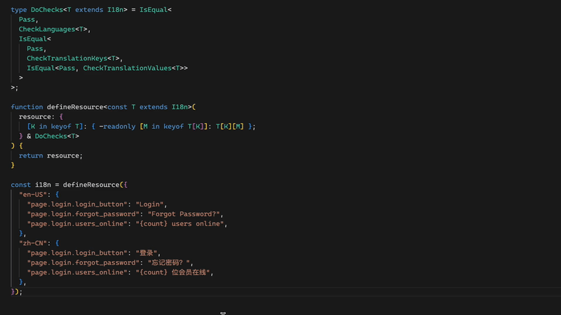

| **上一章** | **目录** | **下一章** |
| :------------- | :----------: | :------: |
| [第三章：类型编程](https://github.com/darkyzhou/You-Might-Not-Know-TypeScript/blob/main/chapter3.md) | [你可能不知道的 TypeScript](https://github.com/darkyzhou/You-Might-Not-Know-TypeScript#%E4%BD%A0%E5%8F%AF%E8%83%BD%E4%B8%8D%E7%9F%A5%E9%81%93%E7%9A%84-typescript) | [第五章：探索之路](https://github.com/darkyzhou/You-Might-Not-Know-TypeScript/blob/main/chapter5.md) |

---

# 第四章：生产实践

下面介绍一些使用了前文介绍的特性和技巧的实践，它们主要来源于我自己在工作中和私下里的项目中得到的灵感。

## 类型安全的路由器

这里的「路由器」不是指办公室墙上的那个，而是下面这种东西：

```typescript
// https://expressjs.com/en/guide/routing.html
app.get("/users/:userId/books/:bookId", (req) => {
  // req.params 是 unknown 类型，但是它会有下面的属性：
  // req.params.userId
  // req.params.bookId
});
```

有没有什么办法可以为 `req.params` 提供类型支持，让它能够从传入的路由定义中解析出参数呢？为了方便展示，我们准备了下面的代码：

```typescript
interface MyRequest<T> {
  params: T;
}

type MakeParamsType<T extends string> = {}; // 如何实现？

declare function get<T extends string>(
  route: T,
  handlerFn: (req: MyRequest<MakeParamsType<T>>) => void
): void;

get("/users/:userId/books/:bookId", (req) => {
  const { params } = req;
  //      ^? 如何让它具有 { userId: unknown; bookId: unknown } 类型？
});
```

### 解决方案

可以通过[模板字面量类型](https://github.com/darkyzhou/You-Might-Not-Know-TypeScript/blob/main/chapter2.md#%E6%A8%A1%E6%9D%BF%E5%AD%97%E9%9D%A2%E9%87%8F%E7%B1%BB%E5%9E%8Btemplate-literal-types-41)和[递归](https://github.com/darkyzhou/You-Might-Not-Know-TypeScript/blob/main/chapter3.md#%E9%80%92%E5%BD%92%E4%B8%8E%E5%BE%AA%E7%8E%AF)实现对路由定义的解析，这个过程就像在使用正则表达式匹配字符串。

`Res` 的联合类型充当了 Set 的作用，即可自动去重的元组类型。特别地，`never` 表示「空状态」。

```typescript
type ParseRouteString<
  T extends string,
  Res extends string = never
> = T extends `${string}:${infer P}/${infer Rest}`
  ? ParseRouteString<Rest, Res | P>
  : T extends `${string}:${infer P}` // 参数位于路由定义末尾的情况
  ? Res | P
  : Res; // 此时两个 extends 都匹配失败，说明没有更多路由参数了

type MakeParamsType<T extends string> = {
  [K in ParseRouteString<T>]: unknown;
} & {}; // 这里并上 {} 是为了阻止 Type Alias Preservation

get("/users/:userId/books/:bookId", (req) => {
  const { params } = req;
  //      ^? const params: { userId: unknown; bookId: unknown }
});
```

### 进阶方案

上面的方案得到的 `params` 虽说有了正确的键，但是值的类型还是 `unknown`，使用上有些繁琐。我们可以提供更好的类型功能，让用户可以通过 `@` 指定参数类型，就像下面的例子。注意，当不使用 `@` 指定类型时，参数类型应该被设置为 `unknown`。

```typescript
get("/users/:userId@number/books/:bookId@number", (req) => {
  const { params } = req;
  //      ^? 如何让它具有 { userId: number; bookId: number } 类型？
});
```

对于字符串的解析来说，上述要求并不难实现。但是如何承载对应的参数类型信息呢？请看下面的代码。

```typescript
type ResolveRouteParam<T extends string> =
  //                      👇 我们只判断了 number，你可以扩展其它类型！
  T extends `${infer P}@${infer _ extends "number"}` // 这是比较复杂的写法，可以改成 @number
    ? [P, number]
    : [T, unknown];

type ParseRouteString<
  T extends string,
  // 我们使用元组来承载解析出来的路由参数，当然它们还是通过联合类型去处理
  //（为了简单，这里没有考虑去重问题）
  Params extends [string, unknown] = never
> = T extends `${string}:${infer P}/${infer Rest}`
  ? ParseRouteString<Rest, Params | ResolveRouteParam<P>>
  : T extends `${string}:${infer P}`
  ? Params | ResolveRouteParam<P>
  : Params;
```

对于路由定义 `/users/:userId@number/books/:bookId@number`，上述的 `ParseRouteString` 的返回类型为：`["userId", number] | ["bookId", number]`。接下来的问题是如何将它转换为期望的对象类型。

```typescript
type MakeParamsType<
  T extends string,
  R extends [string, unknown] = ParseRouteString<T>
> = {
  // 👇 注意到 R[0] 返回 "userId" | "bookId"
  [K in R[0]]: R extends [K, infer U] ? U : never;
  //           👆 使用分配式条件类型找到 K 对应的元组的第二个元素，即它的路由参数类型
  // 分配式条件类型的计算过程（当 K 为 "bookId" 时）：
  //  1. ["userId", number] | ["bookId", number] extends ["bookId", infer U]...
  //  2. ["userId", number] extends ["bookId", infer U]... | ["bookId", number] extends ["bookId", infer U]...
  //  3. never | number
  //  4. number
} & {};
```

最后，我们检验一下上面的代码是否正常工作：

```typescript
get("/users/:userId@number/books/:bookId@number", (req) => {
  const { params } = req;
  //      ^? const params: { userId: number; bookId: number }
});

get("/users/:userId/:phone@number", (req) => {
  const { params } = req;
  //      ^? const params: { userId: unknown, phone: number }
});
```

## 类型安全的装饰器 `5.0+`

这里讨论的「装饰器」并不是 [TypeScript 5.0 版本实现的新装饰器提案](https://www.typescriptlang.org/docs/handbook/release-notes/typescript-5-0.html#decorators)，而是旧的 Stage 2 装饰器提案。不过，我们会在本节末尾稍微讨论一下是否可以使用新装饰器提案实现本节的功能。

许多依赖注入框架提供了类似 `@Inject` 的装饰器用来修饰一个类的属性，这样框架就能在实例化这个类时根据装饰器注入的元数据知道应该向这个属性赋予什么值（注意，这个过程发生在运行时而不是编译时）。

假如有下面的代码，我们这里使用的框架需要通过向 `@Inject` 中提供需要注入的类实例的构造函数（即 `SomeService`）来让框架注入对应的元数据。这里我们遇到了一个问题：如何确保给 `someService` 属性标注的类型是正确的？

```typescript
class SomeService {}

class MyService {
  constructor(@Inject(SomeService) private readonly someService: SomeService) {}
}
```

考虑一个进阶的装饰器 `@OptionalInject`，它告诉框架如果对应的服务不存在就直接注入 `null` 值，而不是像 `@Inject` 那样直接抛错。在这种情况下应该给属性的类型额外标上 `null`，就像下面这样：

```typescript
class MyService {
  constructor(
    @Inject(SomeService) private readonly someService: SomeService,
    @OptionalInject(OtherService)
    private readonly otherService: OtherService | null
  ) {}
}
```

这种依赖于用户自觉的办法是不稳妥的，因为他们很可能不会仔细阅读 `OptionalInject` 的文档，不会知道它可能会使得属性被赋予 `null` 值。另外，后续一旦 `OptionalInject` 发生了修改，从注入 `null` 值修改为了注入 `undefined` 值，那么所有的引用都需要一个个地查找和修改，这不是一种可扩展的方法。

可惜的是，TypeScript 不能通过装饰器的修饰来为类属性赋予类型，所以我们没有办法略去类型标注而让装饰器负责提供类型。不过，也许可以退而求次，提供一种类型检查的手段让 TypeScript 检查下面两个类型的关系：

- 向装饰器传入的类构造函数的类型
- 为装饰器装饰的属性提供的类型标注

### 解决方案

TypeScript 要求属性装饰器函数必须满足下面的类型，注意到它的返回值类型必须为 `void` 或 `any`。

```typescript
type ParameterDecorator = (
  // 被装饰的属性所在的类的构造函数
  target: Object,
  // 被装饰的属性所在函数的键
  propertyKey: string | symbol | undefined,
  // 被装饰的属性是所在函数的第几个参数
  parameterIndex: number
) => void;
```

当某个属性装饰器函数的类型返回值不为 `void` 或 `any` 时，TypeScript 会在*使用这个装饰器的地方*报错：

> Decorator function return type is '...' but is expected to be 'void' or 'any'.

于是我们有了下面的实现思路：提供一种类型化的装饰器函数，当被装饰属性的类型（即 `target` 的类型）不满足一定条件时，让函数的返回值类型不再为 `void`，从而触发 TypeScript 的报错。

我们的实现先从装饰器函数本身开始，为了实现上述功能，需要一个返回装饰器的函数 `OptionalInjectDecoratorFactory`。注意在 `@Inject(...)` 中我们实际上是调用了 `Inject` 这个函数，然后再将它返回的装饰器（它本质上也是一个函数）交给 TypeScript。

```typescript
interface OptionalInjectDecoratorFactory {
  // 通过函数类型推导，获得输入的构造函数对应的类实例类型
  <T>(token: { new (): T }): TypedParameterDecorator<T | null>;

  // 似乎不是必要的，但许多装饰器实现都会包含这个
  new (): OptionalInjectDecoratorFactory;
}

// 具体的装饰器实现就不讨论了
declare const OptionalInject: OptionalInjectDecoratorFactory;
```

`TypedParameterDecorator` 类型的计算结果即为我们的装饰器的类型，请看下面的代码：

```typescript
type TypedParameterDecorator<T> = <
  Target extends abstract new (...args: any) => any,
  Index extends number
>(
  target: Target,
  propertyKey: string | symbol | undefined,
  parameterIndex: Index
  // 👇 检查传入的 T 类型是否和被装饰的属性的类型相等
) => DoCheck<T, ConstructorParameters<Target>[Index]>;
//              👆 先得到构造函数的参数列表，然后使用下标访问

// 当两个类型相等时，返回 `void` 让装饰器通过类型检查，否则返回 `false`。
// 这里的 `false` 可以是其它一些能够满足上述条件的类型
type DoCheck<T, U> = IsEqual<T, U> extends true ? void : false;

// TypeScript 社区发明了很多方法来检查两个类型是否「相等」，但是它们都或多或少存在一些边界条件
// 下面这个版本是泛用性比较强的，详见 Stack Overflow 上的讨论
type IsEqual<X, Y> = (<T>() => T extends X ? 1 : 2) extends <T>() => T extends Y
  ? 1
  : 2
  ? true
  : false;
```

下面，让我们来测试一下这个装饰器的效果如何：

```typescript
class MyService {
  constructor(
    @OptionalInject(SomeService) // 类型检查通过！
    private readonly _0: SomeService | null,

    @OptionalInject(SomeService) // 类型检查不通过！
    private readonly _1: SomeService,

    @OptionalInject(SomeService) // 类型检查不通过！
    private readonly _2: boolean
  ) {}
}
```

尽管 TypeScript 在很久以前就支持了旧的 Stage 2 装饰器提案，但直到 5.0 版本开始 TypeScript 内部引入了某项未知的修改，使得我们能够在 `TypedParameterDecorator` 中得到 `Target` 的具体类型。在 4.9 版本及以前，我们只能获得 `unknown`，无法实现对被装饰的属性进行类型检查。

### 提供具体的报错信息

在上面的代码中，当装饰器的类型检查不通过时的报错信息是：

> Decorator function return type is 'boolean' but is expected to be 'void' or 'any'.

这样的报错信息非常原始，甚至会让用户感到费解。是否有一种办法可以告诉用户「你的类型标错了」呢？有的，而且这种方法算是比较常见的，当人们在使用类似的进阶类型技巧时用来提示用户的方法。

```typescript
declare const ERROR: unique symbol;
type MyTypeError<S extends string> = { [ERROR]: S };

type DoCheck<T, U> = IsEqual<T, U> extends true
  ? void
  : MyTypeError<"Type of parameter is not equal to type of decorator">;
```

此时，我们得到的错误信息如下，变得清晰了很多：

> Decorator function return type is 'MyTypeError<"Type of parameter is not equal to type of decorator">' but is expected to be 'void' or 'any'.

### 关于新装饰器的讨论

对于从 5.0 版本开始支持的新装饰器提案来说，它并不支持装饰声明在构造函数中的类成员变量：

```typescript
class Main {
  constructor(
    @Inject(...)
    private readonly foo: SomeService // Error: Decorators are not valid here.
  ) {}
}
```

不过，我们可以选择另外一种形式，即装饰那些直接声明在类中的成员变量：

```typescript
class Main {
  @Inject(...)
  private readonly foo: SomeService // OK
}
```

对于新装饰器提案，TypeScript 仍然对装饰器的函数返回值类型存在约束，我们依然可以利用前面的技巧完成功能，且由于 TypeScript 为新装饰器提供的类型定义本身就包含了被装饰属性的类型，实现起来会更加简单。不过，由于篇幅限制这里不再赘述，感兴趣的读者可以自行实现。

> 或许就是因为新装饰器能够获得被装饰的属性的具体类型，从 TypeScript 5.0 开始旧装饰器也跟着具备了上述的访问 `Target` 类型的能力。

## 类型安全的 Event Emitter

Event Emitter 相信大家用的都很多了，我们接下来用 TypeScript 写一个「类型安全」的 Event Emitter。本节的重心在如何使用 TypeScript 的类型系统，所以不会提供具体的代码实现，也会省略 `off()` 函数。

我们先来编写一个简易的 Event Emitter 实现：

```typescript
// 调用这个函数释放事件，可以通过 `args` 向监听器传递参数
declare function emit(key: string, ...args: unknown[]): void;

// 调用这个函数监听事件
declare function on(key: string, handler: (...args: unknown[]) => void): void;

// 省略 off
```

### 简易实现的问题

简易实现的这简简单单的几行代码，却存在着比有效行数更多的问题。我们接下来先分析这些问题，然后尝试使用多种方案解决上面的问题。方案的先后顺序不代表绝对的优劣，却或多或少地体现出我个人对它们的偏好（不同的方案总是有着不同的魅力……你应该懂的）。

#### 参数类型匹配

如何确保释放事件的参数类型和监听事件的参数类型相匹配？例如，在下面的代码中：

- 没有办法确保 `isReallyHungry` 参数确实存在且为 `boolean`
- 如果调用了 `emit('I_AM_HUNGRY')` 却没有传递任何参数，我们不会在编译期得到任何报错

```typescript
// 释放事件：
emit("I_AM_HUNGRY", true);

// 监听事件：
on("I_AM_HUNGRY", (isReallyHungry) => {
  // ...
});
```

#### 事件名的正确性 & 冲突问题

如何确保监听事件传入的事件名正确？

- 如果我们不小心将 `I_AM_HUNGRY` 拼成了 `I_AM_HUNGARY`，并不会得到任何编译报错
- 如果释放事件经过修改之后，没有任何地方会发布 `I_AM_HUNGRY` 事件了，那么这个监听事件就失去了作用

目前的很多实践会通过手动定义并导出一些常量或枚举来让事件名常量化，但取决于具体的实现方式，它可能会带来额外的问题：不存在一种中心化的机制防止事件名冲突。

#### 参数名称标注

在上面的例子中，我们发现事件提供的参数的名称是由事件的监听器定义的，这看上去是非常奇怪的。事件的定义，包括参数的名称应由释放事件一方负责，但碍于简易实现的问题没有办法做到这点。

参数名称的标注问题同样是危险的，因为一旦事件释放一方修改了参数的含义，使得它和现有的监听事件方不再一致，那么很可能导致一些出人意料且难以排查的运行时 bug。

### 解决方案

```typescript
interface EventDefinitions {
  // 通过将事件声明收敛到同一个 interface，能够防止事件名冲突
  I_AM_HUNGRY: [isReallyHungry: boolean];
}

declare function emit<T extends keyof EventDefinitions>(
  key: T,
  ...args: EventDefinitions[T]
): void;

declare function on<T extends keyof EventDefinitions>(
  key: T,
  handler: (...args: EventDefinitions[T]) => void
): void;

// 🎉 正确地报错，没有提供足够的参数
emit("I_AM_HUNGRY");

// 🎉 输入逗号时，自动补全提示第二个参数叫「isReallyHungry」且类型为 boolean
emit("I_AM_HUNGRY", true);

// 🎉 输入逗号时，自动补全提示函数接收一个名为「isReallyHungry」且类型为 boolean 的参数
on("I_AM_HUNGRY", (isReallyHungry) => {});

// 🎉 正确地报错，没有这样的事件名
on("I_AM_HUNGARY", () => {});
```

上述方案的要点如下：

- 使用 `interface` 的属性名作为事件名，我们可以通过 `keyof` 取出它的属性名
- 使用[具名元组](https://github.com/darkyzhou/You-Might-Not-Know-TypeScript/blob/main/chapter2.md#%E5%85%B7%E5%90%8D%E5%85%83%E7%BB%84%E5%85%83%E7%B4%A0labeled-tuple-elements40)定义参数列表。当在函数参数中使用具名元组作为 [Rest Parameters](https://developer.mozilla.org/en-US/docs/Web/JavaScript/Reference/Functions/rest_parameters) 的类型时，TypeScript 会自动使用元素的名称作为对应参数的名称

我们目前做到的功能已经和拥有着 9.6k 个 star 的 Event Emitter 库 [mitt](https://github.com/developit/mitt) 基本一样了，但是它还是存在下列缺点：

1. 如果要修改已有事件的名字，例如将 `I_AM_HUNGRY` 改为 `WO_E_LE`，TypeScript 不会自动修改使用了这个事件的 `emit` 和 `on` 调用中传入的字符串名称，这意味着你可能需要依赖全局搜索手动修改
2. 在大型项目中，维护一个中心化的 `interface` 定义可能是困难的，或者说有时会存在一些扩展需求，即在另外的源文件中定义特殊的事件

### 解决第一个缺点

对于第一个缺点，其实这是使用联合类型作为枚举时的「通病」，要解决这种通病可以尝试直接使用枚举。

```typescript
enum EventKeys {
  I_AM_HUNGRY,
}

interface EventDefinitions {
  [EventKeys.I_AM_HUNGRY]: [isReallyHungry: boolean];
}

on(EventKeys.I_AM_HUNGRY, (isReallyHungry) => {});
```

### 解决第二个缺点

还记得我们在[模块扩充](https://github.com/darkyzhou/You-Might-Not-Know-TypeScript/blob/main/chapter2.md#%E6%A8%A1%E5%9D%97%E6%89%A9%E5%85%85module-augmentation)中的讨论吗？对于接口 `EventDefinitions`，可以在某个单独的源文件中定义一个空接口，然后在其它源文件中通过模块扩充来扩充它的定义，这样可以实现在不同的源文件中扩充同一个类型定义。

对于 `EventKeys` 来说，因为枚举定义涉及到值的定义，而模块扩充只能扩充类型定义，所以不能直接如法炮制。不过，你也许记得[常值枚举和模块扩充之间奇妙的化学反应](https://github.com/darkyzhou/You-Might-Not-Know-TypeScript/blob/main/chapter2.md#%E5%9C%A8%E6%A8%A1%E5%9D%97%E6%89%A9%E5%85%85%E4%B8%AD%E4%BD%BF%E7%94%A8)。我们可以将 `EventKeys` 声明为常值枚举来让它能够在模块扩充中使用，绕开了值定义的问题。

```typescript
// registry.ts
export const enum EventKeys {}
export interface EventDefinitions {}

// foo.ts，是 I_AM_HUNGRY 这个事件主要触发的地方，提供了事件的注册
declare module "./registry" {
  export const enum EventKeys {
    I_AM_HUNGRY,
  }

  export interface EventDefinitions {
    [EventKeys.I_AM_HUNGRY]: [isReallyHungry: boolean];
  }
}

emit(EventKeys.I_AM_HUNGRY, ...);
export {};

// bar.ts
import { EventKeys } from "./registry";
// 并不需要导入 `foo.ts`，TypeScript 知道 I_AM_HUNGRY 来自 `foo.ts`
on(EventKeys.I_AM_HUNGRY, (isReallyHungry) => {});
```

- 在 `EventKeys` 枚举中定义的事件的键仍然可以避免重复的键

  TypeScript 能够检查是否存在重复的键，即使它们是通过模块扩充声明的

- 在 `EventDefinitions` 接口中定义的事件的参数仍然可以避免重复的键

  TypeScript 不允许定义另一个 `[EventKeys.I_AM_HUNGRY]: X`，其中 `X` 为 `[boolean]` 以外的类型

- 还可以将上面的 `registry.ts` 通过 tsconfig.json 中的配置赋予一些特殊的路径名，例如 `@registry`，这样可以让各个源文件都能通过方便的方式引用到这个文件

> [!WARNING]
> 不建议将 `registry.ts` 或者任何常值枚举通过共享库的方式发布，换句话说上述技巧只推荐在一些终端应用（不会被其它包依赖）中使用。参见[前文的讨论](https://github.com/darkyzhou/You-Might-Not-Know-TypeScript/blob/main/chapter2.md#%E4%B8%8D%E6%8E%A8%E8%8D%90%E5%9C%A8%E5%85%B1%E4%BA%AB%E5%BA%93%E4%B8%AD%E4%BD%BF%E7%94%A8)。

> [!WARNING]
> 常值枚举以及关于它的模块扩充是一个极为复杂的功能，对于除了 tsc 以外的 TypeScript 编译器（例如 swc、esbuild、babel 等）来说它们很可能不会提供「正确」的输出，如果你想要在生产环境中接入这里的解决方案，请务必事先确认自己使用的编译工具链是否能输出正确的结果。参见[前文的讨论](https://github.com/darkyzhou/You-Might-Not-Know-TypeScript/blob/main/chapter2.md#%E5%9C%A8%E6%A8%A1%E5%9D%97%E6%89%A9%E5%85%85%E4%B8%AD%E4%BD%BF%E7%94%A8)。

## 类型安全的文案注册

某个 Web App 的文案定义在 `.ts` 文件中，具有下面的形式：

```typescript
const i18n = {
  "en-US": {
    "page.login.login_button": "Login",
    "page.login.forgot_password": "Forgot Password?",
    "page.login.users_online": "{count} users online",
  },
  "zh-CN": {
    "page.login.login_button": "登录", // 不要打错成「登陆」了哦，太多人被苹果输入法坑害了
    "page.login.forgot_password": "忘记密码？",
    "page.login.users_online": "{count} 位会员在线",
  },
};
```

请尝试为 `i18n` 对象字面量提供类型检查能力：

1. 键只能为 `'en-US'` 或 `'zh-CN'`，其它语言还没做，因为没钱
2. 每个值对应的对象的键必须一致，换句话说每个语言必须拥有相同的文案种类，防止缺漏
3. 对应的文案的翻译必须引用相同的插值，比如英文中的 `page.login.users_online` 的值里引用了一个 `{count}` 插值，那么中文里的 `page.login.users_online` 的值里也必须引用这个插值，反之亦然

```typescript
type Resource<T> = {
  [K in keyof T]: {
    [M in keyof T[K]]: T[K][M];
  };
};

function defineResource<T>(resource: Resource<T>) {
  return resource;
}
```

接下来我们分别实现三个能力，最后再将它们合并到一起。不过在此之前，先来介绍一下本节会反复使用的一个工具类型：`IsEqual`。我们会使用它来检查两个类型是否相等。它有些像三目表达式，不过我们为 true 分支和两个 false 分支都提供了默认值。

```typescript
type IsEqual<A, B, T = A, F1 = B, F2 = F1> = [A] extends [B]
  ? [B] extends [A]
    ? T
    : F2
  : F1;
```

我们还有下面的工具类型，其中的 `I18nError` 就是一个用于承载报错信息的名义类型。

```typescript
type Pass = unknown;

type I18n = Record<string, Record<string, string>>;

declare const ERROR_SYMBOL: unique symbol;
interface I18nError<T extends string> {
  [ERROR_SYMBOL]: T;
}
```

本节的完整的代码可以在 [TypeScript Playground](https://www.typescriptlang.org/play?ts=5.2.2&q=483#code/C4TwDgpgBACghgZwVAvFArgOwNaYPYDumA3AFCmiRQCSAjAByapQBKEAxngE4AmAPAmBcAlpgDmAGlYdu-QSPFT5osQD5VZUjw4AbOF2idMgqAFEWLAPIsA+gGUAmgFkAQpYAyALgyZhAR3RoBBAAWwAjPB1NUWAILgAzOHZoOkZTLi5uPgAVKAgAD1jMHmRlcVUoAG9SKCgAbXMrW0dXDwBdb2yyAF9yShSEUwC4HT4AQSkXKVy0CagAMVpmKYWAJmZFirQ6sba8wohi5DqXNpqoAH560-2ikvrd89qr7Keob3nV84-aTX6oADCAAsONh3HBxOg4GIIAgcrdDvdUpgtjRBsNRudsBAQHh4lBshJzgAiQ4AWgAqnZiVAAD5QYkALyBZIBADliUTavAkFyaAxMOlMlw+MTsng8FAQhCQFA9JDodBtPFRMJgMI8MZiao+cihVliU5hEgVHKIWIoTCoMrVerNQhtaQNH1wNAAOIQYBjHQ6bJcCEIPR2zAAaRxcNyBTuyGRqOqtTqIagoig2Nx+OyHVTOLxBMTbR6dTTuczf1dgJB7GwfoDQY1ofDfHOkYOR35jD5YwRbbKYmYHq9PprxjrmrDIAjFQAZFBe3yk2hi-j47V6kmU0uCVBEGihlDRpvsvmpHNMBAAG5xKQh1RZs+XrhkWq9VHUdH7pu1EN8+9X848hBdQFfURQAAyNE1xGzCcoHibgzQVK0AHIABJKiTGde26JDQNUJ0yyoNgEEiS9qEwWIuDASI4GDOFm27e453OIiGNKIRTTQX8uCdZgW2jKBQLQrDKjQ0R4jiKBx26bpRMwcSuGkQRulA84riIkiIDIiiqNHYw+CI4ApBY+lxzw2pvCIgjoGBUEtLiHSaPrCMpHcVjZ3YxQoAANTc3tUU3FdE2TJhD23GN3xGT9VyPEM2jqVyZ0PfM2j5Wp1J0UjyPs6jaL4LydTeLjUsk85b28LieisitQWHQNHM1LyRkCOjaj4xEYwFPkKWYFcE3XEKcwzLNetXOonGC6CS2SizYQ0uzKJypycnzMa2mdVcoG6J9Nr5Hy0BGoKN0GglhreBNxqO9M81irMbKreaHNyikpHGzCPMka64qcNbtufbaX2YN890i84ivOA7+sm-EvNOjbzomzcvOm3cMSiuHvJW77io2sH0dqXG8b1DIslAsjrQgFVfGDKBc1Q9CoDehQxGwqQhFreqmAINUgWgqA6des64awpDrTwWEoHwYBZyBfRoGAEFZzgEJoBibLdOQLn5ageWaJp-E6aR2LVoZwWNuF3DBfW1duiLY7DbaAtzhtxGUvOLBcEITB8JdKgABE8Du7AIzc2NAYizFuUQQDzkD8FENhHICtqIHUbeADisD2rdPHSdipTj90+qqss45xqdGaxOzKgPDnVIeIsHYambTPdT0C4ZI+CMEw2rbWMAApzgMYi2+SbwIYR47MzHqAyQMOAeE1HRZTGierpih3OkxvYtqdhmoH9wPJ1IABKKpB89NumCHvAR4gHpyC7qXhAFZhm4gVv24gPuV1JTBKWpMebxiRgEVAAOh0HgMQohwGQNEDYMI6BgDAE1MSbwxJ3CwMwJyIBICYQwKgZgUBcEuBiDwMAGwICkAEFkKghk8xuCkKlgBahvALjYI2sAsBECCGgPQAgOICAbCL1EBAWhxJKicCwMAboGB+FcGQMIs87CdokmZKyDkgCOG4IgPg6B3C4EIKQSgtBgBvN0AKr6yjaicLwfowhxDGEUKjiwngYjAAb+oABujABj2oAQA9AD4-5Yhk2jdGEL4QIoRmAdAiLERIm+5EZGAFl5QAWPKAA0VQAFOqAH6-ZR3QiTdGPmQIAA) 中看到。

### 检查对象的键

检查对象是否仅含 `en-US` 和 `zh-CN` 两个键是平凡的，只需要让它们和 `keyof T` 进行比较即可。不过，由于 `keyof T` 会返回联合类型，为了绕过[分配式联合类型](https://github.com/darkyzhou/You-Might-Not-Know-TypeScript/blob/main/chapter3.md#%E5%88%86%E9%85%8D%E5%BC%8F%E6%9D%A1%E4%BB%B6%E7%B1%BB%E5%9E%8Bdistributive-conditional-types)特性，我们用方括号将比较双方包围，这样比较的就是元组类型而不是联合类型（`IsEqual` 内部已经做了这件事情）。

```typescript
type CheckLanguages<T extends I18n> = IsEqual<
  keyof T,
  "en-US" | "zh-CN",
  Pass, // T
  I18nError<"Too many language definitions">, // F1
  I18nError<"Missing language definitions"> // F2
>;
```

### 检查是否具有相同的文案种类

这里使用一个简单的实现思路：将各个语言对应的对象的所有键（也就是文案）表示为联合类型，然后将这些联合类型合并在一起得到一个大的联合类型，最后检查每个语言对应的对象的键构成的联合类型是否等于这个联合类型。

> 这里的联合类型充当了 Set 的作用，即：可自动去重的元组类型。特别地，`never` 表示「空状态」。

```typescript
type GetAllTranslationKeys<T extends I18n> = {
  // 获得 I18n 对象里各个语言对应的对象有哪些键（用联合类型表示）
  [K in keyof T]: keyof T[K];
}[keyof T]; // 使用 IIMT 将对象的值合并在一起得到大的联合类型

type CheckTranslationKeys<
  T extends I18n,
  // 这种用法类似于命令式编程里在函数体中声明的本地变量
  A extends string = GetAllTranslationKeys<T> & string,
  K = keyof {
    // 使用映射类型中键的重映射，检查每个语言的对象里的键是否等于上面的 A
    // 如果等于，返回 never，这会使得这个键不会出现在构造出来的映射类型中
    // 否则，返回 K 本身，让它出现在映射类型里，通过第 10 行的 keyof 收集出来
    [K in keyof T as IsEqual<keyof T[K], A, never, K>]: never;
  }
> = IsEqual<
  // 检查我们找到的有问题的键 K（联合类型）是否为空（never）
  K,
  never,
  Pass,
  // 当 K 不为空时，会返回这个报错类型，我们实际上可以将 K 嵌入到报错信息里
  I18nError<`Missing keys for language '${K & string}'`>
>;
```

### 检查文案的翻译是否引用相同的插值

给定一个字符串字面量类型，提取出它格式为 `{key}` 的插值并表示为联合类型是简单的。具体的代码如下所示，注意到我们仍然使用了联合类型去充当 Set 的作用，它一方面用来存储找到的插值，另一方面可以自动去重。

```typescript
type ResolveInterpolations<
  T extends string,
  Res extends string = never
> = T extends `${string}{${infer Key}}${infer Rest}`
  ? ResolveInterpolations<Rest, Res | Key>
  : Res;
```

假如我们通过上面的类型，得到了文案对象里面各个文案字符串使用了哪些插值，就像下面的类型：

```typescript
type T = {
  "en-US": {
    "page.login.login_button": never;
    "page.login.forgot_password": never;
    "page.login.users_online": "count";
  };
  "zh-CN": {
    "page.login.login_button": never;
    "page.login.forgot_password": never;
    "page.login.users_online": "count" | "test";
  };
};
```

假如我们现在在检查某个文案，它的键为 `L`，值为 `V`。如何结合上面的信息检查它是否使用了和其它语言的对应文案完全相同的插值呢？下面的代码实现了这一点。

```typescript
// 注意第二行末尾的 keyof 哦，它实际上返回了「哪些语言的对应文案，使用的插值不一样」
type CheckInterpolations<T, L extends string, V extends string> = keyof {
  [K in keyof T as IsEqual<
    // 检查各个语言中的对应文案（即键同样为 `L` 的属性）使用的插值
    T[K][L & keyof T[K]],
    // 当前文案使用了哪些插值
    ResolveInterpolations<V>,
    // 两类型相等时，返回 never 让 TypeScript 去掉这个属性
    never,
    // 否则，将 K 作为这个属性的键，也就是语言
    K
  >]: never;
};
```

下面是完成功能的主体代码：

- `U` 作为「局部变量」存储了从 `ResolveInterpolations` 得到的信息：各个语言的各个文案使用了哪些插值，用联合类型表示
- `V` 作为另一个「局部变量」存储了从 `CheckInterpolations` 得到的信息：各个语言的各个文案，使用了和哪些语言的对应文案不同的插值，为 `never` 时表示「没有，都一样！」
- 从第十三行开始，我们检查 `V` 的各个值是否为 `never`，也即「是否存在有问题的文案值」。注意我们这里是如何利用对应的泛型参数构造信息量充足的报错信息的。这里还使用了两层嵌套的 [IIMT](https://github.com/darkyzhou/You-Might-Not-Know-TypeScript/blob/main/chapter2.md#immediately-indexed-mapped-typeiimt)，用来将可能存在的 `I18nError` 提取出来作为联合类型。
  - 当然，如果整个文案对象都没有错误，它会返回 `never`，通过 `IsEqual` 的判断最终返回 `unknown`。

```typescript
type CheckTranslationValues<
  T extends I18n,
  U = {
    [K in keyof T]: {
      [M in keyof T[K]]: ResolveInterpolations<T[K][M]>;
    };
  },
  V = {
    [K in keyof T]: {
      [M in keyof T[K]]: CheckInterpolations<U, M & string, T[K][M]>;
    };
  }
> = IsEqual<
  never,
  {
    [K in keyof V]: {
      [M in keyof V[K]]: IsEqual<
        V[K][M],
        never,
        never,
        I18nError<`In definition of '${K & string}', translation with key '${M &
          string}' does not share the same interpolations with that of '${V[K][M] &
          string}'`>
      >;
    }[keyof V[K]];
  }[keyof V],
  unknown
>;
```

### 将三种检查串在一起

为了防止三种检查相互干扰，我们通过条件类型来先后执行这三种检查。如果前面的检查失败，后面的检查就不会执行。请看下面的代码：

```typescript
type DoChecks<T extends I18n> = IsEqual<
  Pass,
  CheckLanguages<T>,
  IsEqual<
    Pass,
    CheckTranslationKeys<T>,
    IsEqual<Pass, CheckTranslationValues<T>>
  >
>;
```

函数 `defineResource` 的代码如下所示，注意：

- 使用 `const T` 是为了让 TypeScript 推导输入对象的类型时，将内含的字符串类型推导为字面量类型
- 使用第 3 行的映射类型，而不是 `Record<string, Record<string, string>>` 是为了[提供更强的 contextual types](https://github.com/darkyzhou/You-Might-Not-Know-TypeScript/blob/main/chapter3.md#type-parameter-inference)，让 TypeScript 顺利推导出文案对象这种复杂对象结构的字面量类型。这里的做法是通过经验试出来的。
- `-readonly` 是为了去掉 `const T` 为属性附加的 `readonly` 修饰符。

```typescript
function defineResource<const T extends I18n>(
  resource: {
    [K in keyof T]: { -readonly [M in keyof T[K]]: T[K][M] };
  } & DoChecks<T>
) {
  return resource;
}
```

### 效果展示

本节的完整的代码可以在 [TypeScript Playground](https://www.typescriptlang.org/play?ts=5.2.2&q=483#code/C4TwDgpgBACghgZwVAvFArgOwNaYPYDumA3AFCmiRQCSAjAByapQBKEAxngE4AmAPAmBcAlpgDmAGlYdu-QSPFT5osQD5VZUjw4AbOF2idMgqAFEWLAPIsA+gGUAmgFkAQpYAyALgyZhAR3RoBBAAWwAjPB1NUWAILgAzOHZoOkZTLi5uPgAVKAgAD1jMHmRlcVUoAG9SKCgAbXMrW0dXDwBdb2yyAF9yShSEUwC4HT4AQSkXKVy0CagAMVpmKYWAJmZFirQ6sba8wohi5DqXNpqoAH560-2ikvrd89qr7Keob3nV84-aTX6oADCAAsONh3HBxOg4GIIAgcrdDvdUpgtjRBsNRudsBAQHh4lBshJzgAiQ4AWgAqnZiVAAD5QYkALyBZIBADliUTavAkFyaAxMOlMlw+MTsng8FAQhCQFA9JDodBtPFRMJgMI8MZiao+cihVliU5hEgVHKIWIoTCoMrVerNQhtaQNH1wNAAOIQYBjHQ6bJcCEIPR2zAAaRxcNyBTuyGRqOqtTqIagoig2Nx+OyHVTOLxBMTbR6dTTuczf1dgJB7GwfoDQY1ofDfHOkYOR35jD5YwRbbKYmYHq9PprxjrmrDIAjFQAZFBe3yk2hi-j47V6kmU0uCVBEGihlDRpvsvmpHNMBAAG5xKQh1RZs+XrhkWq9VHUdH7pu1EN8+9X848hBdQFfURQAAyNE1xGzCcoHibgzQVK0AHIABJKiTGde26JDQNUJ0yyoNgEEiS9qEwWIuDASI4GDOFm27e453OIiGNKIRTTQX8uCdZgW2jKBQLQrDKjQ0R4jiKBx26bpRMwcSuGkQRulA84riIkiIDIiiqNHYw+CI4ApBY+lxzw2pvCIgjoGBUEtLiHSaPrCMpHcVjZ3YxQoAANTc3tUU3FdE2TJhD23GN3xGT9VyPEM2jqVyZ0PfM2j5Wp1J0UjyPs6jaL4LydTeLjUsk85b28LieisitQWHQNHM1LyRkCOjaj4xEYwFPkKWYFcE3XEKcwzLNetXOonGC6CS2SizYQ0uzKJypycnzMa2mdVcoG6J9Nr5Hy0BGoKN0GglhreBNxqO9M81irMbKreaHNyikpHGzCPMka64qcNbtufbaX2YN890i84ivOA7+sm-EvNOjbzomzcvOm3cMSiuHvJW77io2sH0dqXG8b1DIslAsjrQgFVfGDKBc1Q9CoDehQxGwqQhFreqmAINUgWgqA6des64awpDrTwWEoHwYBZyBfRoGAEFZzgEJoBibLdOQLn5ageWaJp-E6aR2LVoZwWNuF3DBfW1duiLY7DbaAtzhtxGUvOLBcEITB8JdKgABE8Du7AIzc2NAYizFuUQQDzkD8FENhHICtqIHUbeADisD2rdPHSdipTj90+qqss45xqdGaxOzKgPDnVIeIsHYambTPdT0C4ZI+CMEw2rbWMAApzgMYi2+SbwIYR47MzHqAyQMOAeE1HRZTGierpih3OkxvYtqdhmoH9wPJ1IABKKpB89NumCHvAR4gHpyC7qXhAFZhm4gVv24gPuV1JTBKWpMebxiRgEVAAOh0HgMQohwGQNEDYMI6BgDAE1MSbwxJ3CwMwJyIBICYQwKgZgUBcEuBiDwMAGwICkAEFkKghk8xuCkKlgBahvALjYI2sAsBECCGgPQAgOICAbCL1EBAWhxJKicCwMAboGB+FcGQMIs87CdokmZKyDkgCOG4IgPg6B3C4EIKQSgtBgBvN0AKr6yjaicLwfowhxDGEUKjiwngYjAAb+oABujABj2oAQA9AD4-5Yhk2jdGEL4QIoRmAdAiLERIm+5EZGAFl5QAWPKAA0VQAFOqAH6-ZR3QiTdGPmQIAA) 中找到。下面的视频展示了最终的效果。

<p align="center">
  
</p>

> 我们其实可以做得更好，可以考虑改进报错的粒度以及报错信息里的提示。

## 端到端类型安全（End-to-End Type-Safety）

Web 前端界每隔一段时间就会出现一些爆款，感觉很多都有不少的水分，不过其中的 [tRPC](https://trpc.io/) 库却让人眼前一亮。这个库宣称自己为 API 调用提供了「端到端」的类型安全支持。可能就是这个库提出或者发扬了「端到端的类型安全」这个概念，以至于后续出现的很多新的服务端框架都提供了这种功能。

<p align="center">
  
</p>

虽然文档中似乎没有解释这个概念具体是什么意思，不过我暂且假定它指的是这种能力：服务端源文件的路由的类型定义（包括具体的请求体类型和响应体类型）可以直接传播到客户端的源文件中。

这种功能是怎么实现的？为了探究问题的答案，本节会研究一个形式较为简单的「端到端类型安全」的实现：[ElysiaJS](https://elysiajs.com/)，它是一款新式的服务端框架，主要服务于 [Bun](https://bun.sh/)（一个爆款 JavaScript 运行时）。ElysiaJS 提供了下面例子的端到端类型安全功能（这个功能需要安装它的一个名为 [Eden](https://elysiajs.com/plugins/eden/overview.html) 的插件……唔，熟悉的名字）。

先来看看服务端的源文件 `server.ts`：

```TypeScript
import { Elysia, t } from "elysia";

const app = new Elysia()
  // 这个端点响应体是一个字符串，来自给定的 id
  .get("/id/:id", ({ params: { id } }) => id)
  // 这个端点响应体是一个 JSON 对象，来自请求体
  .post("/json", ({ body }) => body, {
    // 对请求体的类型验证
    body: t.Object({
      name: t.String(),
    }),
  })
  .listen(3000);

export type App = typeof app;
```

再来看看在客户端中，我们能得到怎么样的「端到端类型安全」。注意下面三处高亮标记的地方。

```TypeScript
import { edenTreaty } from "@elysiajs/eden";
import type { App } from "./server";

const api = edenTreaty<App>("http://0.0.0.0:8080");

// 这是 Elysia 调用它的服务端的特殊方式，下面等价于 GET /id/seele 请求
const _0 = await api.id.seele.get();
// 它的返回值类型等于下面的 T0
type T0 = (
  | { // Elysia 成功地根据 server.ts 第 6 行的函数返回值推导出了响应体类型
      data: string;
      error: null;
    }
  | { // 客户端请求错误时的响应体，在这个例子是固定的
      data: null;
      error: EdenFetchError<number, string>;
    }
) & { // 响应体的公共属性，在这个例子是固定的
  status: number;
  response: Response;
  headers: Record<string, string>;
};

const _1 = await api.json.post({ name: "saltyaom" });
// 它的返回值类型等于下面的 T1
type T1 = (
  | { // 看！它又推导出正确的响应体类型了
      data: {
        name: string;
      };
      error: null;
    }
  | { // 客户端请求错误时的响应体，在这个例子是固定的
      data: null;
      error: EdenFetchError<number, string>;
    }
) & { // 响应体的公共属性，在这个例子是固定的
  status: number;
  response: Response;
  headers: Record<string, string>;
};


api.json.post({
  // TypeScript 正确地报错，因为 server.ts 第 10 行说 name 应该是个字符串
  name: 1,
});
```

由于篇幅原因，我们这里只简单地研究它的 `get` 函数是如何实现的并解答下面的问题：

> 在 `server.ts` 中的代码是 `get("/id/:id", ({ params: { id } }) => id)`

- 为什么它可以推导出 `params` 中存在一个 `id` 字符串类型？
- 为什么处理函数的返回值类型 `string` 可以被客户端知道？

解决了这些问题之后再阅读其它函数的实现不是一件困难的事情（我相信能坚持读到这里的你一定有足够的能力……），而且对于端到端类型安全的原理分析，如果要「认真地」写，恐怕又会需要写出一篇万字长文。

在开始研究源码之前，我们先说结论：它的原理是对函数泛型的巧妙利用，尤其是前文讨论的[各种匹配方法](https://github.com/darkyzhou/You-Might-Not-Know-TypeScript/blob/main/chapter3.md#%E5%B8%B8%E7%94%A8%E7%9A%84%E5%8C%B9%E9%85%8D%E6%96%B9%E6%B3%95)和[函数类型闭包](https://github.com/darkyzhou/You-Might-Not-Know-TypeScript/blob/main/chapter3.md#%E5%87%BD%E6%95%B0%E7%B1%BB%E5%9E%8B%E9%97%AD%E5%8C%85)。简化后的 `get` 函数源码如下所示（只需要关心高亮的代码）。

- `Elysia` 本身就是一个带有泛型参数的类，它携带了包括路由信息 `Routes` 在内的类型闭包
- 每次调用 `get` 函数之后得到的返回值是一个被扩充了类型信息之后的 `Elysia` 类型，具体被扩充了什么类型信息可以看下面的代码，对于 `get` 函数来说只需要扩充 `Routes` 的定义
- `Routes` 定义中，当前路由的响应体类型在我们的例子中由第 28 行的 `ReturnType<Function>` 得到
- 因此，`client.ts` 之所以能得到每个请求的请求体类型、响应体类型的类型信息，就是因为包括 `Routes` 在内的类型信息被通过类型闭包（`export type App = typeof app`）传递到了 `client.ts` 中
- `Function` 具体是如何推导出来的？请看后文！

```TypeScript
// ⚠️ 省略了很多类型参数以及其它内容，具体以源码为准！
class Elysia<
    BasePath extends string = '',
    Routes extends RouteBase = {},
>{
  get<
    const Path extends string,
    const Route extends MergeSchema< // 省略了 LocalSchema 的定义
      UnwrapRoute<LocalSchema, Definitions['type']>,
      ParentSchema
    >,
    const Function extends Handler<Route, `${BasePath}${Path}`>
  >(
    path: Path,
    handler: Function
  ): Elysia<
    BasePath,
    // 👇 通过交叉类型将新构造的对象类型扩充到 Routes 里
    Routes & {
      // 👇 映射类型，意思是「构造一个对象类型，它具有一个键为这个的属性」
      [path in `${BasePath}${Path}`]: {
        get: {
          body: Route["body"];
          params: Route["params"];
          query: Route["query"];
          headers: Route["headers"];
          response: unknown extends Route["response"]
            ? { 200: ReturnType<Function> } // 👈 处理函数的返回值类型通过这种方式保存了下来
            : Route["response"] extends { 200: any }
              ? Route["response"]
              : { 200: Route["response"] };
        };
      };
    }
  > {
    // 本函数在运行时中的实现是很简单的
    this.add("GET", path, handler as any, hook);
    // 让它通过 TypeScript 的类型检查，库作者会确保扩充的 Elysia 类型定义不会造成运行时错误
    return this as any;
  }
}
```

我们来看看 `Function` 类型依靠的 `Handler` 类型的定义：

```TypeScript
export type Handler<
    Route extends RouteSchema = {},
    Path extends string = ''
> = (context: Context<Route, Path>) => // 注意，这个类型是个函数类型
    Route['response'] extends { 200: unknown }
        ? Response | MaybePromise<Route['response'][keyof Route['response']]>
        : Response | MaybePromise<Route['response']>
```

从这里可以看出来，`Context` 类型应该是一个对象类型，`id` 应该是它根据 `Path` 字符串类型推导出来的。

```TypeScript
export type Context<
    Route extends RouteSchema = RouteSchema,
    Decorators extends DecoratorBase = {
        request: {}
        store: {}
    },
    Path extends string = ''
> = {
    // 👇 看！这里发生了和前文类型安全的路由器类似的字符串解析过程
    params: undefined extends Route['params']
        ? Path extends `${string}/${':' | '*'}${string}`
            ? Record<GetPathParameter<Path>, string>
            : never
        : Route['params']
    // ... 省略其它属性
} & Decorators['request']
```

至于 `Handler` 返回的函数类型的返回值，它定义中的返回值类型是用来做类型检查的，如果我们使用了其它 Elysia 的 API，那么这些 API 可能会限制处理函数能够返回的值的类型。

---

| **上一章** | **目录** | **下一章** |
| :------------- | :----------: | :------: |
| [第三章：类型编程](https://github.com/darkyzhou/You-Might-Not-Know-TypeScript/blob/main/chapter3.md) | [你可能不知道的 TypeScript](https://github.com/darkyzhou/You-Might-Not-Know-TypeScript#%E4%BD%A0%E5%8F%AF%E8%83%BD%E4%B8%8D%E7%9F%A5%E9%81%93%E7%9A%84-typescript) | [第五章：探索之路](https://github.com/darkyzhou/You-Might-Not-Know-TypeScript/blob/main/chapter5.md) |
