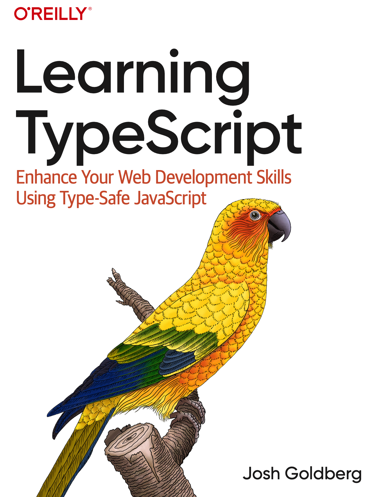

| **上一章** | **目录** |
| :------------- | :----------: |
| [第四章：生产实践](https://github.com/darkyzhou/You-Might-Not-Know-TypeScript/blob/main/chapter4.md) | [你可能不知道的 TypeScript](https://github.com/darkyzhou/You-Might-Not-Know-TypeScript#%E4%BD%A0%E5%8F%AF%E8%83%BD%E4%B8%8D%E7%9F%A5%E9%81%93%E7%9A%84-typescript) |

---

# 探索之路

本章节将介绍一些和 TypeScript 相关的资料、书籍和类型库，希望能够帮助你继续在 TypeScript 的道路上探索下去。

## 资料

### [type-challenges](https://github.com/type-challenges/type-challenges)

收集了一系列难度从简单到极难的 TypeScript 类型谜题。曾经是 [antfu](https://github.com/antfu) 的个人仓库，可能就是因为这个仓库，前端界把钻研 TypeScript 各种类型技巧的行为称为「类型体操」。本文开头说的「体操家」的出处就是这里。

### [FAQs](https://github.com/microsoft/TypeScript/wiki/FAQ)

TypeScript 仓库的 Wiki 里提供的 FAQ 列表，介绍了和 TypeScript 有关的一些基本概念，以及解答了许多常见的疑难杂症。

### [How the TypeScript Compiler Compiles](https://www.youtube.com/watch?v=X8k_4tZ16qU&list=PLYUbsZda9oHu-EiIdekbAzNO0-pUM5Iqj&index=5)

TypeScript 前开发者 Orta Therox 的一个关于 TypeScript 编译器实现细节的简短介绍，重心放在了类型检查的部分。不过内容比较浅薄，只能提供一种宏观视角。

### [TypeScript-Compiler-Notes](https://github.com/microsoft/TypeScript-Compiler-Notes)

关于 TypeScript 源码的笔记：

- 编译器，特别是类型检查部分的一些概念的介绍、原理的解释
- 语言服务的部分介绍
- 源码调试技巧、开发流程介绍

> [!NOTE]
> Fun fact：我们在使用 TypeScript 的过程中遇到的绝大多数类型报错都来自一个名为 `checker.ts` 的源文件提供的类型检查能力。截至 2023 年 10 月 15 日，这个源文件有 50463 行！

阅读 TypeScript 的源码可能不是简单的，因为它涉及了太多、太复杂的概念（请思考这个事实：TypeScript 的历史已经超过了 13 年）。一种效率较高的「理解 TypeScript 如何工作」的方式可能是：

1. 将源码克隆下来
2. 运行 `npm install` 和 `npm run build:compiler`
3. 使用[笔记里的调试配置](https://github.com/microsoft/TypeScript-Compiler-Notes/blob/main/systems/debugging/settings.md#hard-coded-file)，在随便什么地方建一个 `.ts` 文件，将路径填到配置里
4. 在源码中设置断点，然后运行调试
5. 一步一步、反反复复地看你感兴趣的过程

### [TypeScript Origins: The Documentary](https://www.youtube.com/watch?v=U6s2pdxebSo)

TypeScript 的纪录片，比较有看点的地方：

- TypeScript 的起源，为什么会做这个东西
- 微软对开源的态度是如何从 TypeScript 开始发生变化的
- TypeScript 的发展过程中比较重要的一些时间节点，比如 Angular 2 的接入

## 书籍

关于 TypeScript 的书籍，我能找到的似乎都是一些内容偏向基础的书籍。它们讨论的内容并不会像本文那样深入（或者说硬核），也许是因为这些知识不太成体系，并且大多属于经验之谈（尽管有一定的源码和文档支撑）。

### Effective TypeScript


提供了 62 种改善 TypeScript 使用技巧的方式，让你摆脱一些关于 TypeScript 的常见误用。

书中还讨论了 TypeScript 的许多并没有在文档中介绍得清楚的机制，例如 Type Narrowing 和 Type Widening，帮助你理清 TypeScript 的一些设计原则和机制细节。

总的来说，这是一本在闲暇之余可以读读看的好书。

> 此书第一版发布于 2019 年底，至今已经接近 4 年，在这个过程中 TypeScript 已经发生了很多新的改变。书中讨论的一些问题已经有了更好、更现代的解法，可以参考本文章来形成互补。

### Learning TypeScript



补充 TypeScript 基础知识的好书，涵盖了很多 TypeScript 官方文档没有涉及或讲得不多的内容，尤其是其中的：

- 关于泛型的各种机制的介绍
- 对 declaration files（声明文件，即 d.ts 文件）的介绍
- 对 TypeScript 的配置项（特别是 tsconfig）的介绍

> 本书的发布日期非常新，于 2022 年 7 月发行第二版，可以说是目前入门 TypeScript 的首选好书。

有趣的是，这两本书的封面都是鸟，也许可以把它们合称为「两本鸟书」。

## 类型库

下面是一些能够帮助我们编写类型的工具库，注意这些库提供的 API 大多数都是 TypeScript 类型，所以并不会出现在编译产物中，也不会增加包体积。除了使用上的价值外，这些类型库还有学习上的价值，当我们对 TypeScript 的某个类型或功能不了解时，可以查看这些库的源码实现，从中获取思路。

### [ts-typesafe-decorators](https://github.com/sorgloomer/ts-typesafe-decorators)

为旧的 Stage 2 装饰器提供类型检查的工具类型库，本文在生产实践中[类型安全的装饰器](TODO)一节就是受到了这个库的启发。它同样依赖于 TypeScript 5.0 或以上版本，所以又多了一个理由升级 TypeScript。

### [ts-essentials](https://github.com/ts-essentials/ts-essentials)

提供一些 TypeScript 没有自带但是很有用的工具类型。例如：

- `XOR<Type1, Type2>`
  - 构造一个只能被赋给 `Type1` 或 `Type2` 的类型，但它不会同时可以被赋给两个类型
- `MarkWritable<Type, Keys>`
  - 取消给定对象类型中给定属性的 `readonly` 标识

### [ts-pattern](https://github.com/gvergnaud/ts-pattern)

用于对复杂联合类型进行匹配的类型库，下面的例子来自它的 README。

- 注意它是如何利用[函数类型闭包](TODO)提供丰富的类型功能的
- 它的 `exhaustive()` 提供了和本文的 [Exhaustive Guard](TODO) 类似的功能

```typescript
import { match, P } from 'ts-pattern';

type Data =
  | { type: 'text'; content: string }
  | { type: 'img'; src: string };

type Result =
  | { type: 'ok'; data: Data }
  | { type: 'error'; error: Error };

const result: Result = ...;

const html = match(result)
  .with({ type: 'error' }, () => <p>Oups! An error occured</p>)
  .with({ type: 'ok', data: { type: 'text' } }, (res) => <p>{res.data.content}</p>)
  .with({ type: 'ok', data: { type: 'img', src: P.select() } }, (src) => )
  .exhaustive();
```

### [ts-reset](https://github.com/total-typescript/ts-reset)

- `fetch.json()` 和 `JSON.parse()` 会返回 `unknown` 而不是问题多多的 `any` 了

- `Array.filter(Boolean)` 的返回值类型能够去掉空类型了

  ```typescript
  const input = [null, undefined, true, "seele"];
  //    ^? const input: (string | boolean | null | undefined)[]
  const result = input.filter(Boolean);
  //    ^? const result: (string | boolean)[]
  ```

- 还有许多对 TypeScript 自带的类型库的改进

### [string-ts](https://github.com/gustavoguichard/string-ts)

针对字符串字面量类型的工具类型库，下面的图片来自它的 README。


### [type-fest](https://github.com/sindresorhus/type-fest)

也是一个类似 `ts-essentials` 的工具类型库，提供了许多 TypeScript 没有自带的工具类型。

具体请看它的 README。

### [hotscript](https://github.com/gvergnaud/hotscript)

使用 TypeScript 的类型系统构建的一套新的类型「语言」，内置了很多类似函数式编程的组合式 API（你可以尝试将它类比为给类型系统用的 lodash）。它提供的 API 能够让我们通过一种统一、直观的方式表达各种复杂的类型计算，不过看上去学习成本有些高。下面是来自它的 README 的一些例子：

- Transforming a list

  ```typescript
  type _ = Pipe<
    //   ^? type _ = 62
    [1, 2, 3, 4],
    [
      Tuples.Map<Numbers.Add<3>>, // [4, 5, 6, 7]
      Tuples.Join<".">, // "4.5.6.7"
      Strings.Split<".">, // ["4", "5", "6", "7"]
      Tuples.Map<Strings.Prepend<"1">>, // ["14", "15", "16", "17"]
      Tuples.Map<Strings.ToNumber>, // [14, 15, 16, 17]
      Tuples.Sum // 62
    ]
  >;
  ```

- Parsing a route path

  ```typescript
  type _ = Pipe<
    //   ^? type _ = { id: string, index: number }
    "/users/<id:string>/posts/<index:number>",
    [
      Strings.Split<"/">,
      Tuples.Filter<Strings.StartsWith<"<">>,
      Tuples.Map<ComposeLeft<[Strings.Trim<"<" | ">">, Strings.Split<":">]>>,
      Tuples.ToUnion,
      Objects.FromEntries,
      Objects.MapValues<
        Match<[Match.With<"string", string>, Match.With<"number", number>]>
      >
    ]
  >;
  ```

---

| **上一章** | **目录** |
| :------------- | :----------: |
| [第四章：生产实践](https://github.com/darkyzhou/You-Might-Not-Know-TypeScript/blob/main/chapter4.md) | [你可能不知道的 TypeScript](https://github.com/darkyzhou/You-Might-Not-Know-TypeScript#%E4%BD%A0%E5%8F%AF%E8%83%BD%E4%B8%8D%E7%9F%A5%E9%81%93%E7%9A%84-typescript) |
